# Промт 14 — подробный error analysis

Эксперимент: `20261004T095716Z_s42_2334c932`. Выбрано 60 примеров: по шесть категорий для каждого из десяти инструментов.

Выбор детерминирован: в каждой паре tool × category взят объект с минимальным Object Score; при равенстве — первый по ID. Это стратифицированная диагностическая выборка, а не новая метрика и не изменение benchmark.

## Покрытие

| Инструмент | Примеров | Категории | Пропущено |
|---|---:|---|---:|
| PyMuPDF | 6 | Text, Tables, Math, Chemistry, Images, Diagrams | 3 |
| pdfplumber | 6 | Text, Tables, Math, Chemistry, Images, Diagrams | 3 |
| Docling | 6 | Text, Tables, Math, Chemistry, Images, Diagrams | 1 |
| pdfminer.six | 6 | Text, Tables, Math, Chemistry, Images, Diagrams | 3 |
| MinerU | 6 | Text, Tables, Math, Chemistry, Images, Diagrams | 1 |
| OCR.Space | 6 | Text, Tables, Math, Chemistry, Images, Diagrams | 4 |
| Nutrient | 6 | Text, Tables, Math, Chemistry, Images, Diagrams | 1 |
| Mindee | 6 | Text, Tables, Math, Chemistry, Images, Diagrams | 3 |
| Adobe Extract | 6 | Text, Tables, Math, Chemistry, Images, Diagrams | 4 |
| LlamaParse | 6 | Text, Tables, Math, Chemistry, Images, Diagrams | 2 |

Полные машиночитаемые значения: [examples.csv](examples.csv), [examples.json](examples.json). Изображение «Исходный объект» — рендер точного GT bbox с небольшим контекстом.

## PyMuPDF

### 1. Text — TXT_002 (D01, стр. 27)

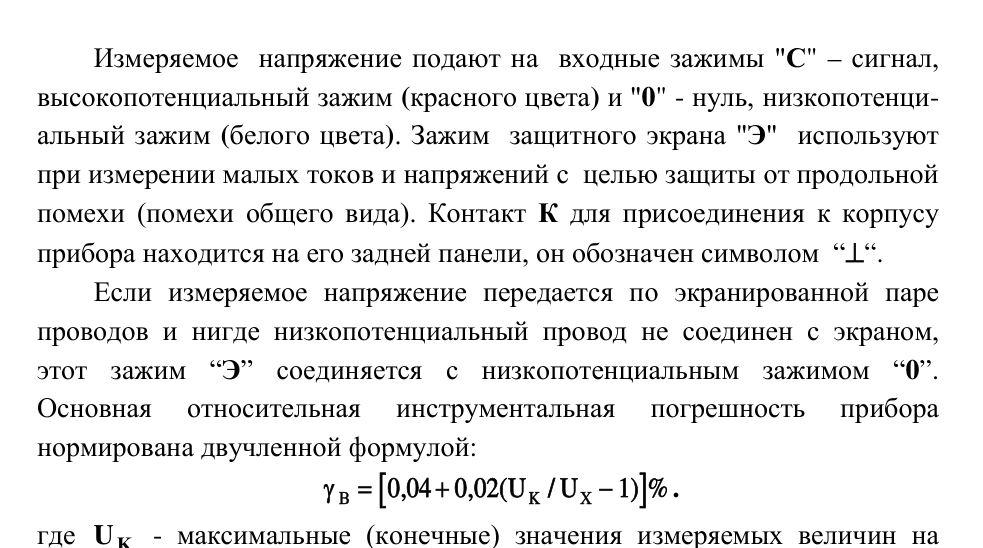

**Ошибка:** незначительные переносы/пунктуация

**Причина:** Длина output составляет 0.96 от GT; CER-quality=99.73, WER-quality=100.00. Классификация причины основана на фактическом соотношении длин и разрыве между посимвольной и пословной метриками.

**Влияние на метрику:** Object Score=99.83/100; потеря относительно идеального объекта=0.17 п.п.; cer=99.73, wer=100.00, edit_similarity=99.73

**Ground Truth**

```text
Измеряемое  напряжение подают на  входные зажимы "С" – сигнал, 
высокопотенциальный зажим (красного цвета) и "0" - нуль, низкопотенци-
альный зажим (белого цвета). Зажим  защитного экрана "Э"  используют 
при измерении малых токов и напряжений с  целью защиты от продольной 
помехи (помехи общего вида). Контакт К для присоединения к корпусу 
прибора находится на его задней панели, он обозначен символом  “⊥“. 
Если измеряемое напряжение передается по экранированной паре 
проводов и нигде низкопотенциальный провод не соединен с экраном, 
этот зажим “Э” соединяется с низкопотенциальным зажимом “0”. 
Основная 
относительная 
инструментальная 
погрешность 
прибора 
нормирована двучленной формулой: 
  
 
 
[
]
γ В
K
X
U
U
=
+
−
0 04
0 02
1
,
,
(
/
) %.
```

**Output инструмента**

```text
Измеряемое напряжение подают на входные зажимы "С" – сигнал,
высокопотенциальный зажим (красного цвета) и "0" - нуль, низкопотенци-
альный зажим (белого цвета). Зажим защитного экрана "Э" используют
при измерении малых токов и напряжений с целью защиты от продольной
помехи (помехи общего вида). Контакт К для присоединения к корпусу
прибора находится на его задней панели, он обозначен символом “⊥“.
Если измеряемое напряжение передается по экранированной паре
проводов и нигде низкопотенциальный провод не соединен с экраном,
этот зажим “Э” соединяется с низкопотенциальным зажимом “0”.
Основная
относительная
инструментальная
погрешность
прибора
нормирована двучленной формулой:
[
]
γ В
K
X
U
U
=
+
−
0 04
0 02
1
,
,
(
/
) %.
```


### 2. Tables — TAB_006 (D04, стр. 8)

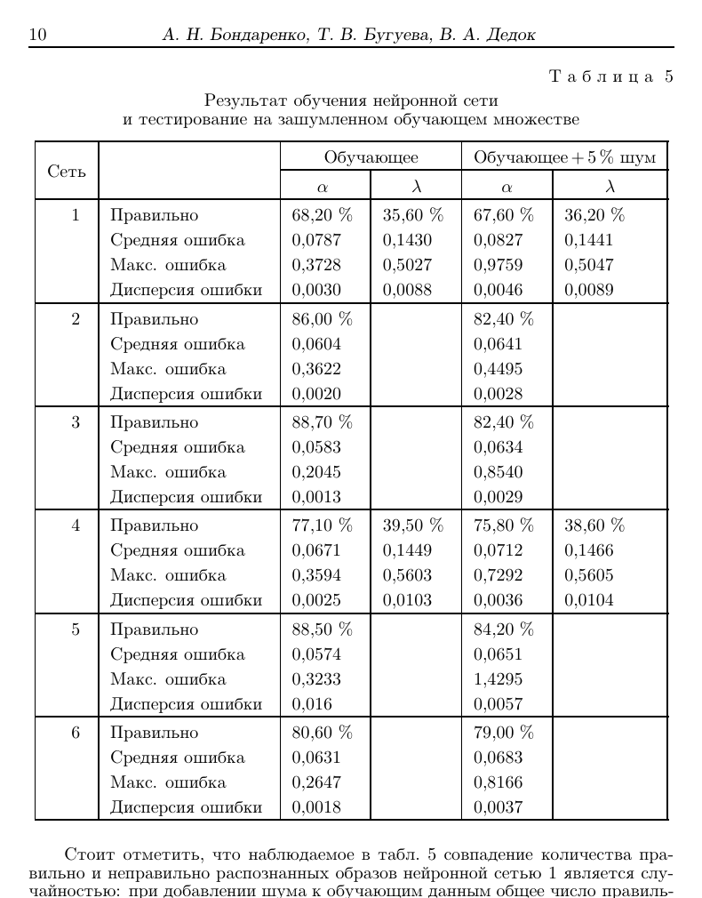

**Ошибка:** таблица превращена в обычный текст; структура строк/колонок отсутствует

**Причина:** Typed Table отсутствует, но внутри GT-области найдено TextBlock: 8. Текст извлечён без сетки ячеек, поэтому cell recall и структурные компоненты обнуляются.

**Влияние на метрику:** Object Score=0.00/100; потеря относительно идеального объекта=100.00 п.п.; cell_recall=0.00, cell_content=24.24, row_structure=0.00, column_structure=0.00, merged_f1=0.00, teds_like=0.45

**Ground Truth**

```text
Размер: 25 × 6; ячеек: 132
[H] Сеть | [H] Показатель | [H] Обучающее α | [H] Обучающее λ | [H] Обучающее + 5% шум α | [H] Обучающее + 5% шум λ
1 | Правильно | 68,20 % | 35,60 % | 67,60 % | 36,20 %
 | Средняя ошибка | 0,0787 | 0,1430 | 0,0827 | 0,1441
 | Макс. ошибка | 0,3728 | 0,5027 | 0,9759 | 0,5047
 | Дисперсия ошибки | 0,0030 | 0,0088 | 0,0046 | 0,0089
2 | Правильно | 86,00 % |  | 82,40 % | 
 | Средняя ошибка | 0,0604 |  | 0,0641 | 
 | Макс. ошибка | 0,3622 |  | 0,4495 | 
 | Дисперсия ошибки | 0,0020 |  | 0,0028 | 
3 | Правильно | 88,70 % |  | 82,40 % | 
 | Средняя ошибка | 0,0583 |  | 0,0634 | 
 | Макс. ошибка | 0,2045 |  | 0,8540 | 
 | Дисперсия ошибки | 0,0013 |  | 0,0029 | 
4 | Правильно | 77,10 % | 39,50 % | 75,80 % | 38,60 %
 | Средняя ошибка | 0,0671 | 0,1449 | 0,0712 | 0,1466
 | Макс. ошибка | 0,3594 | 0,5603 | 0,7292 | 0,5605
 | Дисперсия ошибки | 0,0025 | 0,0103 | 0,0036 | 0,0104
5 | Правильно | 88,50 % |  | 84,20 % | 
 | Средняя ошибка | 0,0574 |  | 0,0651 | 
 | Макс. ошибка | 0,3233 |  | 1,4295 | 
 | Дисперсия ошибки | 0,016 |  | 0,0057 | 
6 | Правильно | 80,60 % |  | 79,00 % | 
 | Средняя ошибка | 0,0631 |  | 0,0683 | 
 | Макс. ошибка | 0,2647 |  | 0,8166 | 
 | Дисперсия ошибки | 0,0018 |  | 0,0037 | 
```

**Output инструмента**

```text
Типизированный объект отсутствует.

Содержимое в той же области, но другого/несопоставленного типа:
- TextBlock overlap=0.02: и тестирование на зашумленном обучающем множестве
- TextBlock overlap=0.01: Результат обучения нейронной сети
- TextBlock overlap=0.01: Обучающее + 5 % шум
- TextBlock overlap=0.01: Дисперсия ошибки
- TextBlock overlap=0.01: Дисперсия ошибки
- TextBlock overlap=0.01: Дисперсия ошибки
- TextBlock overlap=0.01: Дисперсия ошибки
- TextBlock overlap=0.01: Дисперсия ошибки
```


### 3. Math — MATH_001 (D01, стр. 17)

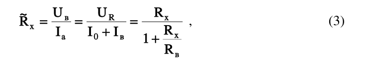

**Ошибка:** потеря fraction structure; ошибки subscript; потеря brackets

**Причина:** Exact match отсутствует; token precision=61.90, token recall=15.12, edit similarity=8.40.

**Влияние на метрику:** Object Score=11.40/100; потеря относительно идеального объекта=88.60 п.п.; raw_exact_match=0.00, normalized_exact_match=0.00, token_precision=61.90, token_recall=15.12, token_f1=24.30, edit_similarity=8.40

**Ground Truth**

```text
\tilde{R}_{x}=\frac{U_{\mathrm{в}}}{I_{\mathrm{а}}}=\frac{U_R}{I_0+I_{\mathrm{в}}}=\frac{R_x}{1+\frac{R_x}{R_{\mathrm{в}}}}
```

**Output инструмента**

```text
a 0 U U R ~R в R x = = = , x R + I I I x 0 а в + 1 R в
```


### 4. Chemistry — CHEM_003 (D02, стр. 2)


**Ошибка:** потеря химических символов/меток; неточный crop

**Причина:** Structure detection есть, но IoU=51.62, label recall=0.00, extraction=100.00.

**Влияние на метрику:** Object Score=62.91/100; потеря относительно идеального объекта=37.09 п.п.; detection=100.00, iou=51.62, label_recall=0.00, extraction=100.00, structured_extraction=47.01

**Ground Truth**

```text
Желтый «солнечный закат» (Sunset Yellow FCF); текстовые метки: HO, N=N, NaO3S, SO3Na; asset: ground_truth/assets/CHEM_003.png
```

**Output инструмента**

```text
structure; текстовые метки: нет; asset: assets\p2_image_15.jpeg
```

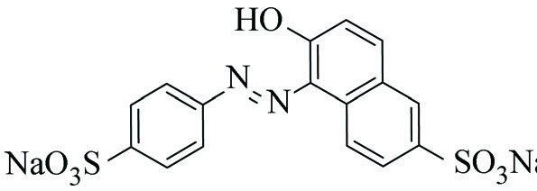


### 5. Images — IMG_004 (D05, стр. 2)


**Ошибка:** visual candidate не сопоставлен с Image GT

**Причина:** В области есть visual candidate, но он не выбран при one-to-one сопоставлении по типу/геометрии либо не имеет подтверждённого extraction payload.

**Влияние на метрику:** Object Score=0.00/100; потеря относительно идеального объекта=100.00 п.п.; detection_recall=0.00, iou=0.00, extraction=0.00, caption=0.00

**Ground Truth**

```text
caption: Рис. 1. Картины течения в системе двух параллельных проводников; asset: ground_truth/assets/IMG_004.png
```

**Output инструмента**

```text
Типизированный объект отсутствует.

Содержимое в той же области, но другого/несопоставленного типа:
- Image overlap=1.00: caption: нет; asset: assets\p2_image_16.png
```


### 6. Diagrams — DIA_001 (D01, стр. 9)


**Ошибка:** диаграмма сохранена как обычное изображение; потеря текста и связей

**Причина:** В GT-области найдено Image: 1, но Diagram отсутствует. Generic image не содержит типизированных text_elements/key_elements.

**Влияние на метрику:** Object Score=0.00/100; потеря относительно идеального объекта=100.00 п.п.; detection_recall=0.00, iou=0.00, diagram_text_recall=0.00, caption=0.00, element_recall=0.00, key_elements=0.00

**Ground Truth**

```text
тип: electrical_scheme
caption: Рис. 4.1. Схемы электрических цепей для реализации метода амперметра и вольтметра
текст: Источник напряжения, Rрег, A, V, Rx
ключевые элементы/связи: амперметр, вольтметр, измеряемое сопротивление
asset: ground_truth/assets/DIA_001.png
```

**Output инструмента**

```text
Типизированный объект отсутствует.

Содержимое в той же области, но другого/несопоставленного типа:
- Image overlap=1.00: caption: нет; asset: assets\p9_image_9.png
```

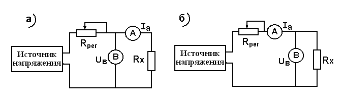

## pdfplumber

### 1. Text — TXT_008 (D04, стр. 9)

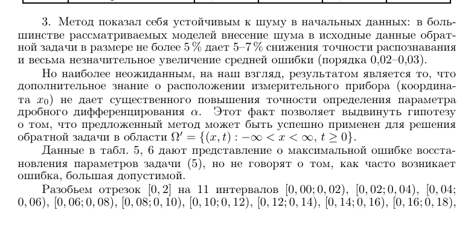

**Ошибка:** reading order или разбиение слов; ошибки OCR/символьные замены

**Причина:** Длина output составляет 0.96 от GT; CER-quality=85.36, WER-quality=50.00. Классификация причины основана на фактическом соотношении длин и разрыве между посимвольной и пословной метриками.

**Влияние на метрику:** Object Score=72.10/100; потеря относительно идеального объекта=27.90 п.п.; cer=85.36, wer=50.00, edit_similarity=85.36

**Ground Truth**

```text
3. Метод показал себя устойчивым к шуму в начальных данных: в боль-
шинстве рассматриваемых моделей внесение шума в исходные данные обрат-
ной задачи в размере не более 5 % дает 5–7 % снижения точности распознавания
и весьма незначительное увеличение средней ошибки (порядка 0,02–0,03).
Но наиболее неожиданным, на наш взгляд, результатом является то, что
дополнительное знание о расположении измерительного прибора (координа-
та x0) не дает существенного повышения точности определения параметра
дробного дифференцирования α.
Этот факт позволяет выдвинуть гипотезу
о том, что предложенный метод может быть успешно применен для решения
обратной задачи в области Ω′ = {(x, t) : −∞< x < ∞, t ≥0}.
Данные в табл. 5, 6 дают представление о максимальной ошибке восста-
новления параметров задачи (5), но не говорят о том, как часто возникает
ошибка, большая допустимой.
Разобьем отрезок [0, 2] на 11 интервалов [0, 00; 0, 02), [0, 02; 0, 04), [0, 04;
0, 06), [0, 06; 0, 08), [0, 08; 0, 10), [0, 10; 0, 12), [0, 12; 0, 14), [0, 14; 0, 16), [0, 16; 0, 18),
```

**Output инструмента**

```text
Метод
показал
себя
устойчивым
к
шуму
в
начальных
данных:
в
боль-
3.
шинстве
рассматриваемых
моделей
внесение
шума
в
исходные
данные
обрат-
нойзадачивразмеренеболее5%дает5–7%снижения
точностираспознавания
и
весьма
незначительное
увеличение
средней
ошибки
(порядка
0,02–0,03).
Но
наиболее
неожиданным,
на
наш
взгляд,
результатом
является
то,
что
дополнительное
знание
о
расположении
измерительного
прибора
(координа-
та
не
дает
существенного
повышения
точности
определения
параметра
x0)
дробного
дифференцирования
Этот
факт
позволяет
выдвинуть
гипотезу
α.
о
том,
что
предложенный
метод
может
быть
успешно
применен
для
решения
(cid:3)
={(x,t):−∞<x<∞,
t≥0}.
обратной
задачи
в
области
Ω
Данные
в
табл.
дают
представление
о
максимальной
ошибке
восста-
5,
6
новления
параметров
задачи
но
не
говорят
о
том,
как
часто
возникает
(5),
ошибка,большая
допустимой.
Разобьем
отрезок
на
интервалов
[0,2]
11
[0,00;0,02),
[0,02;0,04),
[0,04;
0,06),
[0,06;0,08),[0,08;0,10),
[0,10;0,12),
[0,12;0,14),
[0,14;0,16),
[0,16;0,18),
```


### 2. Tables — TAB_006 (D04, стр. 8)


**Ошибка:** таблица превращена в обычный текст; структура строк/колонок отсутствует

**Причина:** Typed Table отсутствует, но внутри GT-области найдено TextBlock: 8. Текст извлечён без сетки ячеек, поэтому cell recall и структурные компоненты обнуляются.

**Влияние на метрику:** Object Score=0.00/100; потеря относительно идеального объекта=100.00 п.п.; cell_recall=0.00, cell_content=24.24, row_structure=0.00, column_structure=0.00, merged_f1=0.00, teds_like=0.45

**Ground Truth**

```text
Размер: 25 × 6; ячеек: 132
[H] Сеть | [H] Показатель | [H] Обучающее α | [H] Обучающее λ | [H] Обучающее + 5% шум α | [H] Обучающее + 5% шум λ
1 | Правильно | 68,20 % | 35,60 % | 67,60 % | 36,20 %
 | Средняя ошибка | 0,0787 | 0,1430 | 0,0827 | 0,1441
 | Макс. ошибка | 0,3728 | 0,5027 | 0,9759 | 0,5047
 | Дисперсия ошибки | 0,0030 | 0,0088 | 0,0046 | 0,0089
2 | Правильно | 86,00 % |  | 82,40 % | 
 | Средняя ошибка | 0,0604 |  | 0,0641 | 
 | Макс. ошибка | 0,3622 |  | 0,4495 | 
 | Дисперсия ошибки | 0,0020 |  | 0,0028 | 
3 | Правильно | 88,70 % |  | 82,40 % | 
 | Средняя ошибка | 0,0583 |  | 0,0634 | 
 | Макс. ошибка | 0,2045 |  | 0,8540 | 
 | Дисперсия ошибки | 0,0013 |  | 0,0029 | 
4 | Правильно | 77,10 % | 39,50 % | 75,80 % | 38,60 %
 | Средняя ошибка | 0,0671 | 0,1449 | 0,0712 | 0,1466
 | Макс. ошибка | 0,3594 | 0,5603 | 0,7292 | 0,5605
 | Дисперсия ошибки | 0,0025 | 0,0103 | 0,0036 | 0,0104
5 | Правильно | 88,50 % |  | 84,20 % | 
 | Средняя ошибка | 0,0574 |  | 0,0651 | 
 | Макс. ошибка | 0,3233 |  | 1,4295 | 
 | Дисперсия ошибки | 0,016 |  | 0,0057 | 
6 | Правильно | 80,60 % |  | 79,00 % | 
 | Средняя ошибка | 0,0631 |  | 0,0683 | 
 | Макс. ошибка | 0,2647 |  | 0,8166 | 
 | Дисперсия ошибки | 0,0018 |  | 0,0037 | 
```

**Output инструмента**

```text
Типизированный объект отсутствует.

Содержимое в той же области, но другого/несопоставленного типа:
- TextBlock overlap=0.01: Обучающее+5%
- TextBlock overlap=0.00: зашумленном
- TextBlock overlap=0.00: тестирование
- TextBlock overlap=0.00: Обучающее
- TextBlock overlap=0.00: обучающем
- TextBlock overlap=0.00: Правильно
- TextBlock overlap=0.00: Правильно
- TextBlock overlap=0.00: Правильно
```


### 3. Math — MATH_001 (D01, стр. 17)


**Ошибка:** потеря fraction structure; ошибки subscript; потеря brackets

**Причина:** Exact match отсутствует; token precision=60.00, token recall=13.95, edit similarity=9.16.

**Влияние на метрику:** Object Score=10.89/100; потеря относительно идеального объекта=89.11 п.п.; raw_exact_match=0.00, normalized_exact_match=0.00, token_precision=60.00, token_recall=13.95, token_f1=22.64, edit_similarity=9.16

**Ground Truth**

```text
\tilde{R}_{x}=\frac{U_{\mathrm{в}}}{I_{\mathrm{а}}}=\frac{U_R}{I_0+I_{\mathrm{в}}}=\frac{R_x}{1+\frac{R_x}{R_{\mathrm{в}}}}
```

**Output инструмента**

```text
a 0 U U R ~ в R x = = = , R x R + I I I x 0 а в 1+ R в
```


### 4. Chemistry — CHEM_003 (D02, стр. 2)


**Ошибка:** потеря химических символов/меток; structural formula не извлечена; неточный crop

**Причина:** Structure detection есть, но IoU=53.20, label recall=0.00, extraction=0.00.

**Влияние на метрику:** Object Score=43.30/100; потеря относительно идеального объекта=56.70 п.п.; detection=100.00, iou=53.20, label_recall=0.00, extraction=0.00, structured_extraction=19.00

**Ground Truth**

```text
Желтый «солнечный закат» (Sunset Yellow FCF); текстовые метки: HO, N=N, NaO3S, SO3Na; asset: ground_truth/assets/CHEM_003.png
```

**Output инструмента**

```text
structure; текстовые метки: нет; asset: нет
```


### 5. Images — IMG_004 (D05, стр. 2)


**Ошибка:** visual candidate не сопоставлен с Image GT

**Причина:** В области есть visual candidate, но он не выбран при one-to-one сопоставлении по типу/геометрии либо не имеет подтверждённого extraction payload.

**Влияние на метрику:** Object Score=0.00/100; потеря относительно идеального объекта=100.00 п.п.; detection_recall=0.00, iou=0.00, extraction=0.00, caption=0.00

**Ground Truth**

```text
caption: Рис. 1. Картины течения в системе двух параллельных проводников; asset: ground_truth/assets/IMG_004.png
```

**Output инструмента**

```text
Типизированный объект отсутствует.

Содержимое в той же области, но другого/несопоставленного типа:
- Image overlap=1.00: caption: нет; asset: нет
```


### 6. Diagrams — DIA_001 (D01, стр. 9)


**Ошибка:** диаграмма сохранена как обычное изображение; потеря текста и связей

**Причина:** В GT-области найдено Image: 1, но Diagram отсутствует. Generic image не содержит типизированных text_elements/key_elements.

**Влияние на метрику:** Object Score=0.00/100; потеря относительно идеального объекта=100.00 п.п.; detection_recall=0.00, iou=0.00, diagram_text_recall=0.00, caption=0.00, element_recall=0.00, key_elements=0.00

**Ground Truth**

```text
тип: electrical_scheme
caption: Рис. 4.1. Схемы электрических цепей для реализации метода амперметра и вольтметра
текст: Источник напряжения, Rрег, A, V, Rx
ключевые элементы/связи: амперметр, вольтметр, измеряемое сопротивление
asset: ground_truth/assets/DIA_001.png
```

**Output инструмента**

```text
Типизированный объект отсутствует.

Содержимое в той же области, но другого/несопоставленного типа:
- Image overlap=1.00: caption: нет; asset: нет
```

## Docling

### 1. Text — TXT_009 (D05, стр. 10)


**Ошибка:** reading order или разбиение слов; сломанные переносы; ошибки OCR/символьные замены

**Причина:** Длина output составляет 0.91 от GT; CER-quality=90.82, WER-quality=57.59. Классификация причины основана на фактическом соотношении длин и разрыве между посимвольной и пословной метриками.

**Влияние на метрику:** Object Score=78.36/100; потеря относительно идеального объекта=21.64 п.п.; cer=90.82, wer=57.59, edit_similarity=90.82

**Ground Truth**

```text
5.2. Поверхностные электронные состояния 
Поверхностные электронные состояния (ПЭС) играют 
важную роль в теории полупроводников, так как именно 
они определяют контактные электронные свойства [34]. 
Реальная поверхность любого металла покрыта оксид­
ной пленкой, свойства которой ближе к полупроводни­
ковым, то же самое можно сказать и о л ю б о м металличе­
ском электроде. П о определению П Э С связаны только с 
узкой областью вблизи поверхности, где свойства кри­
сталла сильно отличаются от свойств бесконечной кри­
сталлической решетки. В этой области возникает нерав­
н о м е р н о е распределение з а р я д о в как по н о р м а л и к 
поверхности, так и вдоль нее; имеются специфические 
центры адсорбции электронов, связанные с дефектами 
кристаллической решетки, геометрическими неоднород-
н о с т я м и и т.д. В качестве п р и м е р а приведем схему 
распределения поверхностных электронов на границе 
кристалла кремния, покрытого оксидной пленкой S i 0 2 
(рис. 10) [34]. Из рисунка видно, что по мере продвижения 
от свободной поверхности (т.е. оксида кремния) к кри­
сталлу кремния П Э С изменяются, последовательно пере­
ходя от локализованных состояний 7, 2 (обусловленных 
наличием ловушек, образованных за счет адсорбции 
молекул воды с последующим формированием связей 
S i - О Н . . . Н О - S i ) к состояниям медленных 3 и быстрых 
4 поверхностных электронов и, наконец, к рекомбина-
ционным состояниям 5.
```

**Output инструмента**

```text
5.2. Поверхностные электронные состояния
Поверхностные электронные состояния (ПЭС) играют важную роль теории полупроводников, так как именно они определяют контактные электронные свойства [34] Реальная поверхность любого металла покрыта оксидной пленкой; свойства которой ближе к полупроводниковым, то же самое можно сказать и о любом металлическом электроде. По определению ПЭС связаны только областью вблизи повсрхности, гдс свойства кристалла сильно отличаются от свойств бесконечной кристаллической решетки В этой области возникает неравномерное распределение зарядов как По нормали поверхности, так нее; имеются специфические центры адсорбции электронов; связанные дефектами кристаллической решетки, геометрическими неоднородностями качестве примера приведем схему распределения поверхностных электронов на границе кристалла кремния, покрытого оксидной пленкой SiOz (рис. 10) [34]. Из рисунка видно, что по мере продвижения от свободной поверхности (т с. оксида кремния) к кристаллу кремния ПЭС изменяются, последовательно переходя от локализованных состояний 1, 2 (обусловленных наличием ловушек, образованных за счет адсорбции молекул последующим формированием связей Si _OH: HO_Si) к состояниям медленных 3 и быстрых поверхностных электронов И; наконец; рекомбинационным состояниям 5. узкой
```


### 2. Tables — TAB_006 (D04, стр. 8)


**Ошибка:** потеря строк; ошибки объединения ячеек; искажение содержимого ячеек

**Причина:** GT=25×6, output=8×6; headers 6→7. Cell recall=19.70, TEDS-like=17.19.

**Влияние на метрику:** Object Score=28.82/100; потеря относительно идеального объекта=71.18 п.п.; cell_recall=19.70, cell_content=25.54, row_structure=32.00, column_structure=100.00, merged_f1=0.00, teds_like=17.19

**Ground Truth**

```text
Размер: 25 × 6; ячеек: 132
[H] Сеть | [H] Показатель | [H] Обучающее α | [H] Обучающее λ | [H] Обучающее + 5% шум α | [H] Обучающее + 5% шум λ
1 | Правильно | 68,20 % | 35,60 % | 67,60 % | 36,20 %
 | Средняя ошибка | 0,0787 | 0,1430 | 0,0827 | 0,1441
 | Макс. ошибка | 0,3728 | 0,5027 | 0,9759 | 0,5047
 | Дисперсия ошибки | 0,0030 | 0,0088 | 0,0046 | 0,0089
2 | Правильно | 86,00 % |  | 82,40 % | 
 | Средняя ошибка | 0,0604 |  | 0,0641 | 
 | Макс. ошибка | 0,3622 |  | 0,4495 | 
 | Дисперсия ошибки | 0,0020 |  | 0,0028 | 
3 | Правильно | 88,70 % |  | 82,40 % | 
 | Средняя ошибка | 0,0583 |  | 0,0634 | 
 | Макс. ошибка | 0,2045 |  | 0,8540 | 
 | Дисперсия ошибки | 0,0013 |  | 0,0029 | 
4 | Правильно | 77,10 % | 39,50 % | 75,80 % | 38,60 %
 | Средняя ошибка | 0,0671 | 0,1449 | 0,0712 | 0,1466
 | Макс. ошибка | 0,3594 | 0,5603 | 0,7292 | 0,5605
 | Дисперсия ошибки | 0,0025 | 0,0103 | 0,0036 | 0,0104
5 | Правильно | 88,50 % |  | 84,20 % | 
 | Средняя ошибка | 0,0574 |  | 0,0651 | 
 | Макс. ошибка | 0,3233 |  | 1,4295 | 
 | Дисперсия ошибки | 0,016 |  | 0,0057 | 
6 | Правильно | 80,60 % |  | 79,00 % | 
 | Средняя ошибка | 0,0631 |  | 0,0683 | 
 | Макс. ошибка | 0,2647 |  | 0,8166 | 
 | Дисперсия ошибки | 0,0018 |  | 0,0037 | 
```

**Output инструмента**

```text
Размер: 8 × 6; ячеек: 35
 |  | [H] Обучающее |  | [H] Обучающее + 5 % шум | 
[H] Сеть |  | [H] α | [H] λ | [H] α | [H] λ
1 | Правильно Средняя ошибка Макс. ошибка Дисперсия ошибки | 68,20 % 0,0787 0,3728 0,0030 | 35,60 % 0,1430 0,5027 0,0088 | 67,60 % 0,0827 0,9759 0,0046 | 36,20 % 0,1441 0,5047 0,0089
2 | Правильно Средняя ошибка Макс. ошибка Дисперсия ошибки | 86,00 % 0,0604 0,3622 0,0020 |  | 82,40 % 0,0641 0,4495 0,0028 | 
3 | Правильно Средняя ошибка Макс. ошибка Дисперсия ошибки | 88,70 % 0,0583 0,2045 0,0013 |  | 82,40 % 0,0634 0,8540 0,0029 | 
4 | Правильно Средняя ошибка Макс. ошибка Дисперсия ошибки | 77,10 % 0,0671 0,3594 0,0025 | 39,50 % 0,1449 0,5603 0,0103 | 75,80 % 0,0712 0,7292 0,0036 | 38,60 % 0,1466 0,5605 0,0104
5 | Правильно Средняя ошибка Макс. ошибка Дисперсия ошибки | 88,50 % 0,0574 0,3233 0,016 |  | 84,20 % 0,0651 1,4295 0,0057 | 
6 | Правильно Средняя ошибка Макс. ошибка Дисперсия ошибки | 80,60 % 0,0631 0,2647 0,0018 |  | 79,00 % 0,0683 0,8166 0,0037 | 
```


### 3. Math — MATH_006 (D05, стр. 19)


**Ошибка:** потеря fraction structure; ошибки superscript; потеря Greek symbols; потеря operators

**Причина:** Exact match отсутствует; token precision=12.05, token recall=34.54, edit similarity=9.22.

**Влияние на метрику:** Object Score=8.99/100; потеря относительно идеального объекта=91.01 п.п.; raw_exact_match=0.00, normalized_exact_match=0.00, token_precision=12.05, token_recall=34.54, token_f1=17.87, edit_similarity=9.22

**Ground Truth**

```text
j(t)=j_e(t)+j_i(t)+j_d(t),\quad j_e(t)=\varepsilon\varepsilon_0\left.\frac{\partial E_1}{\partial t}\right|_{x=0},\quad j_i(t)=e(\mu_1n_{10}+\mu_2n_{20})E_0+\left.e\mu_2n_{20}E_1\right|_{x=0},\quad j_d(t)=\left.e\mu_2n_{21}\right|_{x=0}E_0,\quad \left.E_1\right|_{x=0}=\frac{en_0}{\varepsilon\varepsilon_0d}\left[(x_1+x_2)d-\frac{d^2}{2}-\frac{1}{2}(x_1^2+x_2^2)\right],\quad \left.n_{21}\right|_{x=0}=\left(k_dN-\mu_2\frac{en_0^2}{\varepsilon_0\varepsilon}\right)\frac{x_1}{V_2},\quad t\le t_*;\quad \left.n_{21}\right|_{x=0}=k_dN\frac{d}{V_2}-\mu_2\frac{en_0^2}{\varepsilon\varepsilon_0}\frac{x_2}{V_2},\quad t>t_*
```

**Output инструмента**

```text
\Pi o c j e \colon & \rho j e _ { N } h a ( 5 5 ) \ n \ \Pi o c j e A \bar { h } \ \bar { b } e p x , \\ \hom e \left ( 5 \right ) c \ & \top \Pi o c \bar { b } \ \Pi o \ J \bar { h } \ \Pi o \bar { h } \ \Pi o \bar { h } \ \Pi o \ J \bar { h } \ \Pi o \ J \bar { h } \ \Pi o \ J \bar { h } \ \Pi o \ J \bar { h } \ \Pi o \ J \bar { h } \ \Pi o \ J \bar { h } \ \Pi o \ J \bar { h } \ \Pi o \ J \bar { h } \ \Pi o \ J \bar { h } \ \Pi o \ J \bar { h } \ \Pi o \ J \bar { h } \ \Pi o \ J \bar { h } \ \Pi o \ J \bar { h } \ \Pi o \ J \bar { h } \ \Pi o \ J \bar { h } \ \Pi o \ J \bar { h } \ \Pi o \ J \bar { h } \ \Pi o \ J \bar { h } \ \Pi o \ J \bar { h } \ \Pi o \ J \bar { h } \ \Pi o \ J \bar { h } \ \Pi o \ J \bar { h } \ \Pi o \ J \bar { h } \ \Pi o \ J \bar { h } \ \Pi o \ J \bar { h } \ \Pi o \ J \bar { h } \ \Pi o \ J \bar { h } \ \Pi o \ J \bar { h } \ \Pi o \ J \bar { h } \ \Pi o \ J \bar { h } \ \Pi o \ J \bar { h } \ \Pi o \ J \bar { h } \ \Pi o \ J \bar { h } \ \Pi o \ J \bar { h } \ \Pi o \ J \bar { h } \ \Pi o \ J \bar { h } \ \Pi o \ J \bar { h } \ \Pi o \ J \bar { h } \ \Pi o \ J \bar { h } \ \Pi o \ J \bar { h } \ \Pi o \ J \bar { h } \ \Pi o \ J \bar { h } \ \Pi o \ J \bar { h } \ \Pi o \ J \bar { h } \ \Pi o \ J \bar { h } \ \Pi o \ J \bar { h } \ \Pi o \ J \bar { h } \ \Pi o \ J \bar { h } \ \Pi o \ J \bar { h } \ \Pi o \ J \bar { h } \ \Pi o \ J \bar { h } \ \Pi o \ J \bar { h } \ \Pi o \ J \bar { h } \ \Pi o \ J \bar { h } \ \Pi o \ J \bar { h } \ \Pi o \ J \bar { h } \ \Pi o \ J \bar { h } \ \Pi o \ J \bar { h } \ \Pi o \ J \bar { h } \ \Pi o \ J \bar { h } \ \Pi o \ J \bar { h } \ \Pi o \ J \bar { h } \ \Pi o \ J \bar { h } \ \Pi o \ J \bar { h } \ \Pi o \ J \bar { h } \ \Pi o \ J \bar { h } \ \Pi o \ J \bar { h } \ \Pi o \ J \bar { h } \ \Pi o \ J \bar { h } \ \Pi o \ J \bar { h } \ \Pi o \ J \bar { h } \ \Pi o \ J \bar { h } \ \Pi o \ J \bar { h } \ \Pi o \ J \bar { h } \ \Pi o \ J \bar { h } \ \Pi o \ J \bar { h } \ \Pi o \ J \bar { h } \ \Pi o \ J \bar { h } \ \Pi o \ J \bar { h } \ \Pi o \ J \bar { h } \ \Pi o \ J \bar { h } \ \Pi o \ J \bar { h } \ \Pi o \ J \bar { h } \ \Pi o \ J \bar { h } \ \Pi o \ J \bar { h } \ \Pi o \ J \bar { h } \ \Pi o \ J \bar { h } \ \Pi o \ J \bar { h } \ \Pi o \ J \bar { h } \ \Pi o \ J \bar { h } \ \Pi o \ J \bar { h } \ \Pi o \ J \bar { h } \ \Pi o \ J \bar { h } \ \Pi o \ J \bar { h } \ \Pi o \ J \bar
… [полное значение в examples.json]
```


### 4. Chemistry — CHEM_004 (D02, стр. 2)


**Ошибка:** потеря химических символов/меток; structural formula не извлечена; неточный crop

**Причина:** Structure detection есть, но IoU=48.78, label recall=0.00, extraction=0.00.

**Влияние на метрику:** Object Score=42.20/100; потеря относительно идеального объекта=57.80 п.п.; detection=100.00, iou=48.78, label_recall=0.00, extraction=0.00, structured_extraction=17.42

**Ground Truth**

```text
Тартразин (Tartrazine); текстовые метки: NaOOC, N=N, OH, NaO3S, SO3Na; asset: ground_truth/assets/CHEM_004.png
```

**Output инструмента**

```text
structure; текстовые метки: нет; asset: нет
```


### 5. Images — IMG_003 (D01, стр. 27)


**Ошибка:** visual candidate не сопоставлен с Image GT

**Причина:** В области есть visual candidate, но он не выбран при one-to-one сопоставлении по типу/геометрии либо не имеет подтверждённого extraction payload.

**Влияние на метрику:** Object Score=0.00/100; потеря относительно идеального объекта=100.00 п.п.; detection_recall=0.00, iou=0.00, extraction=0.00, caption=0.00

**Ground Truth**

```text
caption: Рис. 3.2. Лицевая панель цифрового интегрирующего вольтметра В7-23; asset: ground_truth/assets/IMG_003.png
```

**Output инструмента**

```text
Типизированный объект отсутствует.

Содержимое в той же области, но другого/несопоставленного типа:
- Diagram overlap=0.97: тип: scientific_scheme
caption: Рис. 3.2. Лицевая панель цифрового интегрирующего вольтметра В7-23
текст: Вольтнетр универсальный цифровой В7-23, ЗАПЧЕК, D.l, 1D, IDD, BКЛ, нт, 1D, IUUD дBT, ДЧ БЛОК СЕТЬ
ключевые элементы/связи: нет
asset: assets\picture_0007.png
```

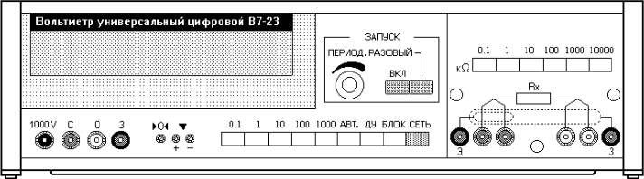


### 6. Diagrams — DIA_003 (D02, стр. 4)


**Ошибка:** потеря текста; потеря связей/ключевых элементов; потеря caption

**Причина:** Detection=100.00, IoU=93.74, diagram text recall=0.00, key elements=0.00.

**Влияние на метрику:** Object Score=34.06/100; потеря относительно идеального объекта=65.94 п.п.; detection_recall=100.00, iou=93.74, diagram_text_recall=0.00, caption=0.00, element_recall=0.00, key_elements=0.00

**Ground Truth**

```text
тип: chart
caption: Намагниченность насыщения: а – ХМК–C16–100/Fe3O4; б – ХМК–C16–250/Fe3O4
текст: Намагниченность, Магнитное поле
ключевые элементы/связи: кривая намагничивания, ось поля, ось намагниченности
asset: ground_truth/assets/DIA_003.png
```

**Output инструмента**

```text
тип: chart
caption: нет
текст: 04, 5, nn, 124, =
ключевые элементы/связи: нет
asset: assets\picture_0001.png
```

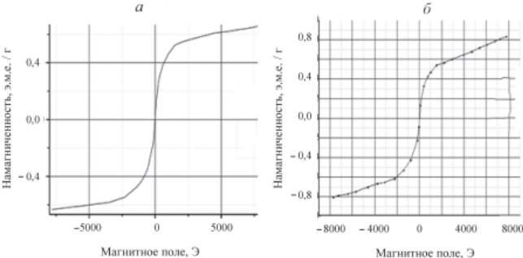

## pdfminer.six

### 1. Text — TXT_009 (D05, стр. 10)


**Ошибка:** потеря символов/строк; reading order или разбиение слов; сломанные переносы; ошибки OCR/символьные замены

**Причина:** Длина output составляет 0.43 от GT; CER-quality=25.25, WER-quality=0.00. Классификация причины основана на фактическом соотношении длин и разрыве между посимвольной и пословной метриками.

**Влияние на метрику:** Object Score=15.78/100; потеря относительно идеального объекта=84.22 п.п.; cer=25.25, wer=0.00, edit_similarity=25.25

**Ground Truth**

```text
5.2. Поверхностные электронные состояния 
Поверхностные электронные состояния (ПЭС) играют 
важную роль в теории полупроводников, так как именно 
они определяют контактные электронные свойства [34]. 
Реальная поверхность любого металла покрыта оксид­
ной пленкой, свойства которой ближе к полупроводни­
ковым, то же самое можно сказать и о л ю б о м металличе­
ском электроде. П о определению П Э С связаны только с 
узкой областью вблизи поверхности, где свойства кри­
сталла сильно отличаются от свойств бесконечной кри­
сталлической решетки. В этой области возникает нерав­
н о м е р н о е распределение з а р я д о в как по н о р м а л и к 
поверхности, так и вдоль нее; имеются специфические 
центры адсорбции электронов, связанные с дефектами 
кристаллической решетки, геометрическими неоднород-
н о с т я м и и т.д. В качестве п р и м е р а приведем схему 
распределения поверхностных электронов на границе 
кристалла кремния, покрытого оксидной пленкой S i 0 2 
(рис. 10) [34]. Из рисунка видно, что по мере продвижения 
от свободной поверхности (т.е. оксида кремния) к кри­
сталлу кремния П Э С изменяются, последовательно пере­
ходя от локализованных состояний 7, 2 (обусловленных 
наличием ловушек, образованных за счет адсорбции 
молекул воды с последующим формированием связей 
S i - О Н . . . Н О - S i ) к состояниям медленных 3 и быстрых 
4 поверхностных электронов и, наконец, к рекомбина-
ционным состояниям 5.
```

**Output инструмента**

```text
т
е с
я
я ( П
С)
в, т
к к
к и
о
е с
а [34].
а
а п
е к п
м м
ы т
е с
е э
е
и п
5.2. П
е
ь в т
т к
ю р
и о
я п
й п
м, т
м э
й о
а с
ь л
а к
о с
е э
о м
й б
ь и о л
С с
ю П
и, г
в б
и в
в
е; и
и п
я о
т с
и. В э
й о
е
к и в
и э
ь н
в, с
й, с
е м
е с
о ж
е. П
о о
ю в
о о
й р
е
и, т
ы а
о с
а к
й к
т н
о
к
я
е с
к
и
е
и
д-
а
м
у
е
й S i 02
о, ч
е п
о м
о п
я) к к
я
х
и
В к
й р
и, г
и т . д.
и н
е
в
а
я
й п
я, п
а к
с. 10) [34]. И
з р
и (т.е. о
я, п
й п
С и
я П
о
а в
а к
о п
й 7, 2 ( о
а
х
т
м
м
О - S i) к с
в и, н
ц, к
(р
т с
у к
т л
я о
м
л
S i - О
4 п
м с
х с
к,
ы с п
Н .. . Н
х
м 5.
х
и
й
м м
х
х 3 и б
а-
```


### 2. Tables — TAB_001 (D01, стр. 4)


**Ошибка:** таблица превращена в обычный текст; структура строк/колонок отсутствует

**Причина:** Typed Table отсутствует, но внутри GT-области найдено TextBlock: 8. Текст извлечён без сетки ячеек, поэтому cell recall и структурные компоненты обнуляются.

**Влияние на метрику:** Object Score=0.00/100; потеря относительно идеального объекта=100.00 п.п.; cell_recall=0.00, cell_content=0.00, row_structure=0.00, column_structure=0.00, merged_f1=100.00, teds_like=1.96

**Ground Truth**

```text
Размер: 5 × 6; ячеек: 30
[H] Тип | [H] Число декад | [H] Пределы воспроизведения R, Ом | [H] Дискретность воспроизведения, Ом | [H] Класс точности γ, % | [H] Допускаемая мощность на декаду, Вт
Р 33 | 6 | 0–100000 | 0,1 | 0,2 | 0,5
КМС 6 | 6 | 0–100000 | 0,1 | 0,2 | 0,5
МСР 60М | 6 | 0–10000 | 0,01 | 0,02 | 0,5
МСР 63 | 7 | 0–100000 | 0,01 | 0,05 | 0,5
```

**Output инструмента**

```text
Типизированный объект отсутствует.

Содержимое в той же области, но другого/несопоставленного типа:
- TextBlock overlap=0.01: Допускаема
- TextBlock overlap=0.01: 0 - 100000
- TextBlock overlap=0.01: 0 - 100000
- TextBlock overlap=0.01: 0 - 100000
- TextBlock overlap=0.01: произведе-
- TextBlock overlap=0.01: ведения R
- TextBlock overlap=0.01: ность вос-
- TextBlock overlap=0.01: 0 - 10000
```


### 3. Math — MATH_001 (D01, стр. 17)


**Ошибка:** потеря fraction structure; ошибки subscript; потеря brackets

**Причина:** Exact match отсутствует; token precision=63.16, token recall=13.95, edit similarity=9.16.

**Влияние на метрику:** Object Score=10.97/100; потеря относительно идеального объекта=89.03 п.п.; raw_exact_match=0.00, normalized_exact_match=0.00, token_precision=63.16, token_recall=13.95, token_f1=22.86, edit_similarity=9.16

**Ground Truth**

```text
\tilde{R}_{x}=\frac{U_{\mathrm{в}}}{I_{\mathrm{а}}}=\frac{U_R}{I_0+I_{\mathrm{в}}}=\frac{R_x}{1+\frac{R_x}{R_{\mathrm{в}}}}
```

**Output инструмента**

```text
U R в R x ~R = = = , U I x + I I 0 а в + 1 R R x в
```


### 4. Chemistry — CHEM_003 (D02, стр. 2)


**Ошибка:** потеря химических символов/меток; неточный crop

**Причина:** Structure detection есть, но IoU=53.20, label recall=0.00, extraction=100.00.

**Влияние на метрику:** Object Score=63.30/100; потеря относительно идеального объекта=36.70 п.п.; detection=100.00, iou=53.20, label_recall=0.00, extraction=100.00, structured_extraction=47.57

**Ground Truth**

```text
Желтый «солнечный закат» (Sunset Yellow FCF); текстовые метки: HO, N=N, NaO3S, SO3Na; asset: ground_truth/assets/CHEM_003.png
```

**Output инструмента**

```text
structure; текстовые метки: нет; asset: assets\Im15.jpg
```

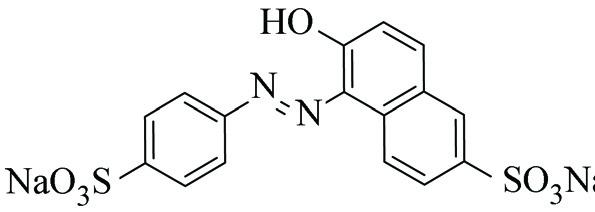


### 5. Images — IMG_004 (D05, стр. 2)


**Ошибка:** visual candidate не сопоставлен с Image GT

**Причина:** В области есть visual candidate, но он не выбран при one-to-one сопоставлении по типу/геометрии либо не имеет подтверждённого extraction payload.

**Влияние на метрику:** Object Score=0.00/100; потеря относительно идеального объекта=100.00 п.п.; detection_recall=0.00, iou=0.00, extraction=0.00, caption=0.00

**Ground Truth**

```text
caption: Рис. 1. Картины течения в системе двух параллельных проводников; asset: ground_truth/assets/IMG_004.png
```

**Output инструмента**

```text
Типизированный объект отсутствует.

Содержимое в той же области, но другого/несопоставленного типа:
- Image overlap=1.00: caption: нет; asset: assets\im2.bmp
```

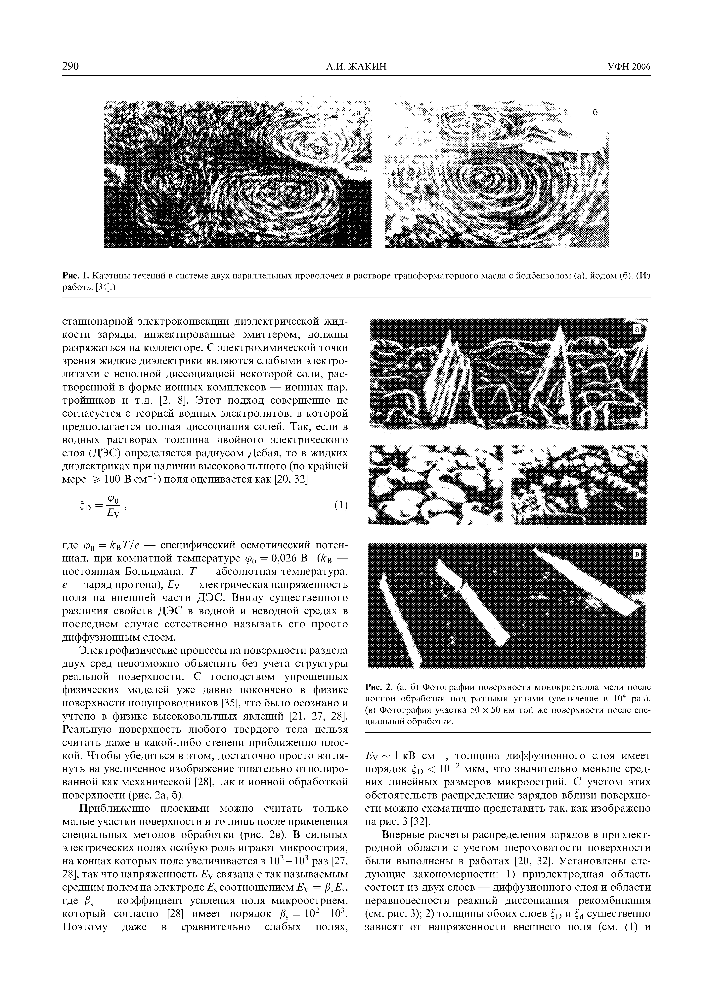


### 6. Diagrams — DIA_001 (D01, стр. 9)


**Ошибка:** диаграмма сохранена как обычное изображение; потеря текста и связей

**Причина:** В GT-области найдено Image: 1, но Diagram отсутствует. Generic image не содержит типизированных text_elements/key_elements.

**Влияние на метрику:** Object Score=0.00/100; потеря относительно идеального объекта=100.00 п.п.; detection_recall=0.00, iou=0.00, diagram_text_recall=0.00, caption=0.00, element_recall=0.00, key_elements=0.00

**Ground Truth**

```text
тип: electrical_scheme
caption: Рис. 4.1. Схемы электрических цепей для реализации метода амперметра и вольтметра
текст: Источник напряжения, Rрег, A, V, Rx
ключевые элементы/связи: амперметр, вольтметр, измеряемое сопротивление
asset: ground_truth/assets/DIA_001.png
```

**Output инструмента**

```text
Типизированный объект отсутствует.

Содержимое в той же области, но другого/несопоставленного типа:
- Image overlap=1.00: caption: нет; asset: assets\Im1.jpg
```

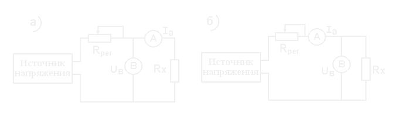

## MinerU

### 1. Text — TXT_007 (D04, стр. 7)

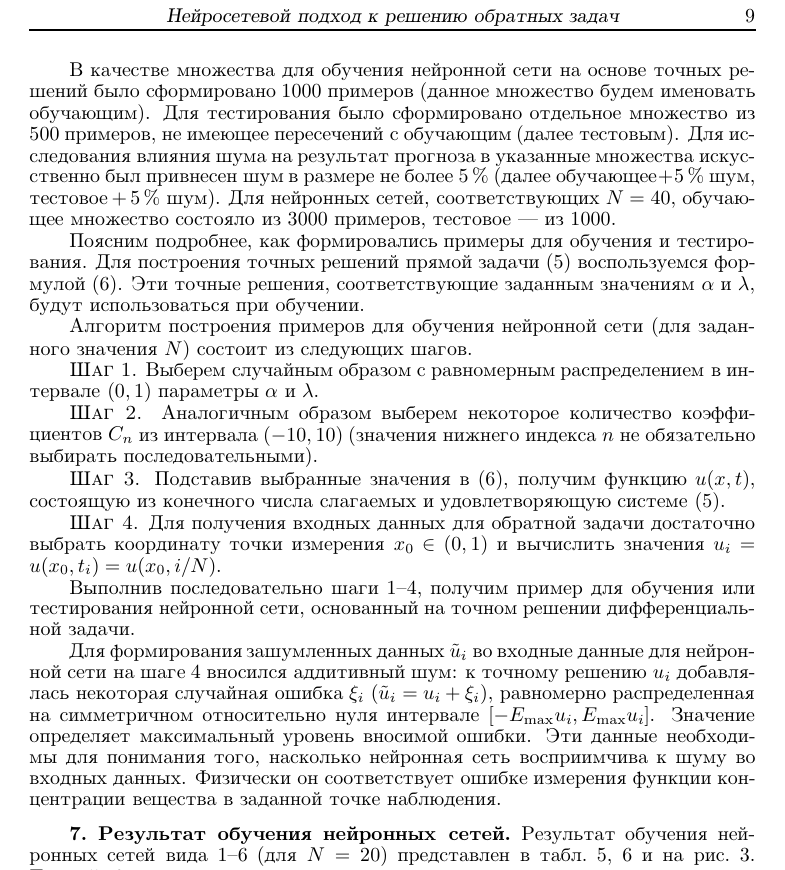

**Ошибка:** reading order или разбиение слов; сломанные переносы; ошибки OCR/символьные замены

**Причина:** Длина output составляет 1.14 от GT; CER-quality=83.87, WER-quality=35.20. Классификация причины основана на фактическом соотношении длин и разрыве между посимвольной и пословной метриками.

**Влияние на метрику:** Object Score=65.88/100; потеря относительно идеального объекта=34.12 п.п.; cer=83.87, wer=35.20, edit_similarity=86.00

**Ground Truth**

```text
В качестве множества для обучения нейронной сети на основе точных ре-
шений было сформировано 1000 примеров (данное множество будем именовать
обучающим). Для тестирования было сформировано отдельное множество из
500 примеров, не имеющее пересечений с обучающим (далее тестовым). Для ис-
следования влияния шума на результат прогноза в указанные множества искус-
ственно был привнесен шум в размере не более 5 % (далее обучающее+5 % шум,
тестовое + 5 % шум). Для нейронных сетей, соответствующих N = 40, обучаю-
щее множество состояло из 3000 примеров, тестовое — из 1000.
Поясним подробнее, как формировались примеры для обучения и тестиро-
вания. Для построения точных решений прямой задачи (5) воспользуемся фор-
мулой (6). Эти точные решения, соответствующие заданным значениям α и λ,
будут использоваться при обучении.
Алгоритм построения примеров для обучения нейронной сети (для задан-
ного значения N) состоит из следующих шагов.
Шаг 1. Выберем случайным образом с равномерным распределением в ин-
тервале (0, 1) параметры α и λ.
Шаг 2.
Аналогичным образом выберем некоторое количество коэффи-
циентов Cn из интервала (−10, 10) (значения нижнего индекса n не обязательно
выбирать последовательными).
Шаг 3. Подставив выбранные значения в (6), получим функцию u(x, t),
состоящую из конечного числа слагаемых и удовлетворяющую системе (5).
Шаг 4. Для получения входных данных для обратной задачи достаточно
выбрать координату точки измерения x0 ∈(0, 1) и вычислить значения ui =
u(x0, ti) = u(x0, i/N).
Выполнив последовательно шаги 1–4, получим пример для обучения или
тестирования нейронной сети, основанный на точном решении дифференциаль-
ной задачи.
Для формирования зашумленных данных ˜ui во входные данные для нейрон-
ной сети на шаге 4 вносился аддитивный шум: к точному решению ui добавля-
лась некоторая случайная ошибка ξi (˜ui = ui + ξi), равномерно распределенная
на симметричном относительно нуля интервале [−Emaxui, Emaxui].
Значение
определяет максимальный уровень вносимой ошибки. Эти данные необходи-
мы для понимания того, насколько нейронная сеть восприимчива к шуму во
входных данных. Физически он соответствует ошибке измерения функции кон-
центрации вещества в заданной точке наблюдения.
```

**Output инструмента**

```text
В качестве множества для обучения нейронной сети на основе точных ре- шений было сформировано 1000 примеров (данное множество будем именовать обучающим). Для тестирования было сформировано отдельное множество из 500 примеров, не имеющее пересечений $\mathrm { c o \bar { o } y }$ чающим (далее тестовым). Для ис- следования влияния шума на результат прогноза в указанные множества искус- ственно был привнесен шум в размере не более $5 \%$ (далее обучающее+5 % шум, тестовое + 5 % шум). Для нейронных сетей, соответствующих $N = 4 0 .$ , обучаю- щее множество состояло из 3000 примеров, тестовое — из 1000.
Поясним подробнее, как формировались примеры для обучения и тестиро- вания. Для построения точных решений прямой задачи (5) воспользуемся фор- мулой (6). Эти точные решения, соответствующие заданным значениям α и $\lambda ,$ будут использоваться при обучении.
Алгоритм построения примеров для $\mathrm { o 6 y }$ чения нейронной сети (для задан- ного значения $N )$ состоит из следующих шагов.
Шаг 1. Выберем случайным образом с равномерным распределением в ин- тервале (0, 1) параметры α и λ.
Шаг 2. Аналогичным образом выберем некоторое количество коэффи- циентов $C _ { n }$ из интервала (−10, 10) (значения нижнего индекса n не обязательно выбирать последовательными).
Шаг 3. Подставив выбранные значения в (6), получим функцию $u ( x , t )$ состоящую из конечного числа слагаемых и удовлетворяющую системе (5).
Шаг 4. Для получения входных данных для обратной задачи достаточно выбрать координату точки измерения $x _ { 0 } \in ( 0 , 1 )$ и вычислить значения $u _ { i } =$ $\bar { u ( x _ { 0 } , t _ { i } ) } = \bar { u ( x _ { 0 } , i / N ) }$
Выполнив последовательно шаги 1–4, получим пример для $\mathrm { o 6 y }$ чения или тестирования нейронной сети, основанный на точном решении дифференциаль- ной задачи.
Для формирования зашумленных данных $\tilde { u } _ { i }$ во входные данные для нейрон- ной сети на шаге 4 вносился аддитивный шум: к точному решению $u _ { i }$ добавля- лась некоторая случайная ошибка $\xi _ { i } ( \tilde { u } _ { i } = u _ { i } + \xi _ { i } )$ , равномерно распределенная на симметричном относительно нуля интервале $[ - E _ { \operatorname* { m a x } } u _ { i } , E _ { \operatorname* { m a x } } u _ { i } ]$ Значение определяет максимальный уровень вносимой ошибки. Эти данные необходи- мы для понимания того, насколько нейронная сеть восприи
… [полное значение в examples.json]
```


### 2. Tables — TAB_006 (D04, стр. 8)


**Ошибка:** потеря строк; ошибки объединения ячеек; искажение содержимого ячеек

**Причина:** GT=25×6, output=8×6; headers 6→6. Cell recall=31.06, TEDS-like=26.79.

**Влияние на метрику:** Object Score=35.92/100; потеря относительно идеального объекта=64.08 п.п.; cell_recall=31.06, cell_content=27.04, row_structure=32.00, column_structure=100.00, merged_f1=0.00, teds_like=26.79

**Ground Truth**

```text
Размер: 25 × 6; ячеек: 132
[H] Сеть | [H] Показатель | [H] Обучающее α | [H] Обучающее λ | [H] Обучающее + 5% шум α | [H] Обучающее + 5% шум λ
1 | Правильно | 68,20 % | 35,60 % | 67,60 % | 36,20 %
 | Средняя ошибка | 0,0787 | 0,1430 | 0,0827 | 0,1441
 | Макс. ошибка | 0,3728 | 0,5027 | 0,9759 | 0,5047
 | Дисперсия ошибки | 0,0030 | 0,0088 | 0,0046 | 0,0089
2 | Правильно | 86,00 % |  | 82,40 % | 
 | Средняя ошибка | 0,0604 |  | 0,0641 | 
 | Макс. ошибка | 0,3622 |  | 0,4495 | 
 | Дисперсия ошибки | 0,0020 |  | 0,0028 | 
3 | Правильно | 88,70 % |  | 82,40 % | 
 | Средняя ошибка | 0,0583 |  | 0,0634 | 
 | Макс. ошибка | 0,2045 |  | 0,8540 | 
 | Дисперсия ошибки | 0,0013 |  | 0,0029 | 
4 | Правильно | 77,10 % | 39,50 % | 75,80 % | 38,60 %
 | Средняя ошибка | 0,0671 | 0,1449 | 0,0712 | 0,1466
 | Макс. ошибка | 0,3594 | 0,5603 | 0,7292 | 0,5605
 | Дисперсия ошибки | 0,0025 | 0,0103 | 0,0036 | 0,0104
5 | Правильно | 88,50 % |  | 84,20 % | 
 | Средняя ошибка | 0,0574 |  | 0,0651 | 
 | Макс. ошибка | 0,3233 |  | 1,4295 | 
 | Дисперсия ошибки | 0,016 |  | 0,0057 | 
6 | Правильно | 80,60 % |  | 79,00 % | 
 | Средняя ошибка | 0,0631 |  | 0,0683 | 
 | Макс. ошибка | 0,2647 |  | 0,8166 | 
 | Дисперсия ошибки | 0,0018 |  | 0,0037 | 
```

**Output инструмента**

```text
Размер: 8 × 6; ячеек: 48
[H]  | [H]  | [H] Обуч | [H] ающее | [H] Обучающ | [H] ее+5% шум
Сеть |  | α | λ | α | λ
1 | ПравильноСредняя ошибкаМакс. ошибкаДисперсия ошибки | 68,20 %0,07870,37280,0030 | 35,60 %0,14300,50270,0088 | 67,60 %0,08270,97590,0046 | 36,20 %0,14410,50470,0089
2 | ПравильноСредняя ошибкаМакс. ошибкаДисперсия ошибки | 86,00 %0,06040,36220,0020 |  | 82,40 %0,06410,44950,0028 | 
3 | ПравильноСредняя ошибкаМакс. ошибкаДисперсия ошибки | 88,70 %0,05830,20450,0013 |  | 82,40 %0,06340,85400,0029 | 
4 | ПравильноСредняя ошибкаМакс. ошибкаДисперсия ошибки | 77,10 %0,06710,35940,0025 | 39,50 %0,14490,56030,0103 | 75,80 %0,07120,72920,0036 | 38,60 %0,14660,56050,0104
5 | ПравильноСредняя ошибкаМакс. ошибкаДисперсия ошибки | 88,50 %0,05740,32330,016 |  | 84,20 %0,06511,42950,0057 | 
6 | ПравильноСредняя ошибкаМакс. ошибкаДисперсия ошибки | 80,60 %0,06310,26470,0018 |  | 79,00 %0,06830,81660,0037 | 
```


### 3. Math — MATH_001 (D01, стр. 17)


**Ошибка:** искажение токенов/номера формулы

**Причина:** Exact match отсутствует; token precision=62.31, token recall=94.19, edit similarity=48.85.

**Влияние на метрику:** Object Score=39.77/100; потеря относительно идеального объекта=60.23 п.п.; raw_exact_match=0.00, normalized_exact_match=0.00, token_precision=62.31, token_recall=94.19, token_f1=75.00, edit_similarity=48.85

**Ground Truth**

```text
\tilde{R}_{x}=\frac{U_{\mathrm{в}}}{I_{\mathrm{а}}}=\frac{U_R}{I_0+I_{\mathrm{в}}}=\frac{R_x}{1+\frac{R_x}{R_{\mathrm{в}}}}
```

**Output инструмента**

```text
\widetilde {\mathrm{R}} _ {\mathrm{x}} = \frac {\mathrm{U} _ {\mathrm{B}}}{\mathrm{I} _ {\mathrm{a}}} = \frac {\mathrm{U} _ {\mathrm{R}}}{\mathrm{I} _ {0} + \mathrm{I} _ {\mathrm{B}}} = \frac {\mathrm{R} _ {\mathrm{x}}}{1 + \frac {\mathrm{R} _ {\mathrm{x}}}{\mathrm{R} _ {\mathrm{B}}}},\tag{3}
```


### 4. Chemistry — CHEM_001 (D02, стр. 3)


**Ошибка:** ошибки индексов; ошибки химических символов

**Причина:** GT='FeCl3·6H2O', output='FeCl3'; token F1=54.55, composition similarity=30.77.

**Влияние на метрику:** Object Score=30.98/100; потеря относительно идеального объекта=69.02 п.п.; detection=100.00, token_f1=54.55, composition_similarity=30.77, structured_extraction=30.98

**Ground Truth**

```text
Формула: FeCl3·6H2O
```

**Output инструмента**

```text
Формула: FeCl3
```


### 5. Images — IMG_005 (D05, стр. 2)


**Ошибка:** неправильный crop; потеря caption

**Причина:** Detection=100.00, IoU=27.89, extraction=100.00, caption=0.00.

**Влияние на метрику:** Object Score=61.97/100; потеря относительно идеального объекта=38.03 п.п.; detection_recall=100.00, iou=27.89, extraction=100.00, caption=0.00

**Ground Truth**

```text
caption: Рис. 2. Фотографии поверхности медного электрода после воздействия электрического поля; asset: ground_truth/assets/IMG_005.png
```

**Output инструмента**

```text
caption: нет; asset: assets\p2_image_0011.jpg
```

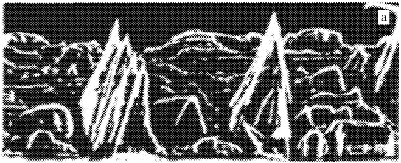


### 6. Diagrams — DIA_001 (D01, стр. 9)


**Ошибка:** диаграмма сохранена как обычное изображение; потеря текста и связей

**Причина:** В GT-области найдено Image: 1, но Diagram отсутствует. Generic image не содержит типизированных text_elements/key_elements.

**Влияние на метрику:** Object Score=0.00/100; потеря относительно идеального объекта=100.00 п.п.; detection_recall=0.00, iou=0.00, diagram_text_recall=0.00, caption=0.00, element_recall=0.00, key_elements=0.00

**Ground Truth**

```text
тип: electrical_scheme
caption: Рис. 4.1. Схемы электрических цепей для реализации метода амперметра и вольтметра
текст: Источник напряжения, Rрег, A, V, Rx
ключевые элементы/связи: амперметр, вольтметр, измеряемое сопротивление
asset: ground_truth/assets/DIA_001.png
```

**Output инструмента**

```text
Типизированный объект отсутствует.

Содержимое в той же области, но другого/несопоставленного типа:
- Image overlap=0.70: caption: Рис. 4.1. Схемы электрических цепей для реализации метода амперметра и вольтметра; asset: assets\p9_image_0007.jpg
```

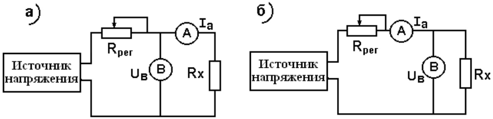

## OCR.Space

### 1. Text — TXT_008 (D04, стр. 9)


**Ошибка:** пропуск текста

**Причина:** В размеченной области не найден TextBlock, поэтому все текстовые компоненты равны нулю.

**Влияние на метрику:** Object Score=0.00/100; потеря относительно идеального объекта=100.00 п.п.; cer=0.00, wer=0.00, edit_similarity=0.00

**Ground Truth**

```text
3. Метод показал себя устойчивым к шуму в начальных данных: в боль-
шинстве рассматриваемых моделей внесение шума в исходные данные обрат-
ной задачи в размере не более 5 % дает 5–7 % снижения точности распознавания
и весьма незначительное увеличение средней ошибки (порядка 0,02–0,03).
Но наиболее неожиданным, на наш взгляд, результатом является то, что
дополнительное знание о расположении измерительного прибора (координа-
та x0) не дает существенного повышения точности определения параметра
дробного дифференцирования α.
Этот факт позволяет выдвинуть гипотезу
о том, что предложенный метод может быть успешно применен для решения
обратной задачи в области Ω′ = {(x, t) : −∞< x < ∞, t ≥0}.
Данные в табл. 5, 6 дают представление о максимальной ошибке восста-
новления параметров задачи (5), но не говорят о том, как часто возникает
ошибка, большая допустимой.
Разобьем отрезок [0, 2] на 11 интервалов [0, 00; 0, 02), [0, 02; 0, 04), [0, 04;
0, 06), [0, 06; 0, 08), [0, 08; 0, 10), [0, 10; 0, 12), [0, 12; 0, 14), [0, 14; 0, 16), [0, 16; 0, 18),
```

**Output инструмента**

```text
Типизированный объект отсутствует.
```


### 2. Tables — TAB_006 (D04, стр. 8)


**Ошибка:** пропуск таблицы

**Причина:** В области нет типизированной таблицы; строки, колонки и headers не восстановлены.

**Влияние на метрику:** Object Score=0.00/100; потеря относительно идеального объекта=100.00 п.п.; cell_recall=0.00, cell_content=24.24, row_structure=0.00, column_structure=0.00, merged_f1=0.00, teds_like=0.45

**Ground Truth**

```text
Размер: 25 × 6; ячеек: 132
[H] Сеть | [H] Показатель | [H] Обучающее α | [H] Обучающее λ | [H] Обучающее + 5% шум α | [H] Обучающее + 5% шум λ
1 | Правильно | 68,20 % | 35,60 % | 67,60 % | 36,20 %
 | Средняя ошибка | 0,0787 | 0,1430 | 0,0827 | 0,1441
 | Макс. ошибка | 0,3728 | 0,5027 | 0,9759 | 0,5047
 | Дисперсия ошибки | 0,0030 | 0,0088 | 0,0046 | 0,0089
2 | Правильно | 86,00 % |  | 82,40 % | 
 | Средняя ошибка | 0,0604 |  | 0,0641 | 
 | Макс. ошибка | 0,3622 |  | 0,4495 | 
 | Дисперсия ошибки | 0,0020 |  | 0,0028 | 
3 | Правильно | 88,70 % |  | 82,40 % | 
 | Средняя ошибка | 0,0583 |  | 0,0634 | 
 | Макс. ошибка | 0,2045 |  | 0,8540 | 
 | Дисперсия ошибки | 0,0013 |  | 0,0029 | 
4 | Правильно | 77,10 % | 39,50 % | 75,80 % | 38,60 %
 | Средняя ошибка | 0,0671 | 0,1449 | 0,0712 | 0,1466
 | Макс. ошибка | 0,3594 | 0,5603 | 0,7292 | 0,5605
 | Дисперсия ошибки | 0,0025 | 0,0103 | 0,0036 | 0,0104
5 | Правильно | 88,50 % |  | 84,20 % | 
 | Средняя ошибка | 0,0574 |  | 0,0651 | 
 | Макс. ошибка | 0,3233 |  | 1,4295 | 
 | Дисперсия ошибки | 0,016 |  | 0,0057 | 
6 | Правильно | 80,60 % |  | 79,00 % | 
 | Средняя ошибка | 0,0631 |  | 0,0683 | 
 | Макс. ошибка | 0,2647 |  | 0,8166 | 
 | Дисперсия ошибки | 0,0018 |  | 0,0037 | 
```

**Output инструмента**

```text
Типизированный объект отсутствует.
```


### 3. Math — MATH_002 (D04, стр. 1)


**Ошибка:** потеря fraction structure; ошибки subscript; ошибки superscript; потеря Greek symbols; потеря operators; потеря brackets

**Причина:** Exact match отсутствует; token precision=72.41, token recall=31.82, edit similarity=21.62.

**Влияние на метрику:** Object Score=22.01/100; потеря относительно идеального объекта=77.99 п.п.; raw_exact_match=0.00, normalized_exact_match=0.00, token_precision=72.41, token_recall=31.82, token_f1=44.21, edit_similarity=21.62

**Ground Truth**

```text
{}_{t}D_*^{\alpha}f(t)=\frac{1}{\Gamma(1-\alpha)}\int_{0}^{t}\frac{f'(\tau)}{(t-\tau)^{\alpha}}\,d\tau,\quad 0<\alpha<1
```

**Output инструмента**

```text
1 f'(т) Dof(t) = (1-a) (1-7) dr. 0 < α <1.
```


### 4. Chemistry — CHEM_001 (D02, стр. 3)


**Ошибка:** ошибки химических символов

**Причина:** GT='FeCl3·6H2O', output='FeCl3-6Н2О'; token F1=62.50, composition similarity=0.00.

**Влияние на метрику:** Object Score=32.75/100; потеря относительно идеального объекта=67.25 п.п.; detection=100.00, token_f1=62.50, composition_similarity=0.00, structured_extraction=32.75

**Ground Truth**

```text
Формула: FeCl3·6H2O
```

**Output инструмента**

```text
Формула: FeCl3-6Н2О
```


### 5. Images — IMG_001 (D01, стр. 8)


**Ошибка:** в области остался только текст; потеря visual payload

**Причина:** В области найдено TextBlock: 8, но отсутствует Image asset; OCR-текст, caption или alt-text не заменяют извлечение изображения.

**Влияние на метрику:** Object Score=0.00/100; потеря относительно идеального объекта=100.00 п.п.; detection_recall=0.00, iou=0.00, extraction=0.00, caption=0.00

**Ground Truth**

```text
caption: Рис. 3.2. Лицевая панель цифрового миллиомметра GOM-802; asset: ground_truth/assets/IMG_001.png
```

**Output инструмента**

```text
Типизированный объект отсутствует.

Содержимое в той же области, но другого/несопоставленного типа:
- TextBlock overlap=0.03: Рис. 3.2. Передняя панель цифрового миллиомметра GOM-802
- TextBlock overlap=0.00: GWINSTEK
- TextBlock overlap=0.00: DC MILLI-OHM METER
- TextBlock overlap=0.00: GOM-802
- TextBlock overlap=0.00: GPIB/RS232
- TextBlock overlap=0.00: HANDLER
- TextBlock overlap=0.00: NORMAL
- TextBlock overlap=0.00: CURSOR
```


### 6. Diagrams — DIA_001 (D01, стр. 9)


**Ошибка:** диаграмма представлена только текстом/Markdown; связи не типизированы

**Причина:** В GT-области найдено TextBlock: 8, но Diagram отсутствует. OCR-текст или Markdown/Mermaid не дают benchmark typed key_elements без отдельного преобразования.

**Влияние на метрику:** Object Score=0.00/100; потеря относительно идеального объекта=100.00 п.п.; detection_recall=0.00, iou=0.00, diagram_text_recall=0.00, caption=0.00, element_recall=0.00, key_elements=0.00

**Ground Truth**

```text
тип: electrical_scheme
caption: Рис. 4.1. Схемы электрических цепей для реализации метода амперметра и вольтметра
текст: Источник напряжения, Rрег, A, V, Rx
ключевые элементы/связи: амперметр, вольтметр, измеряемое сопротивление
asset: ground_truth/assets/DIA_001.png
```

**Output инструмента**

```text
Типизированный объект отсутствует.

Содержимое в той же области, но другого/несопоставленного типа:
- TextBlock overlap=0.01: UBB Rx
- TextBlock overlap=0.01: напряжения
- TextBlock overlap=0.00: 6)
- TextBlock overlap=0.00: Источник
- TextBlock overlap=0.00: Источник
- TextBlock overlap=0.00: a)
- TextBlock overlap=0.00: Rper
- TextBlock overlap=0.00: Rx
```

## Nutrient

### 1. Text — TXT_009 (D05, стр. 10)


**Ошибка:** reading order или разбиение слов; сломанные переносы; ошибки OCR/символьные замены

**Причина:** Длина output составляет 0.95 от GT; CER-quality=94.12, WER-quality=66.07. Классификация причины основана на фактическом соотношении длин и разрыве между посимвольной и пословной метриками.

**Влияние на метрику:** Object Score=83.60/100; потеря относительно идеального объекта=16.40 п.п.; cer=94.12, wer=66.07, edit_similarity=94.12

**Ground Truth**

```text
5.2. Поверхностные электронные состояния 
Поверхностные электронные состояния (ПЭС) играют 
важную роль в теории полупроводников, так как именно 
они определяют контактные электронные свойства [34]. 
Реальная поверхность любого металла покрыта оксид­
ной пленкой, свойства которой ближе к полупроводни­
ковым, то же самое можно сказать и о л ю б о м металличе­
ском электроде. П о определению П Э С связаны только с 
узкой областью вблизи поверхности, где свойства кри­
сталла сильно отличаются от свойств бесконечной кри­
сталлической решетки. В этой области возникает нерав­
н о м е р н о е распределение з а р я д о в как по н о р м а л и к 
поверхности, так и вдоль нее; имеются специфические 
центры адсорбции электронов, связанные с дефектами 
кристаллической решетки, геометрическими неоднород-
н о с т я м и и т.д. В качестве п р и м е р а приведем схему 
распределения поверхностных электронов на границе 
кристалла кремния, покрытого оксидной пленкой S i 0 2 
(рис. 10) [34]. Из рисунка видно, что по мере продвижения 
от свободной поверхности (т.е. оксида кремния) к кри­
сталлу кремния П Э С изменяются, последовательно пере­
ходя от локализованных состояний 7, 2 (обусловленных 
наличием ловушек, образованных за счет адсорбции 
молекул воды с последующим формированием связей 
S i - О Н . . . Н О - S i ) к состояниям медленных 3 и быстрых 
4 поверхностных электронов и, наконец, к рекомбина-
ционным состояниям 5.
```

**Output инструмента**

```text
5.2. Поверхностные электронные состояния
Поверхностные электронные состояния (ПЭС) играют
важную роль в теории полупроводников, так как именно
они определяют контактные электронные свойства [34].
Реальная поверхность любого металла покрыта оксид-
ной пленкой, свойства которой ближе к полупроводни-
ковым, то же самое можно сказать и о любом металличе-
ском электроде. По определению ПЭС связаны только с
узкой областью вблизи поверхности, где свойства кри-
сталла сильно отличаются от свойств бесконечной кри-
сталлической решетки. В этой области возникает нерав-
номерное распределение зарядов как по нормали к
поверхности, так и вдоль нее; имеются специфические
центры адсорбции электронов, связанные с дефектами
кристаллической решетки, геометрическими неоднород-
ностями и т.д. В качестве примера приведем схему
распределения поверхностных электронов на границе
кристалла кремния, покрытого оксидной пленкой 5!О>
(рис. 10) [34]. Из рисунка видно, что по мере продвижения
от свободной поверхности (т.е. оксида кремния) к кри-
сталлу кремния ПЭС изменяются, последовательно пере-
ходя от локализованных состояний / 2 (обусловленных
наличием ловушек, образованных за счет адсорбции
молекул воды с последующим формированием связей
$1-ОН...НО-$) к состояниям медленных 3 и быстрых
4 поверхностных электронов и, наконец, к рекомбина-
ционным СОСТОянНиЯМ 5.
```


### 2. Tables — TAB_006 (D04, стр. 8)


**Ошибка:** потеря строк; ошибки объединения ячеек; искажение содержимого ячеек

**Причина:** GT=25×6, output=8×6; headers 6→10. Cell recall=29.55, TEDS-like=23.66.

**Влияние на метрику:** Object Score=34.73/100; потеря относительно идеального объекта=65.27 п.п.; cell_recall=29.55, cell_content=27.49, row_structure=32.00, column_structure=100.00, merged_f1=0.00, teds_like=23.66

**Ground Truth**

```text
Размер: 25 × 6; ячеек: 132
[H] Сеть | [H] Показатель | [H] Обучающее α | [H] Обучающее λ | [H] Обучающее + 5% шум α | [H] Обучающее + 5% шум λ
1 | Правильно | 68,20 % | 35,60 % | 67,60 % | 36,20 %
 | Средняя ошибка | 0,0787 | 0,1430 | 0,0827 | 0,1441
 | Макс. ошибка | 0,3728 | 0,5027 | 0,9759 | 0,5047
 | Дисперсия ошибки | 0,0030 | 0,0088 | 0,0046 | 0,0089
2 | Правильно | 86,00 % |  | 82,40 % | 
 | Средняя ошибка | 0,0604 |  | 0,0641 | 
 | Макс. ошибка | 0,3622 |  | 0,4495 | 
 | Дисперсия ошибки | 0,0020 |  | 0,0028 | 
3 | Правильно | 88,70 % |  | 82,40 % | 
 | Средняя ошибка | 0,0583 |  | 0,0634 | 
 | Макс. ошибка | 0,2045 |  | 0,8540 | 
 | Дисперсия ошибки | 0,0013 |  | 0,0029 | 
4 | Правильно | 77,10 % | 39,50 % | 75,80 % | 38,60 %
 | Средняя ошибка | 0,0671 | 0,1449 | 0,0712 | 0,1466
 | Макс. ошибка | 0,3594 | 0,5603 | 0,7292 | 0,5605
 | Дисперсия ошибки | 0,0025 | 0,0103 | 0,0036 | 0,0104
5 | Правильно | 88,50 % |  | 84,20 % | 
 | Средняя ошибка | 0,0574 |  | 0,0651 | 
 | Макс. ошибка | 0,3233 |  | 1,4295 | 
 | Дисперсия ошибки | 0,016 |  | 0,0057 | 
6 | Правильно | 80,60 % |  | 79,00 % | 
 | Средняя ошибка | 0,0631 |  | 0,0683 | 
 | Макс. ошибка | 0,2647 |  | 0,8166 | 
 | Дисперсия ошибки | 0,0018 |  | 0,0037 | 
```

**Output инструмента**

```text
Размер: 8 × 6; ячеек: 46
[H] Сеть | [H]  | [H] Обучающее |  | [H] Обучающее+5%шум | 
[H]  | [H]  | [H] α | [H] λ | [H] α | [H] λ
1 | Правильно Средняя ошибка Макс. ошибка Дисперсия ошибки | 68,20 % 0,0787 0,3728 0,0030 | 35,60 % 0,1430 0,5027 0,0088 | 67,60 % 0,0827 0,9759 0,0046 | 36,20 % 0,1441 0,5047 0,0089
2 | Правильно Средняя ошибка Макс. ошибка Дисперсия ошибки | 86,00 % 0,0604 0,3622 0,0020 |  | 82,40 % 0,0641 0,4495 0,0028 | 
3 | Правильно Средняя ошибка Макс. ошибка Дисперсия ошибки | 88,70 % 0,0583 0,2045 0,0013 |  | 82,40 % 0,0634 0,8540 0,0029 | 
4 | Правильно Средняя ошибка Макс. ошибка Дисперсия ошибки | 77,10 % 0,0671 0,3594 0,0025 | 39,50 % 0,1449 0,5603 0,0103 | 75,80 % 0,0712 0,7292 0,0036 | 38,60 % 0,1466 0,5605 0,0104
5 | Правильно Средняя ошибка Макс. ошибка Дисперсия ошибки | 88,50 % 0,0574 0,3233 0,016 |  | 84,20 % 0,0651 1,4295 0,0057 | 
6 | Правильно Средняя ошибка Макс. ошибка Дисперсия ошибки | 80,60 % 0,0631 0,2647 0,0018 |  | 79,00 % 0,0683 0,8166 0,0037 | 
```


### 3. Math — MATH_003 (D04, стр. 2)


**Ошибка:** потеря fraction structure; ошибки subscript; ошибки superscript; потеря Greek symbols; потеря operators; потеря brackets

**Причина:** Exact match отсутствует; token precision=100.00, token recall=0.00, edit similarity=0.00.

**Влияние на метрику:** Object Score=0.00/100; потеря относительно идеального объекта=100.00 п.п.; raw_exact_match=0.00, normalized_exact_match=0.00, token_precision=100.00, token_recall=0.00, token_f1=0.00, edit_similarity=0.00

**Ground Truth**

```text
{}_{t}D^{\alpha}f(t)=\frac{1}{\Gamma(1-\alpha)}\frac{d}{dt}\int_{0}^{t}\frac{f(\tau)}{(t-\tau)^{\alpha}}\,d\tau,\quad 0<\alpha<1
```

**Output инструмента**

```text
Formula spatially matched, но математический payload пуст.
```


### 4. Chemistry — CHEM_004 (D02, стр. 2)


**Ошибка:** потеря химических символов/меток; structural formula не извлечена; неточный crop

**Причина:** Structure detection есть, но IoU=33.18, label recall=0.00, extraction=0.00.

**Влияние на метрику:** Object Score=38.30/100; потеря относительно идеального объекта=61.70 п.п.; detection=100.00, iou=33.18, label_recall=0.00, extraction=0.00, structured_extraction=11.85

**Ground Truth**

```text
Тартразин (Tartrazine); текстовые метки: NaOOC, N=N, OH, NaO3S, SO3Na; asset: ground_truth/assets/CHEM_004.png
```

**Output инструмента**

```text
structure; текстовые метки: нет; asset: нет
```


### 5. Images — IMG_005 (D05, стр. 2)


**Ошибка:** неправильный crop; изображение не сохранено; потеря caption

**Причина:** Detection=100.00, IoU=27.60, extraction=0.00, caption=0.00.

**Влияние на метрику:** Object Score=36.90/100; потеря относительно идеального объекта=63.10 п.п.; detection_recall=100.00, iou=27.60, extraction=0.00, caption=0.00

**Ground Truth**

```text
caption: Рис. 2. Фотографии поверхности медного электрода после воздействия электрического поля; asset: ground_truth/assets/IMG_005.png
```

**Output инструмента**

```text
caption: нет; asset: нет
```


### 6. Diagrams — DIA_001 (D01, стр. 9)


**Ошибка:** диаграмма сохранена как обычное изображение; потеря текста и связей

**Причина:** В GT-области найдено Image: 1, но Diagram отсутствует. Generic image не содержит типизированных text_elements/key_elements.

**Влияние на метрику:** Object Score=0.00/100; потеря относительно идеального объекта=100.00 п.п.; detection_recall=0.00, iou=0.00, diagram_text_recall=0.00, caption=0.00, element_recall=0.00, key_elements=0.00

**Ground Truth**

```text
тип: electrical_scheme
caption: Рис. 4.1. Схемы электрических цепей для реализации метода амперметра и вольтметра
текст: Источник напряжения, Rрег, A, V, Rx
ключевые элементы/связи: амперметр, вольтметр, измеряемое сопротивление
asset: ground_truth/assets/DIA_001.png
```

**Output инструмента**

```text
Типизированный объект отсутствует.

Содержимое в той же области, но другого/несопоставленного типа:
- Image overlap=0.68: caption: нет; asset: нет
```

## Mindee

### 1. Text — TXT_009 (D05, стр. 10)


**Ошибка:** reading order или разбиение слов; сломанные переносы

**Причина:** Длина output составляет 0.95 от GT; CER-quality=95.27, WER-quality=66.52. Классификация причины основана на фактическом соотношении длин и разрыве между посимвольной и пословной метриками.

**Влияние на метрику:** Object Score=84.49/100; потеря относительно идеального объекта=15.51 п.п.; cer=95.27, wer=66.52, edit_similarity=95.27

**Ground Truth**

```text
5.2. Поверхностные электронные состояния 
Поверхностные электронные состояния (ПЭС) играют 
важную роль в теории полупроводников, так как именно 
они определяют контактные электронные свойства [34]. 
Реальная поверхность любого металла покрыта оксид­
ной пленкой, свойства которой ближе к полупроводни­
ковым, то же самое можно сказать и о л ю б о м металличе­
ском электроде. П о определению П Э С связаны только с 
узкой областью вблизи поверхности, где свойства кри­
сталла сильно отличаются от свойств бесконечной кри­
сталлической решетки. В этой области возникает нерав­
н о м е р н о е распределение з а р я д о в как по н о р м а л и к 
поверхности, так и вдоль нее; имеются специфические 
центры адсорбции электронов, связанные с дефектами 
кристаллической решетки, геометрическими неоднород-
н о с т я м и и т.д. В качестве п р и м е р а приведем схему 
распределения поверхностных электронов на границе 
кристалла кремния, покрытого оксидной пленкой S i 0 2 
(рис. 10) [34]. Из рисунка видно, что по мере продвижения 
от свободной поверхности (т.е. оксида кремния) к кри­
сталлу кремния П Э С изменяются, последовательно пере­
ходя от локализованных состояний 7, 2 (обусловленных 
наличием ловушек, образованных за счет адсорбции 
молекул воды с последующим формированием связей 
S i - О Н . . . Н О - S i ) к состояниям медленных 3 и быстрых 
4 поверхностных электронов и, наконец, к рекомбина-
ционным состояниям 5.
```

**Output инструмента**

```text
5.2.
Поверхностные
электронные
состояния
Поверхностные
электронные
состояния
(ПЭС)
играют
важную
роль
в
теории
полупроводников,
так
как
именно
они
определяют
контактные
электронные
свойства
[34].
Реальная
поверхность
любого
металла
покрыта
оксид-
ной
пленкой,
свойства
которой
ближе
к
полупроводни-
ковым,
то
же
самое
можно
сказать
и
о
любом
металличе-
ском
электроде.
По
определению
ПЭС
связаны
только
с
узкой
областью
вблизи
поверхности,
где
свойства
кри-
сталла
сильно
отличаются
от
свойств
бесконечной
кри-
сталлической
решетки.
В
этой
области
возникает
нерав-
номерное
распределение
зарядов
как
по
нормали
к
поверхности,
так
и
вдоль
нее;
имеются
специфические
центры
адсорбции
электронов,
связанные
с
дефектами
кристаллической
решетки,
геометрическими
неоднород-
ностями
и
т.д.
В
качестве
примера
приведем
схему
распределения
поверхностных
электронов
на
границе
кристалла
кремния,
покрытого
оксидной
пленкой
SiO2
(рис.
10)
[34].
Из
рисунка
видно,
что
по
мере
продвижения
от
свободной
поверхности
(т.е.
оксида
кремния)
к
кри-
сталлу
кремния
ПЭС
изменяются,
последовательно
пере-
ходя
от
локализованных
состояний
1,
2
(обусловленных
наличием
ловушек,
образованных
за
счет
адсорбции
молекул
воды
с
последующим
формированием
связей
Si-
ОН
...
HO-Si)
к
состояниям
медленных
3
и
быстрых
4
поверхностных
электронов
и,
наконец,
к
рекомбина-
ционным
состояниям
5.
```


### 2. Tables — TAB_001 (D01, стр. 4)


**Ошибка:** таблица превращена в обычный текст; структура строк/колонок отсутствует

**Причина:** Typed Table отсутствует, но внутри GT-области найдено TextBlock: 8. Текст извлечён без сетки ячеек, поэтому cell recall и структурные компоненты обнуляются.

**Влияние на метрику:** Object Score=0.00/100; потеря относительно идеального объекта=100.00 п.п.; cell_recall=0.00, cell_content=0.00, row_structure=0.00, column_structure=0.00, merged_f1=100.00, teds_like=1.96

**Ground Truth**

```text
Размер: 5 × 6; ячеек: 30
[H] Тип | [H] Число декад | [H] Пределы воспроизведения R, Ом | [H] Дискретность воспроизведения, Ом | [H] Класс точности γ, % | [H] Допускаемая мощность на декаду, Вт
Р 33 | 6 | 0–100000 | 0,1 | 0,2 | 0,5
КМС 6 | 6 | 0–100000 | 0,1 | 0,2 | 0,5
МСР 60М | 6 | 0–10000 | 0,01 | 0,02 | 0,5
МСР 63 | 7 | 0–100000 | 0,01 | 0,05 | 0,5
```

**Output инструмента**

```text
Типизированный объект отсутствует.

Содержимое в той же области, но другого/несопоставленного типа:
- TextBlock overlap=0.01: Допускаема
- TextBlock overlap=0.01: Дискрет-
- TextBlock overlap=0.01: произведе-
- TextBlock overlap=0.01: Пределы
- TextBlock overlap=0.01: воспроиз-
- TextBlock overlap=0.01: мощность
- TextBlock overlap=0.01: ведения
- TextBlock overlap=0.01: Класс
```


### 3. Math — MATH_001 (D01, стр. 17)


**Ошибка:** потеря fraction structure; ошибки subscript; потеря brackets

**Причина:** Exact match отсутствует; token precision=50.00, token recall=11.63, edit similarity=8.40.

**Влияние на метрику:** Object Score=9.23/100; потеря относительно идеального объекта=90.77 п.п.; raw_exact_match=0.00, normalized_exact_match=0.00, token_precision=50.00, token_recall=11.63, token_f1=18.87, edit_similarity=8.40

**Ground Truth**

```text
\tilde{R}_{x}=\frac{U_{\mathrm{в}}}{I_{\mathrm{а}}}=\frac{U_R}{I_0+I_{\mathrm{в}}}=\frac{R_x}{1+\frac{R_x}{R_{\mathrm{в}}}}
```

**Output инструмента**

```text
U R. UR UB = Ř = = , R, I2 I0+1B x a 1+ RA
```


### 4. Chemistry — CHEM_001 (D02, стр. 3)


**Ошибка:** ошибки индексов; ошибки химических символов

**Причина:** GT='FeCl3·6H2O', output='6H2O'; token F1=66.67, composition similarity=90.00.

**Влияние на метрику:** Object Score=41.50/100; потеря относительно идеального объекта=58.50 п.п.; detection=100.00, token_f1=66.67, composition_similarity=90.00, structured_extraction=41.50

**Ground Truth**

```text
Формула: FeCl3·6H2O
```

**Output инструмента**

```text
Формула: 6H2O
```


### 5. Images — IMG_001 (D01, стр. 8)


**Ошибка:** в области остался только текст; потеря visual payload

**Причина:** В области найдено TextBlock: 8, но отсутствует Image asset; OCR-текст, caption или alt-text не заменяют извлечение изображения.

**Влияние на метрику:** Object Score=0.00/100; потеря относительно идеального объекта=100.00 п.п.; detection_recall=0.00, iou=0.00, extraction=0.00, caption=0.00

**Ground Truth**

```text
caption: Рис. 3.2. Лицевая панель цифрового миллиомметра GOM-802; asset: ground_truth/assets/IMG_001.png
```

**Output инструмента**

```text
Типизированный объект отсутствует.

Содержимое в той же области, но другого/несопоставленного типа:
- TextBlock overlap=0.01: GWINSTEK
- TextBlock overlap=0.01: GOM-802
- TextBlock overlap=0.01: миллиомметра
- TextBlock overlap=0.01: цифрового
- TextBlock overlap=0.00: GOM-802
- TextBlock overlap=0.00: Передняя
- TextBlock overlap=0.00: панель
- TextBlock overlap=0.00: -|10
```


### 6. Diagrams — DIA_001 (D01, стр. 9)


**Ошибка:** диаграмма представлена только текстом/Markdown; связи не типизированы

**Причина:** В GT-области найдено TextBlock: 8, но Diagram отсутствует. OCR-текст или Markdown/Mermaid не дают benchmark typed key_elements без отдельного преобразования.

**Влияние на метрику:** Object Score=0.00/100; потеря относительно идеального объекта=100.00 п.п.; detection_recall=0.00, iou=0.00, diagram_text_recall=0.00, caption=0.00, element_recall=0.00, key_elements=0.00

**Ground Truth**

```text
тип: electrical_scheme
caption: Рис. 4.1. Схемы электрических цепей для реализации метода амперметра и вольтметра
текст: Источник напряжения, Rрег, A, V, Rx
ключевые элементы/связи: амперметр, вольтметр, измеряемое сопротивление
asset: ground_truth/assets/DIA_001.png
```

**Output инструмента**

```text
Типизированный объект отсутствует.

Содержимое в той же области, но другого/несопоставленного типа:
- TextBlock overlap=0.01: напряжения
- TextBlock overlap=0.01: Источник
- TextBlock overlap=0.01: напряжения
- TextBlock overlap=0.01: Источник
- TextBlock overlap=0.01: Rper
- TextBlock overlap=0.00: Rper
- TextBlock overlap=0.00: б)
- TextBlock overlap=0.00: (B
```

## Adobe Extract

### 1. Text — TXT_009 (D05, стр. 10)


**Ошибка:** reading order или разбиение слов; сломанные переносы; ошибки OCR/символьные замены

**Причина:** Длина output составляет 0.94 от GT; CER-quality=94.98, WER-quality=67.41. Классификация причины основана на фактическом соотношении длин и разрыве между посимвольной и пословной метриками.

**Влияние на метрику:** Object Score=84.64/100; потеря относительно идеального объекта=15.36 п.п.; cer=94.98, wer=67.41, edit_similarity=94.98

**Ground Truth**

```text
5.2. Поверхностные электронные состояния 
Поверхностные электронные состояния (ПЭС) играют 
важную роль в теории полупроводников, так как именно 
они определяют контактные электронные свойства [34]. 
Реальная поверхность любого металла покрыта оксид­
ной пленкой, свойства которой ближе к полупроводни­
ковым, то же самое можно сказать и о л ю б о м металличе­
ском электроде. П о определению П Э С связаны только с 
узкой областью вблизи поверхности, где свойства кри­
сталла сильно отличаются от свойств бесконечной кри­
сталлической решетки. В этой области возникает нерав­
н о м е р н о е распределение з а р я д о в как по н о р м а л и к 
поверхности, так и вдоль нее; имеются специфические 
центры адсорбции электронов, связанные с дефектами 
кристаллической решетки, геометрическими неоднород-
н о с т я м и и т.д. В качестве п р и м е р а приведем схему 
распределения поверхностных электронов на границе 
кристалла кремния, покрытого оксидной пленкой S i 0 2 
(рис. 10) [34]. Из рисунка видно, что по мере продвижения 
от свободной поверхности (т.е. оксида кремния) к кри­
сталлу кремния П Э С изменяются, последовательно пере­
ходя от локализованных состояний 7, 2 (обусловленных 
наличием ловушек, образованных за счет адсорбции 
молекул воды с последующим формированием связей 
S i - О Н . . . Н О - S i ) к состояниям медленных 3 и быстрых 
4 поверхностных электронов и, наконец, к рекомбина-
ционным состояниям 5.
```

**Output инструмента**

```text
5.2. Поверхностные электронные состояния
Поверхностные электронные состояния (ПЭС) играют важную роль в теории полупроводников, так как именно они определяют контактные электронные свойства [34]. Реальная поверхность любого металла покрыта оксид­ной пленкой, свойства которой ближе к полупроводни­КОВЫМ, ТО же самое можно сказать и о любом металличе­ском электроде. По определению ПЭС связаны только с узкой областью вблизи поверхности, где свойства кри­сталла сильно отличаются от свойств бесконечной кри­сталлической решетки. В этой области возникает нерав­номерное распределение зарядов как по нормали к поверхности, так и вдоль нее; имеются специфические центры адсорбции электронов, связанные с дефектами кристаллической решетки, геометрическими неоднород­ностями и т.д. В качестве примера приведем схему распределения поверхностных электронов на границе кристалла кремния, покрытого оксидной пленкой SiO. (рис. 1 О) [34]. Из рисунка видно, что по мере продвижения от свободной поверхности (т.е. оксида кремния) к кри­сталлу кремния ПЭС изменяются, последовательно пере­ходя от локализованных состояний /, 2 (обусловленных наличием ловушек, образованных за счет адсорбции молекул воды с последующим формированием связей Si-ОН...НО-Si) к состояниям медленных 3 и быстрых 4 поверхностных электронов и, наконец, к рекомбина­ционным состояниям 5.
```


### 2. Tables — TAB_007 (D05, стр. 21)


**Ошибка:** таблица превращена в обычный текст; структура строк/колонок отсутствует

**Причина:** Typed Table отсутствует, но внутри GT-области найдено TextBlock: 2. Текст извлечён без сетки ячеек, поэтому cell recall и структурные компоненты обнуляются.

**Влияние на метрику:** Object Score=0.00/100; потеря относительно идеального объекта=100.00 п.п.; cell_recall=0.00, cell_content=5.71, row_structure=0.00, column_structure=0.00, merged_f1=100.00, teds_like=1.65

**Ground Truth**

```text
Размер: 7 × 5; ячеек: 35
[H] Процесс | [H] Плотность инжектируемого заряда | [H] Плотность инжектируемого тока | [H] Литература | [H] Физико-химическая схема
Инжекция Шоттки | q∞ = qA exp(-ε_ad/r_A) | j_i = β q∞ E | [36] | инжекция с поверхности электрода
M + A+B− ⇄ M(e) + A + B | q∞ | j_i = j_e a_ext a_ox N / (a_red + a_ext) | [19] | окислительно-восстановительный механизм
X+Q−(M) ⇄ X− | q∞ | j_i = μ q∞ E | [35] | полевая инжекция
X+Q−(M) ⇒ X− | q∞ | j_i = μ r_i E² | [35] | полевая инжекция
Адсорбционная электризация | Ток электризации | J = -q_i S V_0; S = 2π r D R |  | q_sj = K_ad j q_0, j=1,2
Электризация по ОВ-механизму | n* = n_A/K_AD; n_A=(k_1/k_2)c_A | I = √(2 ε e n* φ_0) 2πR V_0 |  | K_ad = ∫ exp(E_ad/x) dx
```

**Output инструмента**

```text
Типизированный объект отсутствует.

Содержимое в той же области, но другого/несопоставленного типа:
- Image overlap=1.00: caption: нет; asset: C:\Users\Nocomp\Desktop\nlp\outputs\benchmark\cache\adobe_extract\D05\versions\88da6cd9c6adb25eb367c265\assets\adobe_p21_00613.png
- Image overlap=1.00: caption: нет; asset: нет
- Image overlap=1.00: caption: нет; asset: C:\Users\Nocomp\Desktop\nlp\outputs\benchmark\cache\adobe_extract\D05\versions\88da6cd9c6adb25eb367c265\assets\adobe_p21_00616.png
- Image overlap=1.00: caption: нет; asset: нет
- Image overlap=1.00: caption: нет; asset: C:\Users\Nocomp\Desktop\nlp\outputs\benchmark\cache\adobe_extract\D05\versions\88da6cd9c6adb25eb367c265\assets\adobe_p21_00636.png
- Image overlap=1.00: caption: нет; asset: нет
- TextBlock overlap=0.02: связанными, могут быть причиной электризации тел в газовой среде, содержащей электроотрицательные моле­кулы. Разумеется, это область малых токов, однако в течение длительного времени (или при наличии интен­сивного обтекания тел) накопление зарядов может быть значительным, и эти процессы нельзя не принимать во внимание. По нашему мнению, процесс ионизации плотных газов, скажем воздуха, по окислительно-восста-
- TextBlock overlap=0.02: новительному механизму требует дополнительных как экспериментальных, так и теоретических исследований. 
```

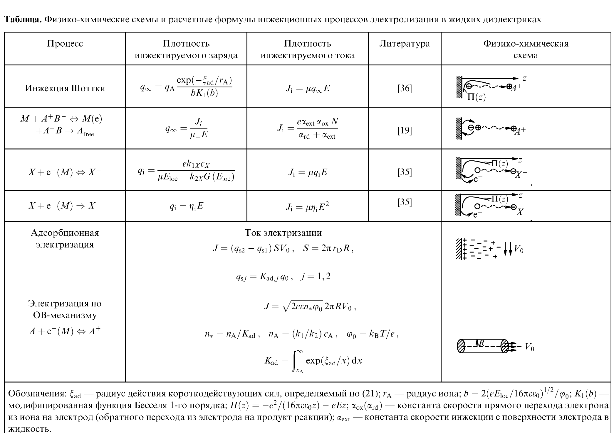


### 3. Math — MATH_001 (D01, стр. 17)


**Ошибка:** формула возвращена как Figure/Image; нет структурированного Math payload

**Причина:** В области есть графический объект, но нет Formula с LaTeX/plain-math представлением; типобезопасный matcher не переименовывает generic Figure в формулу.

**Влияние на метрику:** Object Score=0.00/100; потеря относительно идеального объекта=100.00 п.п.; raw_exact_match=0.00, normalized_exact_match=0.00, token_precision=100.00, token_recall=0.00, token_f1=0.00, edit_similarity=0.00

**Ground Truth**

```text
\tilde{R}_{x}=\frac{U_{\mathrm{в}}}{I_{\mathrm{а}}}=\frac{U_R}{I_0+I_{\mathrm{в}}}=\frac{R_x}{1+\frac{R_x}{R_{\mathrm{в}}}}
```

**Output инструмента**

```text
Типизированный объект отсутствует.

Содержимое в той же области, но другого/несопоставленного типа:
- Image overlap=0.52: caption: нет; asset: C:\Users\Nocomp\Desktop\nlp\outputs\benchmark\cache\adobe_extract\D01\versions\92df332f0870ad8424f1dd75\assets\adobe_p17_00663.png
- Image overlap=0.52: caption: нет; asset: нет
- TextBlock overlap=0.02: (3) 
```

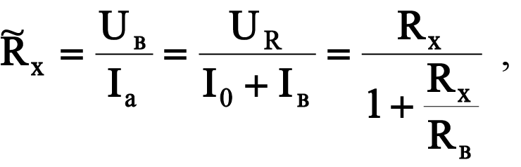


### 4. Chemistry — CHEM_004 (D02, стр. 2)


**Ошибка:** потеря химических символов/меток; structural formula не извлечена; неточный crop

**Причина:** Structure detection есть, но IoU=31.12, label recall=0.00, extraction=0.00.

**Влияние на метрику:** Object Score=37.78/100; потеря относительно идеального объекта=62.22 п.п.; detection=100.00, iou=31.12, label_recall=0.00, extraction=0.00, structured_extraction=11.11

**Ground Truth**

```text
Тартразин (Tartrazine); текстовые метки: NaOOC, N=N, OH, NaO3S, SO3Na; asset: ground_truth/assets/CHEM_004.png
```

**Output инструмента**

```text
structure; текстовые метки: нет; asset: нет
```


### 5. Images — IMG_004 (D05, стр. 2)


**Ошибка:** visual candidate не сопоставлен с Image GT

**Причина:** В области есть visual candidate, но он не выбран при one-to-one сопоставлении по типу/геометрии либо не имеет подтверждённого extraction payload.

**Влияние на метрику:** Object Score=0.00/100; потеря относительно идеального объекта=100.00 п.п.; detection_recall=0.00, iou=0.00, extraction=0.00, caption=0.00

**Ground Truth**

```text
caption: Рис. 1. Картины течения в системе двух параллельных проводников; asset: ground_truth/assets/IMG_004.png
```

**Output инструмента**

```text
Типизированный объект отсутствует.

Содержимое в той же области, но другого/несопоставленного типа:
- Image overlap=1.00: caption: нет; asset: C:\Users\Nocomp\Desktop\nlp\outputs\benchmark\cache\adobe_extract\D05\versions\88da6cd9c6adb25eb367c265\assets\adobe_p2_00043.png
- Image overlap=1.00: caption: нет; asset: нет
- Image overlap=1.00: caption: нет; asset: C:\Users\Nocomp\Desktop\nlp\outputs\benchmark\cache\adobe_extract\D05\versions\88da6cd9c6adb25eb367c265\assets\adobe_p2_00047.png
- Image overlap=1.00: caption: нет; asset: нет
- Image overlap=1.00: caption: нет; asset: C:\Users\Nocomp\Desktop\nlp\outputs\benchmark\cache\adobe_extract\D05\versions\88da6cd9c6adb25eb367c265\assets\adobe_p2_00050.png
- Image overlap=1.00: caption: нет; asset: нет
- Image overlap=1.00: caption: нет; asset: C:\Users\Nocomp\Desktop\nlp\outputs\benchmark\cache\adobe_extract\D05\versions\88da6cd9c6adb25eb367c265\assets\adobe_p2_00056.png
- Image overlap=1.00: caption: нет; asset: нет
```

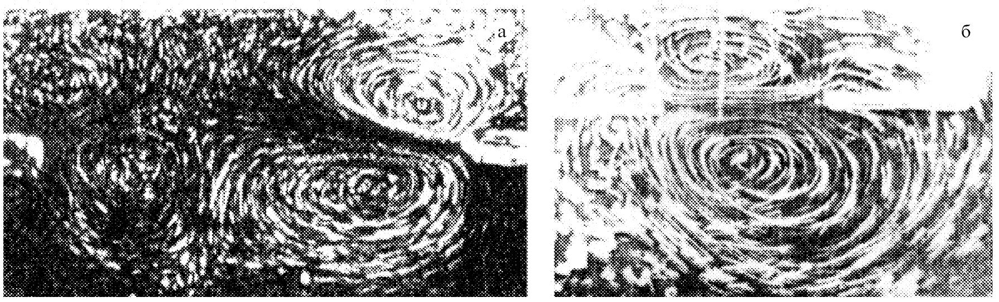


### 6. Diagrams — DIA_001 (D01, стр. 9)


**Ошибка:** диаграмма сохранена как обычное изображение; потеря текста и связей

**Причина:** В GT-области найдено Image: 1, но Diagram отсутствует. Generic image не содержит типизированных text_elements/key_elements.

**Влияние на метрику:** Object Score=0.00/100; потеря относительно идеального объекта=100.00 п.п.; detection_recall=0.00, iou=0.00, diagram_text_recall=0.00, caption=0.00, element_recall=0.00, key_elements=0.00

**Ground Truth**

```text
тип: electrical_scheme
caption: Рис. 4.1. Схемы электрических цепей для реализации метода амперметра и вольтметра
текст: Источник напряжения, Rрег, A, V, Rx
ключевые элементы/связи: амперметр, вольтметр, измеряемое сопротивление
asset: ground_truth/assets/DIA_001.png
```

**Output инструмента**

```text
Типизированный объект отсутствует.

Содержимое в той же области, но другого/несопоставленного типа:
- Image overlap=1.00: caption: нет; asset: C:\Users\Nocomp\Desktop\nlp\outputs\benchmark\cache\adobe_extract\D01\versions\92df332f0870ad8424f1dd75\assets\adobe_p9_00278.png
```

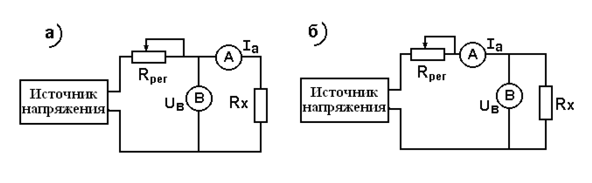

## LlamaParse

### 1. Text — TXT_009 (D05, стр. 10)


**Ошибка:** reading order или разбиение слов; сломанные переносы; ошибки OCR/символьные замены

**Причина:** Длина output составляет 0.94 от GT; CER-quality=94.62, WER-quality=69.20. Классификация причины основана на фактическом соотношении длин и разрыве между посимвольной и пословной метриками.

**Влияние на метрику:** Object Score=85.09/100; потеря относительно идеального объекта=14.91 п.п.; cer=94.62, wer=69.20, edit_similarity=94.62

**Ground Truth**

```text
5.2. Поверхностные электронные состояния 
Поверхностные электронные состояния (ПЭС) играют 
важную роль в теории полупроводников, так как именно 
они определяют контактные электронные свойства [34]. 
Реальная поверхность любого металла покрыта оксид­
ной пленкой, свойства которой ближе к полупроводни­
ковым, то же самое можно сказать и о л ю б о м металличе­
ском электроде. П о определению П Э С связаны только с 
узкой областью вблизи поверхности, где свойства кри­
сталла сильно отличаются от свойств бесконечной кри­
сталлической решетки. В этой области возникает нерав­
н о м е р н о е распределение з а р я д о в как по н о р м а л и к 
поверхности, так и вдоль нее; имеются специфические 
центры адсорбции электронов, связанные с дефектами 
кристаллической решетки, геометрическими неоднород-
н о с т я м и и т.д. В качестве п р и м е р а приведем схему 
распределения поверхностных электронов на границе 
кристалла кремния, покрытого оксидной пленкой S i 0 2 
(рис. 10) [34]. Из рисунка видно, что по мере продвижения 
от свободной поверхности (т.е. оксида кремния) к кри­
сталлу кремния П Э С изменяются, последовательно пере­
ходя от локализованных состояний 7, 2 (обусловленных 
наличием ловушек, образованных за счет адсорбции 
молекул воды с последующим формированием связей 
S i - О Н . . . Н О - S i ) к состояниям медленных 3 и быстрых 
4 поверхностных электронов и, наконец, к рекомбина-
ционным состояниям 5.
```

**Output инструмента**

```text
5.2. Поверхностные электронные состояния
Поверхностные электронные состояния (ПЭС) играют важную роль в теории полупроводников, так как именно они определяют контактные электронные свойства [34]. Реальная поверхность любого металла покрыта оксидной пленкой, свойства которой ближе к полупроводниковым, то же самое можно сказать и о любом металлическом электроде. По определению ПЭС связаны только с узкой областью вблизи поверхности, где свойства кристалла сильно отличаются от свойств бесконечной кристаллической решетки. В этой области возникает неравномерное распределение зарядов как по нормали к поверхности, так и вдоль нее; имеются специфические центры адсорбции электронов, связанные с дефектами кристаллической решетки, геометрическими неоднородностями и т.д. В качестве примера приведем схему распределения поверхностных электронов на границе кристалла кремния, покрытого оксидной пленкой SiO<sub>2</sub> (рис. 10) [34]. Из рисунка видно, что по мере продвижения от свободной поверхности (т.е. оксида кремния) к кристаллу кремния ПЭС изменяются, последовательно переходя от локализованных состояний 1, 2 (обусловленных наличием ловушек, образованных за счет адсорбции молекул воды с последующим формированием связей Si–OH...HO–Si) к состояниям медленных 3 и быстрых 4 поверхностных электронов и, наконец, к рекомбинационным состояниям 5.
```


### 2. Tables — TAB_005 (D03, стр. 6)


**Ошибка:** потеря строк; искажение содержимого ячеек

**Причина:** GT=5×11, output=3×12; headers 11→12. Cell recall=60.00, TEDS-like=50.85.

**Влияние на метрику:** Object Score=51.74/100; потеря относительно идеального объекта=48.26 п.п.; cell_recall=60.00, cell_content=1.98, row_structure=60.00, column_structure=91.67, merged_f1=100.00, teds_like=50.85

**Ground Truth**

```text
Размер: 5 × 11; ячеек: 55
[H]  | [H] severe toxic | [H]  | [H] obscene | [H]  | [H] threat | [H]  | [H] insult | [H]  | [H] identity hate | [H] 
severe toxic | 0 | 1 | 0 | 1 | 0 | 1 | 0 | 1 | 0 | 1
toxic |  |  |  |  |  |  |  |  |  | 
0 | 144277 | 0 | 143754 | 523 | 144248 | 29 | 143744 | 533 | 144174 | 103
1 | 13699 | 1595 | 7368 | 7926 | 14845 | 449 | 7950 | 7344 | 13992 | 1302
```

**Output инструмента**

```text
Размер: 3 × 12; ячеек: 36
[H] severe toxic | [H] toxic | [H] severe toxic<br/>0<br/>toxic | [H] severe toxic<br/>1<br/>toxic | [H] obscene<br/>0<br/>toxic | [H] obscene<br/>1<br/>toxic | [H] threat<br/>0<br/>toxic | [H] threat<br/>1<br/>toxic | [H] insult<br/>0<br/>toxic | [H] insult<br/>1<br/>toxic | [H] identity hate<br/>0<br/>toxic | [H] identity hate<br/>1<br/>toxic
0 | 144277 | 0 | 143754 | 523 | 144248 | 29 | 143744 | 533 | 144174 | 103 | 
1 | 13699 | 1595 | 7368 | 7926 | 14845 | 449 | 7950 | 7344 | 13992 | 1302 | 
```


### 3. Math — MATH_001 (D01, стр. 17)


**Ошибка:** искажение токенов/номера формулы

**Причина:** Exact match отсутствует; token precision=58.65, token recall=90.70, edit similarity=44.74.

**Влияние на метрику:** Object Score=37.44/100; потеря относительно идеального объекта=62.56 п.п.; raw_exact_match=0.00, normalized_exact_match=0.00, token_precision=58.65, token_recall=90.70, token_f1=71.23, edit_similarity=44.74

**Ground Truth**

```text
\tilde{R}_{x}=\frac{U_{\mathrm{в}}}{I_{\mathrm{а}}}=\frac{U_R}{I_0+I_{\mathrm{в}}}=\frac{R_x}{1+\frac{R_x}{R_{\mathrm{в}}}}
```

**Output инструмента**

```text
\tilde{\mathbf{R}}_{\mathbf{x}} = \frac{\mathbf{U}_{\mathbf{B}}}{\mathbf{I}_{\mathbf{a}}} = \frac{\mathbf{U}_{\mathbf{R}}}{\mathbf{I}_{\mathbf{0}} + \mathbf{I}_{\mathbf{B}}} = \frac{\mathbf{R}_{\mathbf{x}}}{1 + \frac{\mathbf{R}_{\mathbf{x}}}{\mathbf{R}_{\mathbf{B}}}}, \eqno(3)
```


### 4. Chemistry — CHEM_004 (D02, стр. 2)


**Ошибка:** потеря химических символов/меток; structural formula не извлечена; неточный crop

**Причина:** Structure detection есть, но IoU=30.56, label recall=0.00, extraction=0.00.

**Влияние на метрику:** Object Score=37.64/100; потеря относительно идеального объекта=62.36 п.п.; detection=100.00, iou=30.56, label_recall=0.00, extraction=0.00, structured_extraction=10.91

**Ground Truth**

```text
Тартразин (Tartrazine); текстовые метки: NaOOC, N=N, OH, NaO3S, SO3Na; asset: ground_truth/assets/CHEM_004.png
```

**Output инструмента**

```text
structure; текстовые метки: Тартразин; asset: нет
```


### 5. Images — IMG_001 (D01, стр. 8)


**Ошибка:** в области остался только текст; потеря visual payload

**Причина:** В области найдено TextBlock: 2, но отсутствует Image asset; OCR-текст, caption или alt-text не заменяют извлечение изображения.

**Влияние на метрику:** Object Score=0.00/100; потеря относительно идеального объекта=100.00 п.п.; detection_recall=0.00, iou=0.00, extraction=0.00, caption=0.00

**Ground Truth**

```text
caption: Рис. 3.2. Лицевая панель цифрового миллиомметра GOM-802; asset: ground_truth/assets/IMG_001.png
```

**Output инструмента**

```text
Типизированный объект отсутствует.

Содержимое в той же области, но другого/несопоставленного типа:
- TextBlock overlap=0.58: photograph: GWINSTEK GOM-802 DC MILLI-OHM METER front panel
- TextBlock overlap=0.03: Рис.3.2. Передняя панель цифрового миллиомметра GОМ-802
```


### 6. Diagrams — DIA_001 (D01, стр. 9)


**Ошибка:** диаграмма представлена только текстом/Markdown; связи не типизированы

**Причина:** В GT-области найдено TextBlock: 1, но Diagram отсутствует. OCR-текст или Markdown/Mermaid не дают benchmark typed key_elements без отдельного преобразования.

**Влияние на метрику:** Object Score=0.00/100; потеря относительно идеального объекта=100.00 п.п.; detection_recall=0.00, iou=0.00, diagram_text_recall=0.00, caption=0.00, element_recall=0.00, key_elements=0.00

**Ground Truth**

```text
тип: electrical_scheme
caption: Рис. 4.1. Схемы электрических цепей для реализации метода амперметра и вольтметра
текст: Источник напряжения, Rрег, A, V, Rx
ключевые элементы/связи: амперметр, вольтметр, измеряемое сопротивление
asset: ground_truth/assets/DIA_001.png
```

**Output инструмента**

```text
Типизированный объект отсутствует.

Содержимое в той же области, но другого/несопоставленного типа:
- TextBlock overlap=0.69: graph TD
    subgraph a
        S1["Источникнапряжения"] --- R1["R<sub>per</sub>"]
        R1 --- A1(("A"))
        A1 ---|I<sub>a</sub>| RX1["R<sub>x</sub>"]
        S1 --- V1(("B"))
        V1 ---|U<sub>B</sub>| RX1
        A1 --- V1
    end
    subgraph b
        S2["Источникнапряжения"] --- R2["R<sub>per</sub>"]
        R2 --- A2(("A"))
        A2 ---|I<sub>a</sub>| RX2["R<sub>x</sub>"]
        S2 --- V2(("B"))
        V2 ---|U<sub>B</sub>| RX2
        R2 --- V2
    end
```

## Методические ограничения

Error labels являются воспроизводимой диагностической интерпретацией сохранённых prediction и metric components. Они не заменяют Object Score. Для Text отдельной GT reading-order разметки нет, поэтому формулировка «reading order или разбиение слов» используется только при большом разрыве CER/WER и не объявляет точную первопричину без визуальной проверки.

Пропуск typed объекта отличён от наличия содержимого другим типом: nearby output перечисляется в output. Generic Image/TextBlock не переименовывается в Table, Formula или Diagram ради повышения score.
