# Сравнительное исследование средств анализа PDF и преобразования в текст

Полный технический отчёт · эксперимент 20261004T095716Z_s42_2334c932 · 10 инструментов · 5 PDF · 40 GT-объектов


## 1. Введение

Технический PDF хранит не только последовательность символов. Значение документа определяется совместным расположением абзацев, колонок, таблиц, математических и химических формул, изображений, подписей и связей внутри диаграмм. Поэтому преобразование PDF в TXT в данном исследовании трактуется как извлечение текстового содержания и восстановление структурированных объектов, которые затем могут быть представлены в текстовой или машиночитаемой форме.

Исследование сравнивает пять локальных библиотек и пять облачных сервисов на одном фиксированном корпусе. Основной результат — воспроизводимая система количественных оценок по шести категориям, дополненная измерением скорости, памяти, стоимости и подробным анализом ошибок.


## 2. Актуальность

PDF остаётся основным форматом публикации научных статей, руководств и отчётов, однако его внутренняя структура часто ориентирована на визуальное отображение, а не на последовательное чтение программой. Ошибка порядка колонок меняет смысл текста; потеря строки или merged-cell искажает таблицу; плоская OCR-строка не сохраняет структуру дроби; пропуск подписи лишает изображение контекста. Эти дефекты непосредственно влияют на поиск, индексацию, RAG, анализ данных и архивную конвертацию.

Практическая актуальность состоит в выборе инструмента под конкретный состав документов. Универсальный Overall полезен как сводный индикатор, но не заменяет профиль по категориям и эксплуатационные ограничения.


## 3. Цель и задачи

Цель — экспериментально оценить качество и эксплуатационные характеристики десяти средств анализа технических PDF при преобразовании содержимого в текстовое и структурированное представление.


- сформировать фиксированный корпус из пяти технических PDF и Ground Truth по шести категориям;
- привести ответы десяти инструментов к единой схеме и выполнить однозначное сопоставление с GT;
- определить объектные, документные, категориальные и итоговую оценки;
- сравнить локальные/облачные и classic/ML группы;
- измерить время, RAM, VRAM и зарегистрированную API-стоимость;
- оценить зависимость результатов от документа и неопределённость;
- провести error analysis и представить пять проверяемых примеров на каждый инструмент.


## 4. Объект и предмет исследования

Объект исследования — программные библиотеки и облачные сервисы анализа PDF. Предмет исследования — точность извлечения текста, таблиц, математических формул, химических формул и структур, изображений и диаграмм, а также скорость, потребление памяти и стоимость обработки.

Единицей качества служит размеченный объект в PDF. Статистическим кластером для межинструментного анализа служит документ: 400 строк объектных результатов представляют 40 одинаковых GT-объектов, оценённых десятью инструментами, и не являются 400 независимыми наблюдениями.


## 5. Обзор выбранных сервисов

Пять облачных сервисов

| Сервис | SDK/adapter | Продукт/режим | Роль в benchmark | Официальная документация |
| --- | --- | --- | --- | --- |
| OCR.Space | 2.32.5 | 3 | Облачный OCR; в эксперименте использован Engine 3 с TextOverlay. | https://ocr.space/ocrapi |
| Nutrient | 3.1.0 | Nutrient Data Extraction API | Облачный Data Extraction API; режим understand, spatial output. | https://www.nutrient.io/api/data-extraction-api/ |
| Mindee | 5.3.1 | Mindee V2 OCR utility / Raw Text OCR | Облачный V2 OCR / Raw Text OCR с текстом и координатами слов. | https://docs.mindee.com/ |
| Adobe Extract | 4.2.0 | — | Облачный PDF Extract API со структурированным JSON и renditions. | https://developer.adobe.com/document-services/docs/overview/pdf-extract-api/ |
| LlamaParse | 2.16.0 | LlamaParse v2 Parse | Облачный LlamaParse v2; tier agentic со структурным page/item output. | https://developers.llamaindex.ai/llamaparse/parse/getting_started/ |

[OCR.Space](https://ocr.space/ocrapi) · [Nutrient](https://www.nutrient.io/api/data-extraction-api/) · [Mindee](https://docs.mindee.com/) · [Adobe Extract](https://developer.adobe.com/document-services/docs/overview/pdf-extract-api/) · [LlamaParse](https://developers.llamaindex.ai/llamaparse/parse/getting_started/)

Сравниваются конкретные API-режимы. Например, Mindee использован как Raw Text OCR, поэтому отсутствие типизированных таблиц или изображений характеризует выбранный endpoint, а не все продукты Mindee. Аналогично результаты LlamaParse относятся к tier agentic и сохранённой версии API.


## 6. Обзор выбранных библиотек

Пять локальных библиотек

| Библиотека | Версия | Класс | Роль в benchmark | Официальная документация |
| --- | --- | --- | --- | --- |
| PyMuPDF | 1.28.2 | classic | Классический локальный PDF-парсер; извлечение текста, координат и встроенных изображений. | https://pymupdf.readthedocs.io/en/latest/ |
| pdfplumber | 0.11.10 | classic | Классическая локальная библиотека поверх pdfminer.six с доступом к словам, геометрии и таблицам. | https://github.com/jsvine/pdfplumber |
| Docling | 2.130.0 | ML | Локальная ML-система анализа layout, таблиц, формул и иллюстраций. | https://docling-project.github.io/docling/ |
| pdfminer.six | 20260107 | classic | Классический локальный анализатор текстового слоя и геометрии PDF. | https://pdfminersix.readthedocs.io/en/latest/ |
| MinerU | 4.0.0 | ML | Локальная ML-система структурного разбора технических документов. | https://github.com/opendatalab/MinerU |

[PyMuPDF](https://pymupdf.readthedocs.io/en/latest/) · [pdfplumber](https://github.com/jsvine/pdfplumber) · [Docling](https://docling-project.github.io/docling/) · [pdfminer.six](https://pdfminersix.readthedocs.io/en/latest/) · [MinerU](https://github.com/opendatalab/MinerU)

PyMuPDF, pdfplumber и pdfminer.six образуют группу классических локальных парсеров. Docling и MinerU образуют локальную ML-группу. Облачные сервисы не включались в сравнение classic/ML, поскольку внутренняя архитектура поставщика не всегда раскрыта и место исполнения является другой осью классификации.


## 7. Описание тестового набора PDF

Корпус: 5 PDF, 98 страниц, 40 GT-объектов

| PDF | Файл | Стр. | Содержание | Текст | Таблицы | Математика | Химия | Изображения | Диаграммы | GT |
| --- | --- | --- | --- | --- | --- | --- | --- | --- | --- | --- |
| D01 | 3619.pdf | 43 | Лабораторный практикум по измерительной технике и метрологии; таблицы, формулы, приборные изображения и схемы. | 2 | 2 | 1 | 0 | 3 | 2 | 10 |
| D02 | 369.pdf | 7 | Химическая статья о магнитных сорбентах; линейные формулы и структурные формулы. | 2 | 2 | 0 | 6 | 0 | 1 | 11 |
| D03 | mais702.pdf | 14 | Статья о классификации токсичности комментариев нейронными сетями; многоколоночный текст, таблицы и графики. | 2 | 1 | 0 | 0 | 0 | 2 | 5 |
| D04 | sjim924.pdf | 12 | Статья о нейросетевом решении обратных задач аномальной диффузии; плотная математика, таблица и диаграмма. | 2 | 1 | 4 | 0 | 0 | 1 | 8 |
| D05 | ufn289.pdf | 22 | Обзор приэлектродных процессов в жидких диэлектриках; сканированный текст, формулы, таблица, фотографии и схема. | 1 | 1 | 1 | 0 | 2 | 1 | 6 |

Корпус целенаправленно включает born-digital и сканированный материал, русский и английский текст, многоколоночную вёрстку, крупные таблицы, LaTeX-подобную математику, химические формулы и структуры, фотографии, графики и схемы. Категории распределены неравномерно: химия размечена только в D02, изображения — в D01 и D05, математика — в D01, D04 и D05.


## 8. Методология benchmark

Общая цепочка: PDF → нативный ответ инструмента → standardized schema → нормализация → one-to-one matching → объектные метрики → document macro → category macro → Overall. Стандартизация отделяет возможности поставщика от формата его ответа, а сохранение raw и provenance позволяет проверить каждое преобразование.

Основной механизм сопоставления — венгерский алгоритм с отношением один к одному. Для объектов с координатами минимальный spatial IoU равен 0,10. Контентный fallback для текста, формул и таблиц без bbox требует similarity не ниже 0,25. Для фрагментированного текста разрешена GT-независимая сборка блоков с overlap относительно меньшего прямоугольника не ниже 0,50. Повторяющиеся слова в разных координатах сохраняются; блоки удаляются как дубликаты только при совпадении нормализованного текста и bbox.

Для визуальных объектов используется sampled-GT recall: GT содержит выбранные примеры, а не исчерпывающую разметку всех картинок страницы. Поэтому несопоставленные кандидаты не объявляются false positive без полной аннотации страницы. Пропуск обязательного GT-объекта получает нулевой Object Score.


## 9. Ground Truth

Ground Truth состоит из 40 вручную проверенных объектов с фиксированными ID, страницами, bbox и эталонными payload. Размечены 9 текстовых регионов, 7 таблиц, 6 математических формул, 6 химических объектов, 5 изображений и 7 диаграмм. Табличный GT хранит строки, столбцы, spans, headers и текст ячеек; математический — LaTeX; химический — формулу либо структурное изображение с метками; визуальный — bbox, подпись и семантические элементы.

GT нужен для количественного сравнения: без эталона нельзя измерить потерю символов, структуры или связей. Он не используется для создания ответа инструмента. Все подтверждённые исправления GT выполнены до текущего baseline по методологическим причинам; object IDs, категории и манифест сохранены. Во время Промптов 13–15 GT не изменялся.


## 10. Количественная система оценки

Все объектные оценки переводятся в диапазон 0–100. Если компонент метрики неприменим по определению GT, его вес исключается и оставшиеся веса нормируются. Если инструмент не выдал обязательный объект, применимые компоненты получают нулевое значение.


$$
S_text=100[0.40(1-CER)+0.30(1-WER)+0.10E+0.20R]
$$

CER и WER ограничиваются снизу нулевой quality-функцией; E — нормализованное edit similarity, R — сохранение reading order.


$$
S_table=100[0.30F_{cell}+0.25C_{cell}+0.20S_{struct}+0.25TEDS_{like}]
$$

Структура объединяет сходство числа строк, столбцов и F1 merged-cells; TEDS-like сравнивает линеаризованное дерево таблицы.


$$
S_math=100[0.05EM_{raw}+0.35EM_{norm}+0.40F1_{token}+0.20E]
$$

Нормализация LaTeX устраняет только допустимые поверхностные различия; математическая эквивалентность выражений отдельно не доказывается.


$$
S_{chem,linear}=100[0.35EM_{norm}+0.30F1_{token}+0.20E+0.15C_{composition}]
$$

Composition similarity сравнивает количества химических элементов после строгого разбора формулы.


$$
S_{chem,structure}=100[0.30D+0.25IoU+0.25F1_{label}+0.20X]
$$

D — обнаружение, X — наличие структурированного извлечения. Detection и conditional Structured Extraction дополнительно публикуются раздельно.


$$
S_{image}=100[0.30D+0.25IoU+0.25X+0.20C_{caption}]
$$

Подпись объединяет token F1 и edit similarity; при отсутствии подписи в GT компонент неприменим.


$$
S_{diagram}=100[0.20D+0.15IoU+0.25F1_{text}+0.15C_{caption}+0.25K]
$$

K объединяет полноту ключевых элементов и число подрисунков.


$$
S_{c,t}=\frac{1}{|D_c|}\sum_{d\in D_c}\frac{1}{|O_{d,c}|}\sum_{o\in O_{d,c}}S_{t,o};\quad Overall_t=\frac{1}{6}\sum_c S_{c,t}
$$

Сначала объекты усредняются внутри документа, затем документы — внутри категории. Для химии линейные формулы и структуры предварительно получают равный вес подтипов.

Доверительные интервалы категорий рассчитаны percentile bootstrap с 10 000 повторов и seed=42. Общий Overall CI не строился: при пересэмплировании всего пяти PDF отдельная категория может исчезнуть, а перенормирование весов изменило бы сам показатель.


## 11. Организация эксперимента

Официальный baseline: 20261004T095716Z_s42_2334c932. Он содержит 10 tool rows, 50 успешных tool×PDF пар, 400 object rows, 0 errors и 13 статистических warnings; status=clean означает структурную целостность, а не отсутствие методологических ограничений. Контрольный Промпт 12 прошёл 625/625 проверок.

Текущий baseline получен кэшированной повторной стандартизацией сохранённых raw-ответов после подтверждённых исправлений адаптеров, нормализации, matching и GT. Все 50 пар использовали standardize_only; новых acquisition, облачных вызовов и повторных тяжёлых запусков Docling/MinerU не было. Измерения времени, RAM, VRAM и API cost взяты из исходных запусков, а не из повторного вычисления метрик.

Зафиксированные версии и режимы

| Инструмент | Версия | Развёртывание | Модели/режим |
| --- | --- | --- | --- |
| PyMuPDF | 1.28.2 | локально | {"PyMuPDF": "1.28.2"} |
| pdfplumber | 0.11.10 | локально | {"pdfplumber": "0.11.10", "pdfminer.six": "20260107"} |
| Docling | 2.130.0 | локально | {"docling": "2.130.0", "docling-core": "2.99.0", "docling-ibm-models": "4.0.3", "torch": "2.14.0+cu130"} |
| pdfminer.six | 20260107 | локально | {"pdfminer.six": "20260107"} |
| MinerU | 4.0.0 | локально | {"mineru": "4.0.0", "docvortex": "0.5.7", "onnxruntime": "1.30.0", "torch": "2.14.0+cu130"} |
| OCR.Space | 2.32.5 | облако | {"ocr_engine": "3", "endpoint": "https://api.ocr.space/parse/image"} |
| Nutrient | 3.1.0 | облако | {"product": "Nutrient Data Extraction API", "endpoint": "/extraction/parse", "mode": "understand", "output_format": "spatial"} |
| Mindee | 5.3.1 | облако | {"product": "Mindee V2 OCR utility / Raw Text OCR", "model_id": "58e6c937-4df2-44bd-be3f-32375784ff40"} |
| Adobe Extract | 4.2.0 | облако | {} |
| LlamaParse | 2.16.0 | облако | {"product": "LlamaParse v2 Parse", "tier": "agentic", "version": "2026-09-07"} |


## 12. Результаты

Основные оценки качества, 0–100

| Инструмент | Текст | Таблицы | Математика | Химия | Изображения | Диаграммы | Overall |
| --- | --- | --- | --- | --- | --- | --- | --- |
| Docling | 92,01 | 65,71 | 36,28 | 73,45 | 47,03 | 42,19 | 59,44 |
| MinerU | 84,12 | 71,44 | 48,02 | 47,40 | 75,01 | 14,15 | 56,69 |
| Nutrient | 93,73 | 70,82 | 33,70 | 70,38 | 44,22 | 0,00 | 52,14 |
| PyMuPDF | 99,98 | 48,58 | 21,96 | 82,43 | 54,77 | 0,00 | 51,29 |
| LlamaParse | 92,46 | 71,37 | 49,33 | 69,80 | 0,00 | 0,00 | 47,16 |
| Adobe Extract | 92,20 | 65,86 | 0,00 | 69,90 | 54,77 | 0,00 | 47,12 |
| pdfplumber | 82,90 | 47,44 | 19,85 | 72,59 | 36,02 | 0,00 | 43,13 |
| pdfminer.six | 81,66 | 0,00 | 20,97 | 82,59 | 54,77 | 0,00 | 40,00 |
| OCR.Space | 59,26 | 46,11 | 47,15 | 64,06 | 0,00 | 0,00 | 36,10 |
| Mindee | 93,51 | 0,00 | 14,39 | 52,33 | 0,00 | 0,00 | 26,70 |

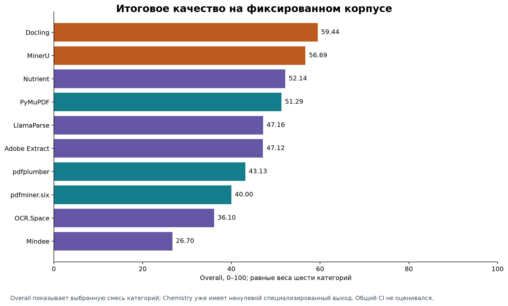

*Overall — равновесное среднее шести Category Scores; он не является универсальным рейтингом.*

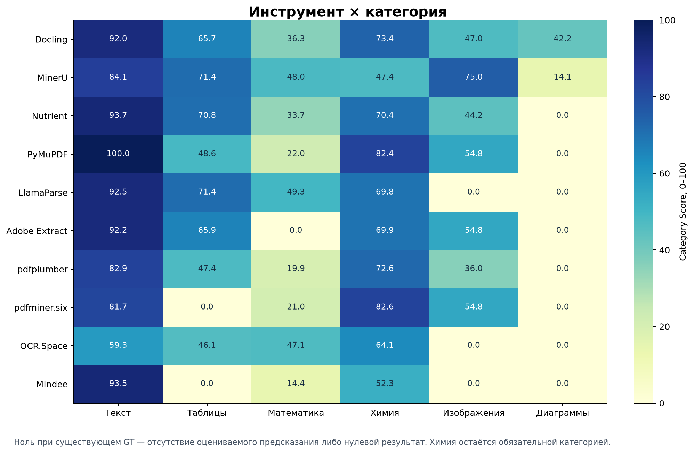

*Профиль категорий показывает специализацию, скрытую сводным Overall.*

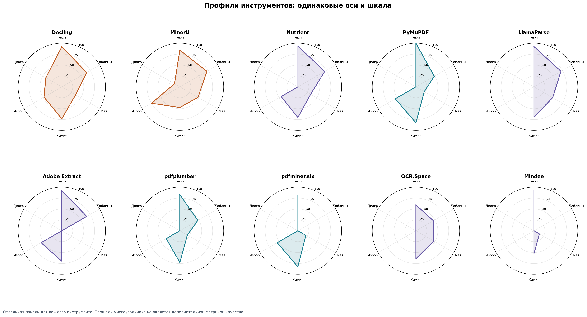

*Радиальные профили позволяют сопоставить сильные и слабые категории инструментов.*

Наибольший наблюдённый Overall у Docling — 59,44, затем MinerU — 56,69 и Nutrient — 52,14. Однако лидеры категорий различаются: PyMuPDF по тексту, MinerU по таблицам и изображениям, LlamaParse по математике, pdfminer.six по действующему Chemistry Score, Docling по диаграммам.


## 13. Сравнение качества

Трудность категорий и покрытие

| Категория | Наибольшая оценка | Score | Среднее 10 tools | Score>0 | Matched |
| --- | --- | --- | --- | --- | --- |
| Текст | pymupdf | 99,98 | 87,18 | 10/10 | 89/90 |
| Таблицы | mineru | 71,44 | 48,73 | 8/10 | 49/70 |
| Математика | llamaparse | 49,33 | 29,17 | 9/10 | 54/60 |
| Химия | pdfminer | 82,59 | 68,49 | 10/10 | 60/60 |
| Изображения | mineru | 75,01 | 36,66 | 7/10 | 29/50 |
| Диаграммы | docling | 42,19 | 5,63 | 2/10 | 10/70 |

Текст оказался наиболее устойчивой категорией: среднее десяти инструментов 87,18. Таблицы имеют среднее 48,73 и особенно зависят от сохранения grid/merged cells. Математика имеет среднее 29,17; ненулевой результат получен у 9/10 инструментов, но структурный LaTeX остаётся сложным. Изображения имеют среднее 36,66. Наиболее трудны диаграммы: среднее 5,63, ненулевые результаты только у Docling и MinerU.

Все инструменты обнаружили 6/6 химических GT-объектов по единому строгому GT-независимому правилу, поэтому Chemistry Detection=100 у всех. Conditional Structured Extraction различается от 39,04 до 75,13 и лучше отражает качество формул, bbox, labels и структурного представления. Chemistry Score и Overall при этом не заменялись диагностическими показателями.

Химия: покрытие и качество payload раздельно

| Инструмент | Chemistry | Detection | Extraction | detected | Объекты |
| --- | --- | --- | --- | --- |
| PyMuPDF | 82,43 | 100,00 | 74,90 | 6/6 |
| pdfplumber | 72,59 | 100,00 | 60,84 | 6/6 |
| Docling | 73,45 | 100,00 | 62,07 | 6/6 |
| pdfminer.six | 82,59 | 100,00 | 75,13 | 6/6 |
| MinerU | 47,40 | 100,00 | 39,04 | 6/6 |
| OCR.Space | 64,06 | 100,00 | 61,69 | 6/6 |
| Nutrient | 70,38 | 100,00 | 57,69 | 6/6 |
| Mindee | 52,33 | 100,00 | 44,00 | 6/6 |
| Adobe Extract | 69,90 | 100,00 | 57,01 | 6/6 |
| LlamaParse | 69,80 | 100,00 | 56,86 | 6/6 |

Средние фиксированных групп

| Группа | Текст | Таблицы | Математика | Химия | Изображения | Диаграммы | Overall |
| --- | --- | --- | --- | --- | --- | --- | --- |
| Локальные | 88,13 | 46,64 | 29,42 | 71,69 | 53,52 | 11,27 | 50,11 |
| Облачные | 86,23 | 50,83 | 28,91 | 65,30 | 19,80 | 0,00 | 41,85 |
| Classic local | 88,18 | 32,01 | 20,93 | 79,20 | 48,52 | 0,00 | 44,81 |
| ML local | 88,06 | 68,58 | 42,15 | 60,42 | 61,02 | 28,17 | 58,07 |

Средний Overall локальной группы равен 50,11, облачной — 41,85. Внутри локальной группы ML-системы имеют 58,07 против 44,81 у classic parsers. Средний Text почти одинаков, а различие связано главным образом с таблицами, математикой, изображениями и диаграммами. Это сравнение выбранных участников, а не всех решений соответствующего класса.

Сопоставимая трудность документов

| PDF | Среднее Text/Table/Diagram | Text | Table | Diagram |
| --- | --- | --- | --- | --- |
| D01 | 52,62 | 93,91 | 59,05 | 4,92 |
| D02 | 52,74 | 90,34 | 61,75 | 6,12 |
| D03 | 56,89 | 94,92 | 69,41 | 6,35 |
| D04 | 39,49 | 85,66 | 25,50 | 7,29 |
| D05 | 34,18 | 71,08 | 27,96 | 3,50 |

На общем наборе Text/Table/Diagram наиболее трудным оказался D05 — 34,18, наиболее лёгким D03 — 56,89. Зависимость от документа велика: например, Text pdfminer.six равен 100 на D02/D03, но 15,78 на D05. Поэтому один PDF не может представлять всё множество технических документов.

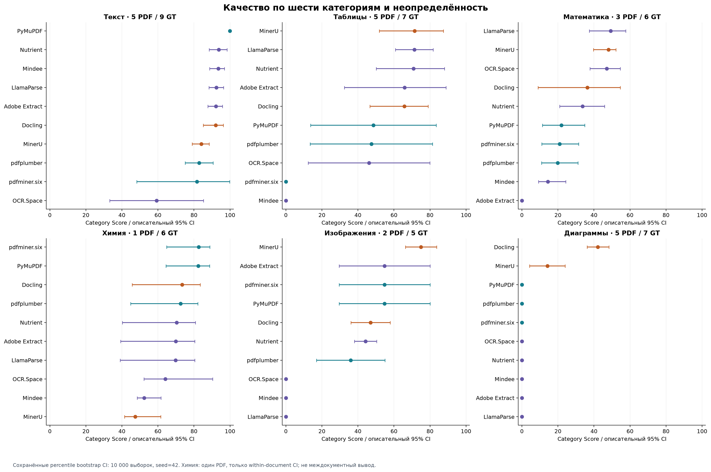

*Интервалы отражают малый фиксированный корпус; Math имеет 3 PDF, Image — 2, Chemistry — 1.*

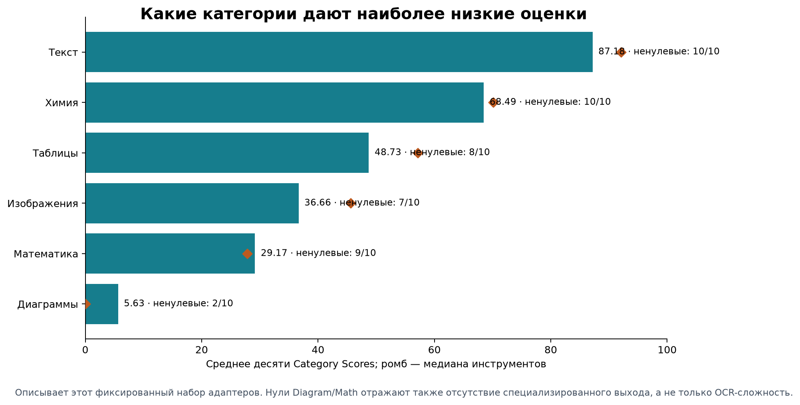

*Средние десяти инструментов показывают резкое усложнение от текста к диаграммам.*

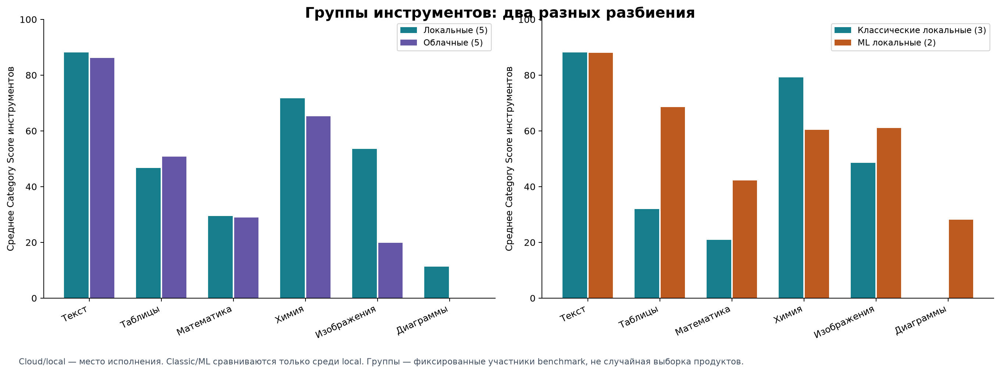

*Средние относятся к фиксированному составу групп.*

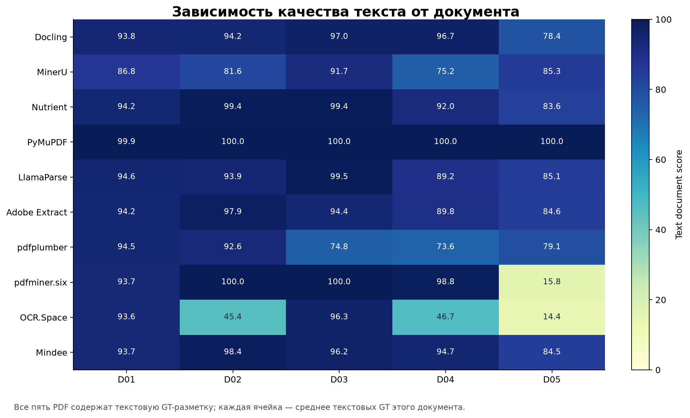

*Текстовая устойчивость зависит от вёрстки и качества текстового слоя.*

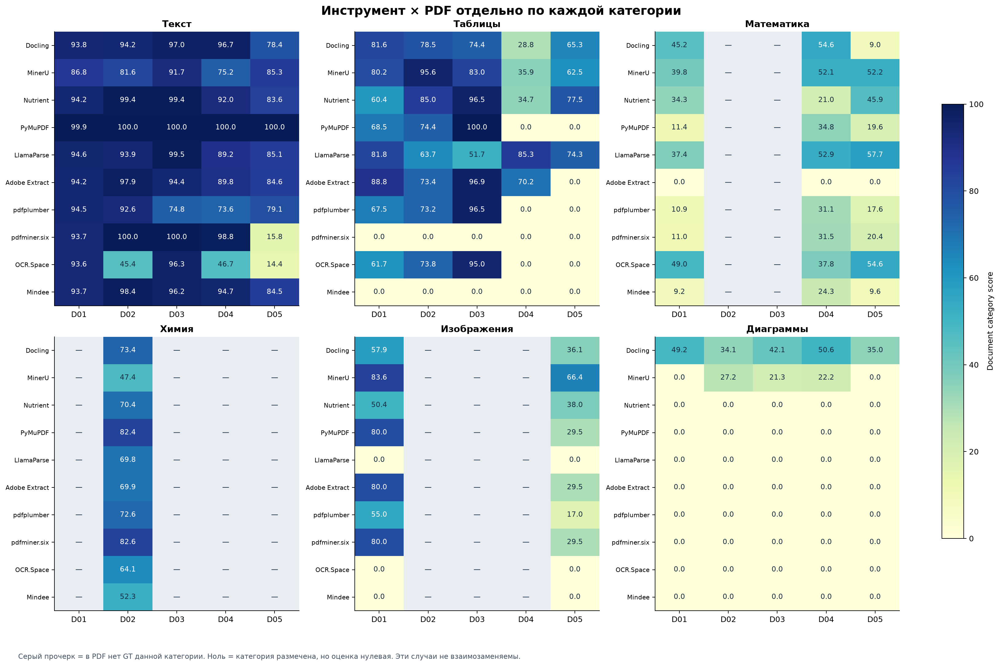

*Состав и трудность объектов неодинаковы между документами.*

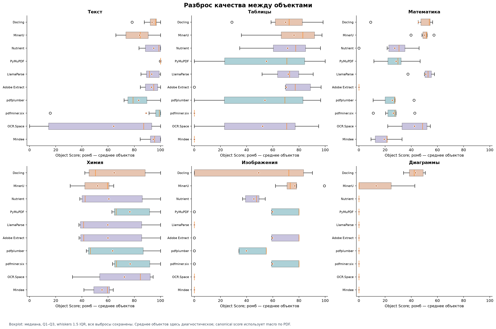

*Нулевая дисперсия нулевых оценок не означает надёжность; coverage анализируется отдельно.*

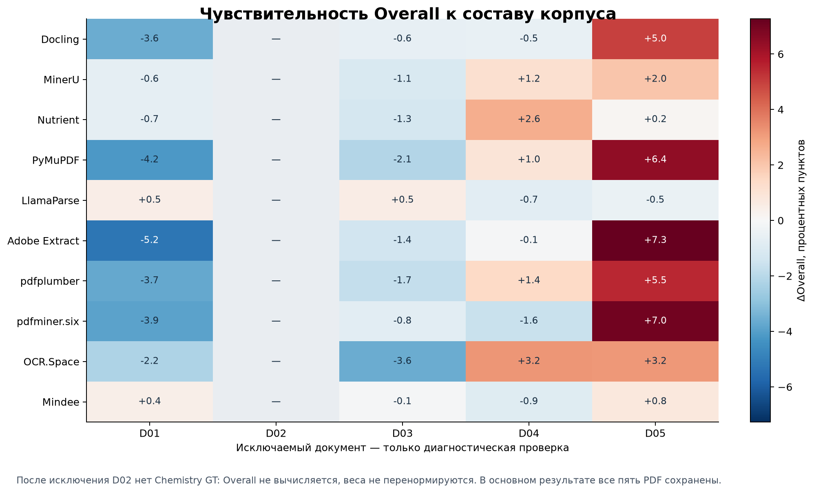

*Leave-one-document-out не заменяет официальный результат по полному корпусу.*


*Парный bootstrap сохраняет общие документы; поправка на множественные сравнения не применялась.*


## 14. Сравнение производительности

Скорость и ресурсы на 98 страницах

| Инструмент | с/стр. | Всего, с | Peak RAM, GiB | Peak VRAM, GiB | Overall |
| --- | --- | --- | --- | --- | --- |
| pdfplumber | 0,086 | 8,5 | 0,81 | 0,00 | 43,13 |
| PyMuPDF | 0,357 | 35,0 | 0,55 | 0,00 | 51,29 |
| Adobe Extract | 1,415 | 138,7 | 0,09 | 0,00 | 47,12 |
| Mindee | 1,435 | 140,7 | 0,14 | 0,00 | 26,70 |
| MinerU | 2,705 | 265,1 | 5,66 | 4,66 | 56,69 |
| pdfminer.six | 2,760 | 270,5 | 0,77 | 0,00 | 40,00 |
| LlamaParse | 2,785 | 273,0 | 0,08 | 0,00 | 47,16 |
| Nutrient | 4,245 | 416,0 | 0,09 | 0,00 | 52,14 |
| OCR.Space | 6,182 | 605,8 | 0,09 | 0,00 | 36,10 |
| Docling | 72,436 | 7098,8 | 10,62 | 7,99 | 59,44 |

Самый быстрый наблюдённый результат у pdfplumber — 0,086 с/стр., затем PyMuPDF — 0,357 с/стр. Docling требует 72,44 с/стр., около 10,62 GiB RAM и 7,99 GiB VRAM; MinerU — 2,70 с/стр., 5,66 GiB RAM и 4,66 GiB VRAM. Для облачных сервисов измерены клиентские ресурсы; серверные RAM/VRAM неизвестны и не интерпретируются как ноль поставщика.

Опубликованный peak_vram_mb использует process GPU peak, если он доступен; иначе device-wide usage учитывается только при подтверждённой CUDA-активности адаптера. torch_peak_reserved не выдаётся за физическое потребление VRAM.

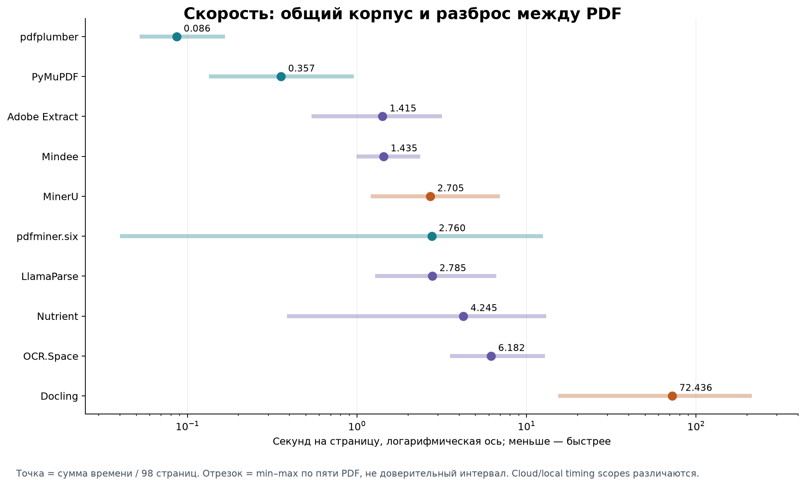

*Время повторного вычисления метрик исключено; показаны исходные замеры адаптеров.*

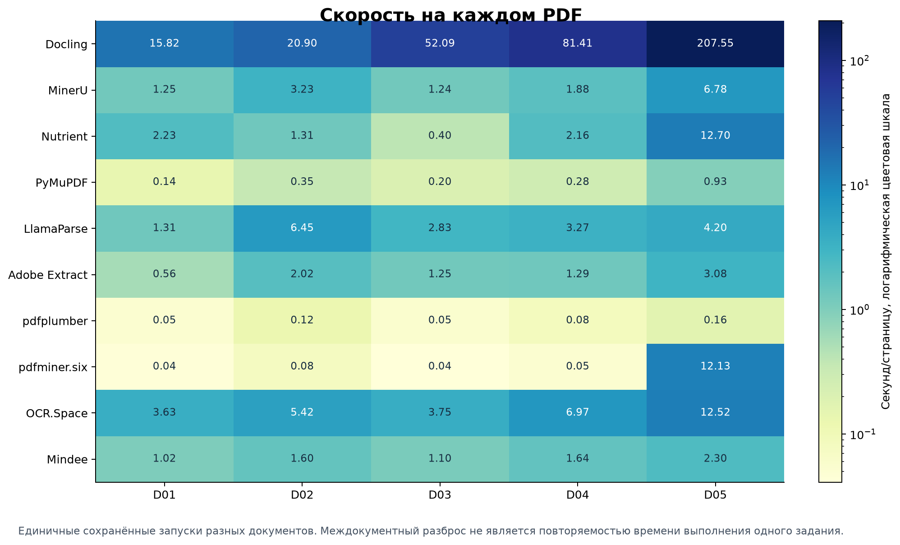

*Отдельные PDF могут доминировать во времени конкретного инструмента.*

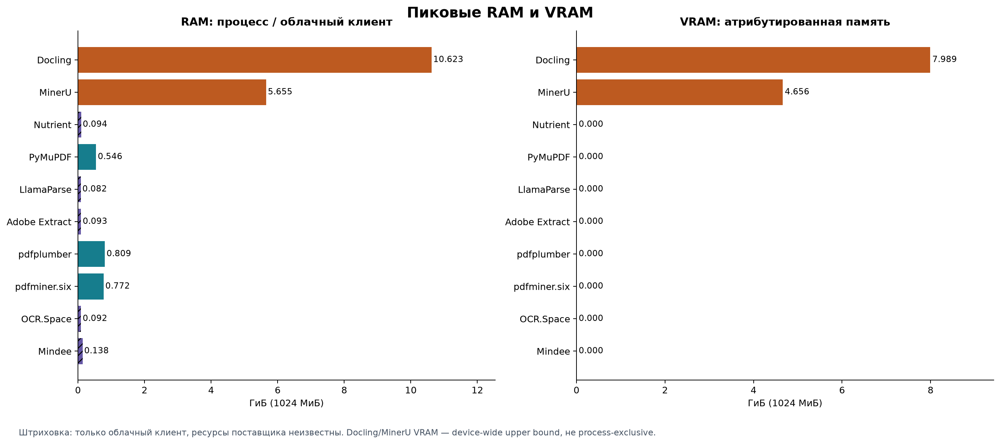

*Облачные значения отражают только клиентский процесс.*

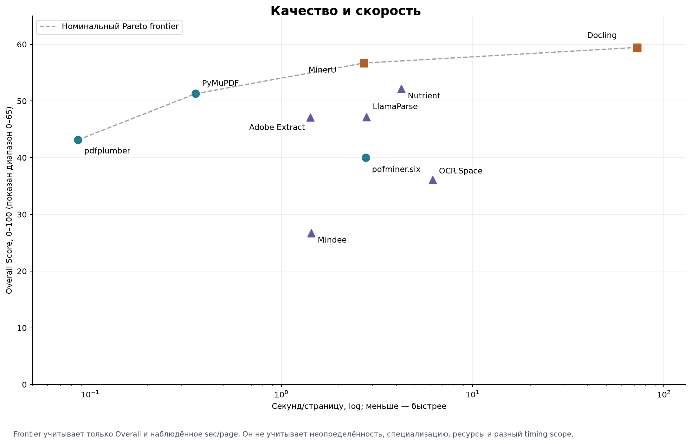

*Pareto-профиль зависит от требуемой категории и допустимых ресурсов.*


## 15. Сравнение стоимости

Стоимость, сохранённая в эксперименте

| Инструмент | Зафиксировано, USD | Основание | Overall |
| --- | --- | --- | --- |
| PyMuPDF | 0,00 | not_applicable_local | 51,29 |
| pdfplumber | 0,00 | not_applicable_local | 43,13 |
| Docling | 0,00 | not_applicable_local | 59,44 |
| pdfminer.six | 0,00 | not_applicable_local | 40,00 |
| MinerU | 0,00 | not_applicable_local | 56,69 |
| OCR.Space | 0,00 | actual | 36,10 |
| Nutrient | 0,00 | estimated | 52,14 |
| Mindee | 0,00 | estimated | 26,70 |
| Adobe Extract | 0,00 | estimated | 47,12 |
| LlamaParse | 0,00 | estimated | 47,16 |

Во всех строках сохранено 0,00 USD. Для локальных библиотек это not_applicable_local; для облачных сервисов — actual, estimated либо free/trial условия конкретного запуска. Эти значения не являются актуальным коммерческим прайс-листом и не позволяют ранжировать cost/quality. Корректное коммерческое сравнение потребует единого тарифа, объёма страниц, региона, налогов и даты фиксации цен.

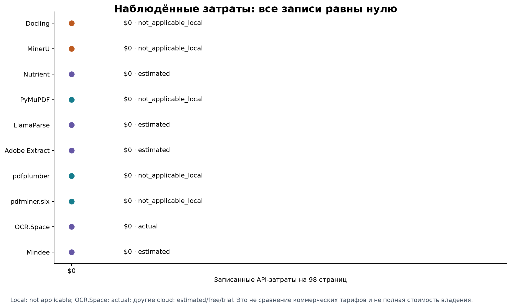

*Нули отражают условия запусков, а не доказанную бесплатность промышленной эксплуатации.*

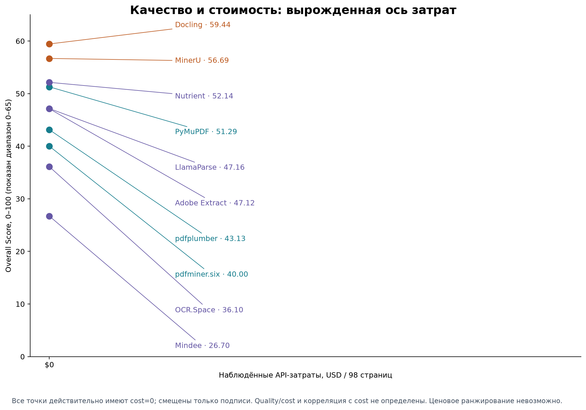

*При одинаковом нулевом наблюдении Pareto-рейтинг стоимости неинформативен.*


## 16. Error analysis

Характерные ошибки десяти инструментов

| Инструмент | Характерные ошибки на выбранных объектах |
| --- | --- |
| PyMuPDF | Текст почти точный; сложные таблицы остаются набором текстовых блоков; формулы теряют дроби и индексы; схемы типизируются как обычные изображения. |
| pdfplumber | В сложной вёрстке нарушаются порядок и разбиение слов; таблицы не всегда собираются из слов; математика становится плоским текстом; диаграммы не типизируются. |
| Docling | На D05 заметны ошибки порядка/OCR; сложные таблицы теряют строки и объединения; MATH_006 повреждает дроби, индексы, греческие символы и операторы; у схем теряются подписи и связи. |
| pdfminer.six | D05 вызывает сильную потерю текста и порядка; таблицы остаются словами; формулы плоские и неполные; изображения извлекаются непоследовательно, диаграммы остаются generic image. |
| MinerU | Ошибки текста связаны с порядком и OCR; таблицы теряют строки/merges; в формулах встречаются токенные ошибки; страдают индексы химии, crop и caption изображений. |
| OCR.Space | Часть текстовых регионов не сопоставляется; таблицы не структурируются; OCR формул теряет дроби, индексы, греческие символы и операторы; визуальный payload отсутствует. |
| Nutrient | На D05 нарушаются порядок и переносы; таблицы теряют строки/объединения; отдельный математический объект сопоставлен пространственно, но payload пуст; схемы часто остаются изображениями. |
| Mindee | Слова D05 дробятся; таблицы представлены словами; математика плоская; химические индексы повреждаются; изображения и диаграммы представлены преимущественно текстом OCR. |
| Adobe Extract | Сегментация слов ухудшается на D05; отдельные таблицы теряют структуру; математические объекты возвращаются как Figure без LaTeX; диаграммы остаются figures. |
| LlamaParse | На D05 встречаются ошибки порядка и переносов; таблицы теряют строки и содержимое; математический payload не всегда точен; Mermaid-граф может остаться TextBlock, а изображения — описанием без visual asset. |

Ошибки разделены на отсутствие объекта и низкое качество уже найденного объекта. Дополнительно проверялся nearby output другого типа: таблица могла присутствовать как TextBlock, формула Adobe — как Figure, диаграмма — как generic Image или Mermaid-текст. Такое содержимое не считается полноценным структурированным извлечением требуемой категории, но учитывается при объяснении причины.

[Полный error analysis из 60 случаев](../../error_analysis/20261004T095716Z_s42_2334c932/report.html) · [Все 60 примеров JSON](../../error_analysis/20261004T095716Z_s42_2334c932/examples.json)


## 17. По 5 примеров для каждого из 10 инструментов

Для каждого инструмента взяты пять наименьших Object Score среди шести стратифицированных категориальных случаев Промпта 14; при равенстве использован фиксированный порядок категорий и object ID. Это диагностическая выборка, а не новая средняя оценка. Шестой случай каждого инструмента доступен в полном error analysis.


### PyMuPDF


#### Пример 1: Tables — TAB_006 (D04, стр. 8), 0,00/100


**Ground Truth**

```text
Размер: 25 × 6; ячеек: 132
[H] Сеть | [H] Показатель | [H] Обучающее α | [H] Обучающее λ | [H] Обучающее + 5% шум α | [H] Обучающее + 5% шум λ
1 | Правильно | 68,20 % | 35,60 % | 67,60 % | 36,20 %
 | Средняя ошибка | 0,0787 | 0,1430 | 0,0827 | 0,1441
 | Макс. ошибка | 0,3728 | 0,5027 | 0,9759 | 0,5047
 | Дисперсия ошибки | 0,0030 | 0,0088 | 0,0046 | 0,0089
2 | Правильно | 86,00 % |  | 82,40 % | 
 | Средняя ошибка | 0,0604 |  | 0,0641 | 
 | Макс. ошибка | 0,3622 |  | 0,4495 | 
 | Дисперсия ошибки | 0,0020 |  | 0,0028 | 
3 | Правильно | 88,70 % |  | 82,40 % | 
 | Средняя ошибка | 0,0583 |  | 0,0634 | 
 | Макс. ошибка | 0,2045 |  | 0,8540 | 
 | Дисперсия ошибки | 0,0013 |  | 0,0029 | 
4 | Правильно | 77,10 % | 39,50 % | 75,80 % | 38,60 %
 | Средняя ошибка | 0,0671 | 0,1449 | 0,0712 | 0,1466
 | Макс. ошибка | 0,3594 | 0,5603 | 0,7292 | 0,5605
 | Дисперсия ошибки | 0,0025 | 0,0103 | 0,0036 | 0,0104
5 | Правильно | 88,50 % |  | 84,20 % | 
 | Средняя ошибка | 0,0574 |  | 0,0651 | 
 | Макс. ошибка | 0,3233 |  | 1,4295 | 
 | Дисперсия ошибки | 0,016 |  | 0,0057 | 
6 | Правильно | 80,60 % |  | 79,00 % | 
 | Средняя ошибка | 0,0631 |  | 0,0683 | 
 | Макс. ошибка | 0,2647 |  | 0,8166 | 
 | Дисперсия ошибки | 0,0018 |  | 0,0037 | 
```


**Output инструмента**

```text
Типизированный объект отсутствует.

Содержимое в той же области, но другого/несопоставленного типа:
- TextBlock overlap=0.02: и тестирование на зашумленном обучающем множестве
- TextBlock overlap=0.01: Результат обучения нейронной сети
- TextBlock overlap=0.01: Обучающее + 5 % шум
- TextBlock overlap=0.01: Дисперсия ошибки
- TextBlock overlap=0.01: Дисперсия ошибки
- TextBlock overlap=0.01: Дисперсия ошибки
- TextBlock overlap=0.01: Дисперсия ошибки
- TextBlock overlap=0.01: Дисперсия ошибки
```


**Тип ошибки:** таблица превращена в обычный текст; структура строк/колонок отсутствует

**Причина:** Typed Table отсутствует, но внутри GT-области найдено TextBlock: 8. Текст извлечён без сетки ячеек, поэтому cell recall и структурные компоненты обнуляются.

**Влияние на метрику:** Object Score=0.00/100; потеря относительно идеального объекта=100.00 п.п.; cell_recall=0.00, cell_content=24.24, row_structure=0.00, column_structure=0.00, merged_f1=0.00, teds_like=0.45


#### Пример 2: Images — IMG_004 (D05, стр. 2), 0,00/100

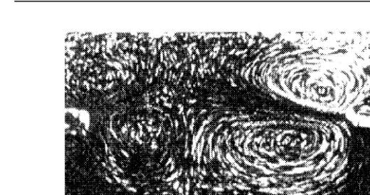


Извлечённый visual asset: [pymupdf_IMG_004.png](prediction_assets/pymupdf_IMG_004.png)


**Ground Truth**

```text
caption: Рис. 1. Картины течения в системе двух параллельных проводников; asset: ground_truth/assets/IMG_004.png
```


**Output инструмента**

```text
Типизированный объект отсутствует.

Содержимое в той же области, но другого/несопоставленного типа:
- Image overlap=1.00: caption: нет; asset: assets\p2_image_16.png
```


**Тип ошибки:** visual candidate не сопоставлен с Image GT

**Причина:** В области есть visual candidate, но он не выбран при one-to-one сопоставлении по типу/геометрии либо не имеет подтверждённого extraction payload.

**Влияние на метрику:** Object Score=0.00/100; потеря относительно идеального объекта=100.00 п.п.; detection_recall=0.00, iou=0.00, extraction=0.00, caption=0.00


#### Пример 3: Diagrams — DIA_001 (D01, стр. 9), 0,00/100

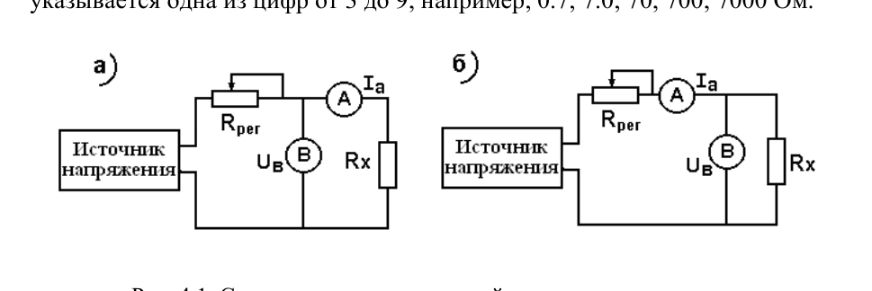


Извлечённый visual asset: [pymupdf_DIA_001.png](prediction_assets/pymupdf_DIA_001.png)


**Ground Truth**

```text
тип: electrical_scheme
caption: Рис. 4.1. Схемы электрических цепей для реализации метода амперметра и вольтметра
текст: Источник напряжения, Rрег, A, V, Rx
ключевые элементы/связи: амперметр, вольтметр, измеряемое сопротивление
asset: ground_truth/assets/DIA_001.png
```


**Output инструмента**

```text
Типизированный объект отсутствует.

Содержимое в той же области, но другого/несопоставленного типа:
- Image overlap=1.00: caption: нет; asset: assets\p9_image_9.png
```


**Тип ошибки:** диаграмма сохранена как обычное изображение; потеря текста и связей

**Причина:** В GT-области найдено Image: 1, но Diagram отсутствует. Generic image не содержит типизированных text_elements/key_elements.

**Влияние на метрику:** Object Score=0.00/100; потеря относительно идеального объекта=100.00 п.п.; detection_recall=0.00, iou=0.00, diagram_text_recall=0.00, caption=0.00, element_recall=0.00, key_elements=0.00


#### Пример 4: Math — MATH_001 (D01, стр. 17), 11,40/100


**Ground Truth**

```text
\tilde{R}_{x}=\frac{U_{\mathrm{в}}}{I_{\mathrm{а}}}=\frac{U_R}{I_0+I_{\mathrm{в}}}=\frac{R_x}{1+\frac{R_x}{R_{\mathrm{в}}}}
```


**Output инструмента**

```text
a 0 U U R ~R в R x = = = , x R + I I I x 0 а в + 1 R в
```


**Тип ошибки:** потеря fraction structure; ошибки subscript; потеря brackets

**Причина:** Exact match отсутствует; token precision=61.90, token recall=15.12, edit similarity=8.40.

**Влияние на метрику:** Object Score=11.40/100; потеря относительно идеального объекта=88.60 п.п.; raw_exact_match=0.00, normalized_exact_match=0.00, token_precision=61.90, token_recall=15.12, token_f1=24.30, edit_similarity=8.40


#### Пример 5: Chemistry — CHEM_003 (D02, стр. 2), 62,91/100

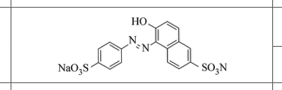


Извлечённый visual asset: [pymupdf_CHEM_003.jpeg](prediction_assets/pymupdf_CHEM_003.jpeg)


**Ground Truth**

```text
Желтый «солнечный закат» (Sunset Yellow FCF); текстовые метки: HO, N=N, NaO3S, SO3Na; asset: ground_truth/assets/CHEM_003.png
```


**Output инструмента**

```text
structure; текстовые метки: нет; asset: assets\p2_image_15.jpeg
```


**Тип ошибки:** потеря химических символов/меток; неточный crop

**Причина:** Structure detection есть, но IoU=51.62, label recall=0.00, extraction=100.00.

**Влияние на метрику:** Object Score=62.91/100; потеря относительно идеального объекта=37.09 п.п.; detection=100.00, iou=51.62, label_recall=0.00, extraction=100.00, structured_extraction=47.01


### pdfplumber


#### Пример 1: Tables — TAB_006 (D04, стр. 8), 0,00/100


**Ground Truth**

```text
Размер: 25 × 6; ячеек: 132
[H] Сеть | [H] Показатель | [H] Обучающее α | [H] Обучающее λ | [H] Обучающее + 5% шум α | [H] Обучающее + 5% шум λ
1 | Правильно | 68,20 % | 35,60 % | 67,60 % | 36,20 %
 | Средняя ошибка | 0,0787 | 0,1430 | 0,0827 | 0,1441
 | Макс. ошибка | 0,3728 | 0,5027 | 0,9759 | 0,5047
 | Дисперсия ошибки | 0,0030 | 0,0088 | 0,0046 | 0,0089
2 | Правильно | 86,00 % |  | 82,40 % | 
 | Средняя ошибка | 0,0604 |  | 0,0641 | 
 | Макс. ошибка | 0,3622 |  | 0,4495 | 
 | Дисперсия ошибки | 0,0020 |  | 0,0028 | 
3 | Правильно | 88,70 % |  | 82,40 % | 
 | Средняя ошибка | 0,0583 |  | 0,0634 | 
 | Макс. ошибка | 0,2045 |  | 0,8540 | 
 | Дисперсия ошибки | 0,0013 |  | 0,0029 | 
4 | Правильно | 77,10 % | 39,50 % | 75,80 % | 38,60 %
 | Средняя ошибка | 0,0671 | 0,1449 | 0,0712 | 0,1466
 | Макс. ошибка | 0,3594 | 0,5603 | 0,7292 | 0,5605
 | Дисперсия ошибки | 0,0025 | 0,0103 | 0,0036 | 0,0104
5 | Правильно | 88,50 % |  | 84,20 % | 
 | Средняя ошибка | 0,0574 |  | 0,0651 | 
 | Макс. ошибка | 0,3233 |  | 1,4295 | 
 | Дисперсия ошибки | 0,016 |  | 0,0057 | 
6 | Правильно | 80,60 % |  | 79,00 % | 
 | Средняя ошибка | 0,0631 |  | 0,0683 | 
 | Макс. ошибка | 0,2647 |  | 0,8166 | 
 | Дисперсия ошибки | 0,0018 |  | 0,0037 | 
```


**Output инструмента**

```text
Типизированный объект отсутствует.

Содержимое в той же области, но другого/несопоставленного типа:
- TextBlock overlap=0.01: Обучающее+5%
- TextBlock overlap=0.00: зашумленном
- TextBlock overlap=0.00: тестирование
- TextBlock overlap=0.00: Обучающее
- TextBlock overlap=0.00: обучающем
- TextBlock overlap=0.00: Правильно
- TextBlock overlap=0.00: Правильно
- TextBlock overlap=0.00: Правильно
```


**Тип ошибки:** таблица превращена в обычный текст; структура строк/колонок отсутствует

**Причина:** Typed Table отсутствует, но внутри GT-области найдено TextBlock: 8. Текст извлечён без сетки ячеек, поэтому cell recall и структурные компоненты обнуляются.

**Влияние на метрику:** Object Score=0.00/100; потеря относительно идеального объекта=100.00 п.п.; cell_recall=0.00, cell_content=24.24, row_structure=0.00, column_structure=0.00, merged_f1=0.00, teds_like=0.45


#### Пример 2: Images — IMG_004 (D05, стр. 2), 0,00/100


**Ground Truth**

```text
caption: Рис. 1. Картины течения в системе двух параллельных проводников; asset: ground_truth/assets/IMG_004.png
```


**Output инструмента**

```text
Типизированный объект отсутствует.

Содержимое в той же области, но другого/несопоставленного типа:
- Image overlap=1.00: caption: нет; asset: нет
```


**Тип ошибки:** visual candidate не сопоставлен с Image GT

**Причина:** В области есть visual candidate, но он не выбран при one-to-one сопоставлении по типу/геометрии либо не имеет подтверждённого extraction payload.

**Влияние на метрику:** Object Score=0.00/100; потеря относительно идеального объекта=100.00 п.п.; detection_recall=0.00, iou=0.00, extraction=0.00, caption=0.00


#### Пример 3: Diagrams — DIA_001 (D01, стр. 9), 0,00/100


**Ground Truth**

```text
тип: electrical_scheme
caption: Рис. 4.1. Схемы электрических цепей для реализации метода амперметра и вольтметра
текст: Источник напряжения, Rрег, A, V, Rx
ключевые элементы/связи: амперметр, вольтметр, измеряемое сопротивление
asset: ground_truth/assets/DIA_001.png
```


**Output инструмента**

```text
Типизированный объект отсутствует.

Содержимое в той же области, но другого/несопоставленного типа:
- Image overlap=1.00: caption: нет; asset: нет
```


**Тип ошибки:** диаграмма сохранена как обычное изображение; потеря текста и связей

**Причина:** В GT-области найдено Image: 1, но Diagram отсутствует. Generic image не содержит типизированных text_elements/key_elements.

**Влияние на метрику:** Object Score=0.00/100; потеря относительно идеального объекта=100.00 п.п.; detection_recall=0.00, iou=0.00, diagram_text_recall=0.00, caption=0.00, element_recall=0.00, key_elements=0.00


#### Пример 4: Math — MATH_001 (D01, стр. 17), 10,89/100


**Ground Truth**

```text
\tilde{R}_{x}=\frac{U_{\mathrm{в}}}{I_{\mathrm{а}}}=\frac{U_R}{I_0+I_{\mathrm{в}}}=\frac{R_x}{1+\frac{R_x}{R_{\mathrm{в}}}}
```


**Output инструмента**

```text
a 0 U U R ~ в R x = = = , R x R + I I I x 0 а в 1+ R в
```


**Тип ошибки:** потеря fraction structure; ошибки subscript; потеря brackets

**Причина:** Exact match отсутствует; token precision=60.00, token recall=13.95, edit similarity=9.16.

**Влияние на метрику:** Object Score=10.89/100; потеря относительно идеального объекта=89.11 п.п.; raw_exact_match=0.00, normalized_exact_match=0.00, token_precision=60.00, token_recall=13.95, token_f1=22.64, edit_similarity=9.16


#### Пример 5: Chemistry — CHEM_003 (D02, стр. 2), 43,30/100


**Ground Truth**

```text
Желтый «солнечный закат» (Sunset Yellow FCF); текстовые метки: HO, N=N, NaO3S, SO3Na; asset: ground_truth/assets/CHEM_003.png
```


**Output инструмента**

```text
structure; текстовые метки: нет; asset: нет
```


**Тип ошибки:** потеря химических символов/меток; structural formula не извлечена; неточный crop

**Причина:** Structure detection есть, но IoU=53.20, label recall=0.00, extraction=0.00.

**Влияние на метрику:** Object Score=43.30/100; потеря относительно идеального объекта=56.70 п.п.; detection=100.00, iou=53.20, label_recall=0.00, extraction=0.00, structured_extraction=19.00


### Docling


#### Пример 1: Images — IMG_003 (D01, стр. 27), 0,00/100

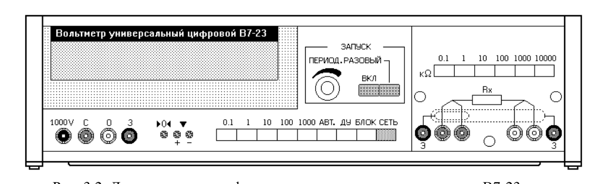


Извлечённый visual asset: [docling_IMG_003.png](prediction_assets/docling_IMG_003.png)


**Ground Truth**

```text
caption: Рис. 3.2. Лицевая панель цифрового интегрирующего вольтметра В7-23; asset: ground_truth/assets/IMG_003.png
```


**Output инструмента**

```text
Типизированный объект отсутствует.

Содержимое в той же области, но другого/несопоставленного типа:
- Diagram overlap=0.97: тип: scientific_scheme
caption: Рис. 3.2. Лицевая панель цифрового интегрирующего вольтметра В7-23
текст: Вольтнетр универсальный цифровой В7-23, ЗАПЧЕК, D.l, 1D, IDD, BКЛ, нт, 1D, IUUD дBT, ДЧ БЛОК СЕТЬ
ключевые элементы/связи: нет
asset: assets\picture_0007.png
```


**Тип ошибки:** visual candidate не сопоставлен с Image GT

**Причина:** В области есть visual candidate, но он не выбран при one-to-one сопоставлении по типу/геометрии либо не имеет подтверждённого extraction payload.

**Влияние на метрику:** Object Score=0.00/100; потеря относительно идеального объекта=100.00 п.п.; detection_recall=0.00, iou=0.00, extraction=0.00, caption=0.00


#### Пример 2: Math — MATH_006 (D05, стр. 19), 8,99/100

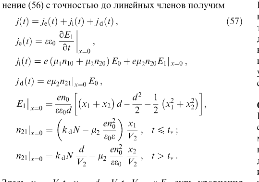


**Ground Truth**

```text
j(t)=j_e(t)+j_i(t)+j_d(t),\quad j_e(t)=\varepsilon\varepsilon_0\left.\frac{\partial E_1}{\partial t}\right|_{x=0},\quad j_i(t)=e(\mu_1n_{10}+\mu_2n_{20})E_0+\left.e\mu_2n_{20}E_1\right|_{x=0},\quad j_d(t)=\left.e\mu_2n_{21}\right|_{x=0}E_0,\quad \left.E_1\right|_{x=0}=\frac{en_0}{\varepsilon\varepsilon_0d}\left[(x_1+x_2)d-\frac{d^2}{2}-\frac{1}{2}(x_1^2+x_2^2)\right],\quad \left.n_{21}\right|_{x=0}=\left(k_dN-\mu_2\frac{en_0^2}{\varepsilon_0\varepsilon}\right)\frac{x_1}{V_2},\quad t\le t_*;\quad \left.n_{21}\right|_{x=0}=k_dN\frac{d}{V_2}-\mu_2\frac{en_0^2}{\varepsilon\varepsilon_0}\frac{x_2}{V_2},\quad t>t_*
```


**Output инструмента**

```text
\Pi o c j e \colon & \rho j e _ { N } h a ( 5 5 ) \ n \ \Pi o c j e A \bar { h } \ \bar { b } e p x , \\ \hom e \left ( 5 \right ) c \ & \top \Pi o c \bar { b } \ \Pi o \ J \bar { h } \ \Pi o \bar { h } \ \Pi o \bar { h } \ \Pi o \ J \bar { h } \ \Pi o \ J \bar { h } \ \Pi o \ J \bar { h } \ \Pi o \ J \bar { h } \ \Pi o \ J \bar { h } \ \Pi o \ J \bar { h } \ \Pi o \ J \bar { h } \ \Pi o \ J \bar { h } \ \Pi o \ J \bar { h } \ \Pi o \ J \bar { h } \ \Pi o \ J \bar { h } \ \Pi o \ J \bar { h } \ \Pi o \ J \bar { h } \ \Pi o \ J \bar { h } \ \Pi o \ J \bar { h } \ \Pi o \ J \bar { h } \ \Pi o \ J \bar { h } \ \Pi o \ J \bar { h } \ \Pi o \ J \bar { h } \ \Pi o \ J \bar { h } \ \Pi o \ J \bar { h } \ \Pi o \ J \bar { h } \ \Pi o \ J \bar { h } \ \Pi o \ J \bar { h } \ \Pi o \ J \bar { h } \ \Pi o \ J \bar { h } \ \Pi o \ J \bar { h } \ \Pi o \ J \bar { h } \ \Pi o \ J \bar { h } \ \Pi o \ J \bar { h } \ \Pi o \ J \bar { h } \ \Pi o \ J \bar { h } \ \Pi o \ J \bar { h } \ \Pi o \ J \bar { h } \ \Pi o \ J \bar { h } \ \Pi o \ J \bar { h } \ \Pi o \ J \bar { h } \ \Pi o \ J \bar { h } \ \Pi o \ J \bar { h } \ \Pi o \ J \bar { h } \ \Pi o \ J \bar { h } \ \Pi o \ J \bar { h } \ \Pi o \ J \bar { h } \ \Pi o \ J \bar { h } \ \Pi o \ J \bar { h } \ \Pi o \ J \bar { h } \ \Pi o \ J \bar { h } \ \Pi o \ J \bar { h } \ \Pi o \ J \bar { h } \ \Pi o \ J \bar { h } \ \Pi o \ J \bar { h } \ \Pi o \ J \bar { h } \ \Pi o \ J \bar { h } \ \Pi o \ J \bar { h } \ \Pi o \ J \bar { h } \ \Pi o \ J \bar { h } \ \Pi o \ J \bar { h } \ \Pi o \ J \bar { h } \ \Pi o \ J \bar { h } \ \Pi o \ J \bar { h } \ \Pi o \ J \bar { h } \ \Pi o \ J \bar { h } \ \Pi o \ J \bar { h } \ \Pi o \ J \bar { h } \ \Pi o \ J \bar { h } \ \Pi o \ J \bar { h } \ \Pi o \ J \bar { h } \ \Pi o \ J \bar { h } \ \Pi o \ J \bar { h } \ \Pi o \ J \bar { h } \ \Pi o \ J \bar { h } \ \Pi o \ J \bar { h } \ \Pi o \ J \bar { h } \ \Pi o \ J \bar { h } \ \Pi o \ J \bar { h } \ \Pi o \ J \bar { h } \ \Pi o \ J \bar { h } \ \Pi o \ J \bar { h } \ \Pi o \ J \bar { h } \ \Pi o \ J \bar { h } \ \Pi o \ J \bar { h } \ \Pi o \ J \bar { h } \ \Pi o \ J \bar { h } \ \Pi o \ J \bar { h } \ \Pi o \ J \bar { h } \ \Pi o \ J \bar { h } \ \Pi o \ J \bar { h } \ \Pi o \ J \bar { h } \ \Pi o \ J \bar { h } \ \Pi o \ J \bar { h } \ \Pi o \ J \bar { h } \ \Pi o \ J \bar { h } \ \Pi o \ J \bar { h } \ \Pi o \ J \bar { h } \ \Pi o \ J \bar { h } \ \Pi o \ J \bar { h } \ \Pi o \ J \bar { h } \ \Pi o \ J \bar { h } \ \Pi o \ J \bar { h } \ \Pi o \ J \bar { h } \ \Pi o \ J \bar { h } \ \Pi o \ J \bar { h } \ \Pi o \ J \bar { h } \ \Pi o \ J \bar { h } \ \Pi o \ J \bar { h } \ \Pi o \ J \bar { h } \ \Pi o \ J \bar { h } \ \Pi o \ J \bar { h } \ \Pi o \ J \bar { h } \ \Pi o \ J \bar { h } \ \Pi o \ J \bar { h } \ \Pi o \ J \bar { h } \ \Pi o \ J \bar { h } \ \Pi o \ J \bar { h } \ \Pi o \ J \bar { h } \ \Pi o \ J \bar { h } \ \Pi o \ J \bar { h } \ \Pi o \ J \bar { h } \ \Pi o \ J \bar { h } \ \Pi o \ J \bar { h } \ \Pi o \ J \bar { h } \ \Pi o \ J \bar { h } \ \Pi o \ J \bar { h } \ \Pi o \ J \bar { h } \ \Pi o \ J \bar { h } \ \Pi o \ J \bar { h } \ \Pi o \ J \bar { h } \ \Pi o \ J \bar { h } \ \Pi o \ J \bar { h } \ \Pi o \ J \bar { h } \ \Pi o \ J \bar { h } \ \Pi o \ J \bar { h } \ \Pi o \ J \bar { h } \ \Pi o \ J \bar { h } \ \Pi o \ J \bar { h } \ \Pi o \ J \bar { h } \ \Pi o \ J \bar { h } \ \Pi o \ J \bar { h } \ \Pi o \ J \bar { h } \ \Pi o \ J \bar { h } \ \Pi o \ J \bar { h } \ \Pi o \ J \bar { h } \ \Pi o \ J \bar { h } \ \Pi o \ J \bar { h } \ \Pi o \ J \bar { h } \ \Pi o \ J \bar { h } \ \Pi o \ J \bar { h } \ \Pi o \ J \bar { h } \ \Pi o \ J \bar { h } \ \Pi o \ J \bar { h } \ \Pi o \ J \bar { h } \ \Pi o \ J \bar { h } \ \Pi o \ J \bar { h } \ \Pi o \ J \bar { h } \ \Pi o \ J \bar { h } \ \Pi o \ J \bar { h } \ \Pi o \ J \bar { h } \ \Pi o \ J \bar { h } \ \Pi o \ J \bar { h } \ \Pi o \ J \bar { h } \ \Pi o \ J \bar { h } \ \Pi o \ J \bar { h } \ \Pi o \ J \bar { h } \ \Pi o \ J \bar { h } \ \Pi o \ J \bar { h } \ \Pi o \ J \bar { h } \ \Pi o \ J \bar { h } \ \Pi o \ J \bar { h } \ \Pi o \ J \bar { h } \ \Pi o \ J \bar { h } \ \Pi o \ J \bar { h } \ \Pi o \ J \bar { h } \ \Pi o \ J \bar { h } \ \Pi o \ J \bar { h } \ \Pi o \ J \bar { h } \ \Pi o \ J
```


**Тип ошибки:** потеря fraction structure; ошибки superscript; потеря Greek symbols; потеря operators

**Причина:** Exact match отсутствует; token precision=12.05, token recall=34.54, edit similarity=9.22.

**Влияние на метрику:** Object Score=8.99/100; потеря относительно идеального объекта=91.01 п.п.; raw_exact_match=0.00, normalized_exact_match=0.00, token_precision=12.05, token_recall=34.54, token_f1=17.87, edit_similarity=9.22


#### Пример 3: Tables — TAB_006 (D04, стр. 8), 28,82/100


**Ground Truth**

```text
Размер: 25 × 6; ячеек: 132
[H] Сеть | [H] Показатель | [H] Обучающее α | [H] Обучающее λ | [H] Обучающее + 5% шум α | [H] Обучающее + 5% шум λ
1 | Правильно | 68,20 % | 35,60 % | 67,60 % | 36,20 %
 | Средняя ошибка | 0,0787 | 0,1430 | 0,0827 | 0,1441
 | Макс. ошибка | 0,3728 | 0,5027 | 0,9759 | 0,5047
 | Дисперсия ошибки | 0,0030 | 0,0088 | 0,0046 | 0,0089
2 | Правильно | 86,00 % |  | 82,40 % | 
 | Средняя ошибка | 0,0604 |  | 0,0641 | 
 | Макс. ошибка | 0,3622 |  | 0,4495 | 
 | Дисперсия ошибки | 0,0020 |  | 0,0028 | 
3 | Правильно | 88,70 % |  | 82,40 % | 
 | Средняя ошибка | 0,0583 |  | 0,0634 | 
 | Макс. ошибка | 0,2045 |  | 0,8540 | 
 | Дисперсия ошибки | 0,0013 |  | 0,0029 | 
4 | Правильно | 77,10 % | 39,50 % | 75,80 % | 38,60 %
 | Средняя ошибка | 0,0671 | 0,1449 | 0,0712 | 0,1466
 | Макс. ошибка | 0,3594 | 0,5603 | 0,7292 | 0,5605
 | Дисперсия ошибки | 0,0025 | 0,0103 | 0,0036 | 0,0104
5 | Правильно | 88,50 % |  | 84,20 % | 
 | Средняя ошибка | 0,0574 |  | 0,0651 | 
 | Макс. ошибка | 0,3233 |  | 1,4295 | 
 | Дисперсия ошибки | 0,016 |  | 0,0057 | 
6 | Правильно | 80,60 % |  | 79,00 % | 
 | Средняя ошибка | 0,0631 |  | 0,0683 | 
 | Макс. ошибка | 0,2647 |  | 0,8166 | 
 | Дисперсия ошибки | 0,0018 |  | 0,0037 | 
```


**Output инструмента**

```text
Размер: 8 × 6; ячеек: 35
 |  | [H] Обучающее |  | [H] Обучающее + 5 % шум | 
[H] Сеть |  | [H] α | [H] λ | [H] α | [H] λ
1 | Правильно Средняя ошибка Макс. ошибка Дисперсия ошибки | 68,20 % 0,0787 0,3728 0,0030 | 35,60 % 0,1430 0,5027 0,0088 | 67,60 % 0,0827 0,9759 0,0046 | 36,20 % 0,1441 0,5047 0,0089
2 | Правильно Средняя ошибка Макс. ошибка Дисперсия ошибки | 86,00 % 0,0604 0,3622 0,0020 |  | 82,40 % 0,0641 0,4495 0,0028 | 
3 | Правильно Средняя ошибка Макс. ошибка Дисперсия ошибки | 88,70 % 0,0583 0,2045 0,0013 |  | 82,40 % 0,0634 0,8540 0,0029 | 
4 | Правильно Средняя ошибка Макс. ошибка Дисперсия ошибки | 77,10 % 0,0671 0,3594 0,0025 | 39,50 % 0,1449 0,5603 0,0103 | 75,80 % 0,0712 0,7292 0,0036 | 38,60 % 0,1466 0,5605 0,0104
5 | Правильно Средняя ошибка Макс. ошибка Дисперсия ошибки | 88,50 % 0,0574 0,3233 0,016 |  | 84,20 % 0,0651 1,4295 0,0057 | 
6 | Правильно Средняя ошибка Макс. ошибка Дисперсия ошибки | 80,60 % 0,0631 0,2647 0,0018 |  | 79,00 % 0,0683 0,8166 0,0037 | 
```


**Тип ошибки:** потеря строк; ошибки объединения ячеек; искажение содержимого ячеек

**Причина:** GT=25×6, output=8×6; headers 6→7. Cell recall=19.70, TEDS-like=17.19.

**Влияние на метрику:** Object Score=28.82/100; потеря относительно идеального объекта=71.18 п.п.; cell_recall=19.70, cell_content=25.54, row_structure=32.00, column_structure=100.00, merged_f1=0.00, teds_like=17.19


#### Пример 4: Diagrams — DIA_003 (D02, стр. 4), 34,06/100

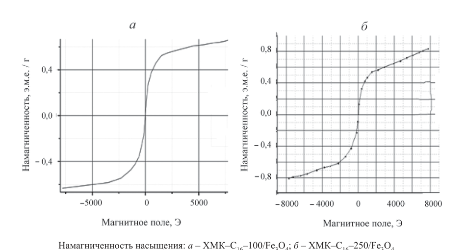


Извлечённый visual asset: [docling_DIA_003.png](prediction_assets/docling_DIA_003.png)


**Ground Truth**

```text
тип: chart
caption: Намагниченность насыщения: а – ХМК–C16–100/Fe3O4; б – ХМК–C16–250/Fe3O4
текст: Намагниченность, Магнитное поле
ключевые элементы/связи: кривая намагничивания, ось поля, ось намагниченности
asset: ground_truth/assets/DIA_003.png
```


**Output инструмента**

```text
тип: chart
caption: нет
текст: 04, 5, nn, 124, =
ключевые элементы/связи: нет
asset: assets\picture_0001.png
```


**Тип ошибки:** потеря текста; потеря связей/ключевых элементов; потеря caption

**Причина:** Detection=100.00, IoU=93.74, diagram text recall=0.00, key elements=0.00.

**Влияние на метрику:** Object Score=34.06/100; потеря относительно идеального объекта=65.94 п.п.; detection_recall=100.00, iou=93.74, diagram_text_recall=0.00, caption=0.00, element_recall=0.00, key_elements=0.00


#### Пример 5: Chemistry — CHEM_004 (D02, стр. 2), 42,20/100

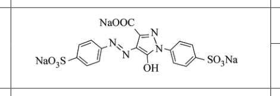


**Ground Truth**

```text
Тартразин (Tartrazine); текстовые метки: NaOOC, N=N, OH, NaO3S, SO3Na; asset: ground_truth/assets/CHEM_004.png
```


**Output инструмента**

```text
structure; текстовые метки: нет; asset: нет
```


**Тип ошибки:** потеря химических символов/меток; structural formula не извлечена; неточный crop

**Причина:** Structure detection есть, но IoU=48.78, label recall=0.00, extraction=0.00.

**Влияние на метрику:** Object Score=42.20/100; потеря относительно идеального объекта=57.80 п.п.; detection=100.00, iou=48.78, label_recall=0.00, extraction=0.00, structured_extraction=17.42


### pdfminer.six


#### Пример 1: Tables — TAB_001 (D01, стр. 4), 0,00/100

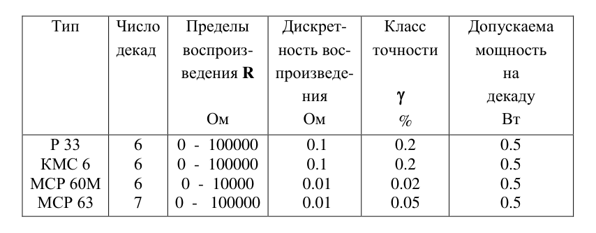


**Ground Truth**

```text
Размер: 5 × 6; ячеек: 30
[H] Тип | [H] Число декад | [H] Пределы воспроизведения R, Ом | [H] Дискретность воспроизведения, Ом | [H] Класс точности γ, % | [H] Допускаемая мощность на декаду, Вт
Р 33 | 6 | 0–100000 | 0,1 | 0,2 | 0,5
КМС 6 | 6 | 0–100000 | 0,1 | 0,2 | 0,5
МСР 60М | 6 | 0–10000 | 0,01 | 0,02 | 0,5
МСР 63 | 7 | 0–100000 | 0,01 | 0,05 | 0,5
```


**Output инструмента**

```text
Типизированный объект отсутствует.

Содержимое в той же области, но другого/несопоставленного типа:
- TextBlock overlap=0.01: Допускаема
- TextBlock overlap=0.01: 0 - 100000
- TextBlock overlap=0.01: 0 - 100000
- TextBlock overlap=0.01: 0 - 100000
- TextBlock overlap=0.01: произведе-
- TextBlock overlap=0.01: ведения R
- TextBlock overlap=0.01: ность вос-
- TextBlock overlap=0.01: 0 - 10000
```


**Тип ошибки:** таблица превращена в обычный текст; структура строк/колонок отсутствует

**Причина:** Typed Table отсутствует, но внутри GT-области найдено TextBlock: 8. Текст извлечён без сетки ячеек, поэтому cell recall и структурные компоненты обнуляются.

**Влияние на метрику:** Object Score=0.00/100; потеря относительно идеального объекта=100.00 п.п.; cell_recall=0.00, cell_content=0.00, row_structure=0.00, column_structure=0.00, merged_f1=100.00, teds_like=1.96


#### Пример 2: Images — IMG_004 (D05, стр. 2), 0,00/100


Извлечённый visual asset: [pdfminer_IMG_004.bmp](prediction_assets/pdfminer_IMG_004.bmp)


**Ground Truth**

```text
caption: Рис. 1. Картины течения в системе двух параллельных проводников; asset: ground_truth/assets/IMG_004.png
```


**Output инструмента**

```text
Типизированный объект отсутствует.

Содержимое в той же области, но другого/несопоставленного типа:
- Image overlap=1.00: caption: нет; asset: assets\im2.bmp
```


**Тип ошибки:** visual candidate не сопоставлен с Image GT

**Причина:** В области есть visual candidate, но он не выбран при one-to-one сопоставлении по типу/геометрии либо не имеет подтверждённого extraction payload.

**Влияние на метрику:** Object Score=0.00/100; потеря относительно идеального объекта=100.00 п.п.; detection_recall=0.00, iou=0.00, extraction=0.00, caption=0.00


#### Пример 3: Diagrams — DIA_001 (D01, стр. 9), 0,00/100


Извлечённый visual asset: [pdfminer_DIA_001.jpg](prediction_assets/pdfminer_DIA_001.jpg)


**Ground Truth**

```text
тип: electrical_scheme
caption: Рис. 4.1. Схемы электрических цепей для реализации метода амперметра и вольтметра
текст: Источник напряжения, Rрег, A, V, Rx
ключевые элементы/связи: амперметр, вольтметр, измеряемое сопротивление
asset: ground_truth/assets/DIA_001.png
```


**Output инструмента**

```text
Типизированный объект отсутствует.

Содержимое в той же области, но другого/несопоставленного типа:
- Image overlap=1.00: caption: нет; asset: assets\Im1.jpg
```


**Тип ошибки:** диаграмма сохранена как обычное изображение; потеря текста и связей

**Причина:** В GT-области найдено Image: 1, но Diagram отсутствует. Generic image не содержит типизированных text_elements/key_elements.

**Влияние на метрику:** Object Score=0.00/100; потеря относительно идеального объекта=100.00 п.п.; detection_recall=0.00, iou=0.00, diagram_text_recall=0.00, caption=0.00, element_recall=0.00, key_elements=0.00


#### Пример 4: Math — MATH_001 (D01, стр. 17), 10,97/100


**Ground Truth**

```text
\tilde{R}_{x}=\frac{U_{\mathrm{в}}}{I_{\mathrm{а}}}=\frac{U_R}{I_0+I_{\mathrm{в}}}=\frac{R_x}{1+\frac{R_x}{R_{\mathrm{в}}}}
```


**Output инструмента**

```text
U R в R x ~R = = = , U I x + I I 0 а в + 1 R R x в
```


**Тип ошибки:** потеря fraction structure; ошибки subscript; потеря brackets

**Причина:** Exact match отсутствует; token precision=63.16, token recall=13.95, edit similarity=9.16.

**Влияние на метрику:** Object Score=10.97/100; потеря относительно идеального объекта=89.03 п.п.; raw_exact_match=0.00, normalized_exact_match=0.00, token_precision=63.16, token_recall=13.95, token_f1=22.86, edit_similarity=9.16


#### Пример 5: Text — TXT_009 (D05, стр. 10), 15,78/100

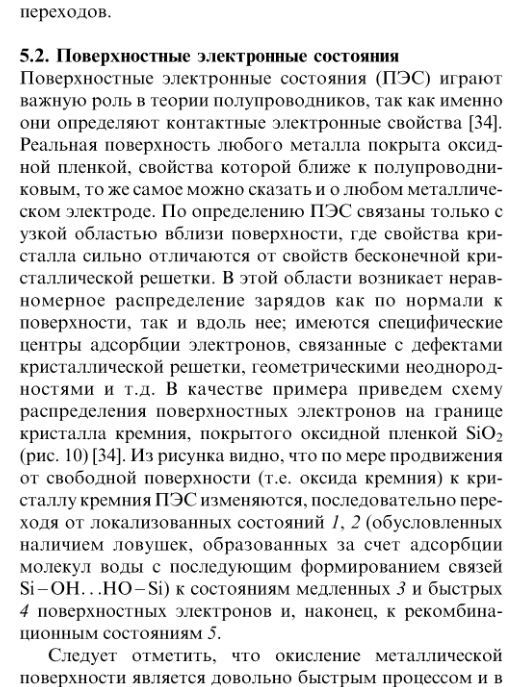


**Ground Truth**

```text
5.2. Поверхностные электронные состояния 
Поверхностные электронные состояния (ПЭС) играют 
важную роль в теории полупроводников, так как именно 
они определяют контактные электронные свойства [34]. 
Реальная поверхность любого металла покрыта оксид­
ной пленкой, свойства которой ближе к полупроводни­
ковым, то же самое можно сказать и о л ю б о м металличе­
ском электроде. П о определению П Э С связаны только с 
узкой областью вблизи поверхности, где свойства кри­
сталла сильно отличаются от свойств бесконечной кри­
сталлической решетки. В этой области возникает нерав­
н о м е р н о е распределение з а р я д о в как по н о р м а л и к 
поверхности, так и вдоль нее; имеются специфические 
центры адсорбции электронов, связанные с дефектами 
кристаллической решетки, геометрическими неоднород-
н о с т я м и и т.д. В качестве п р и м е р а приведем схему 
распределения поверхностных электронов на границе 
кристалла кремния, покрытого оксидной пленкой S i 0 2 
(рис. 10) [34]. Из рисунка видно, что по мере продвижения 
от свободной поверхности (т.е. оксида кремния) к кри­
сталлу кремния П Э С изменяются, последовательно пере­
ходя от локализованных состояний 7, 2 (обусловленных 
наличием ловушек, образованных за счет адсорбции 
молекул воды с последующим формированием связей 
S i - О Н . . . Н О - S i ) к состояниям медленных 3 и быстрых 
4 поверхностных электронов и, наконец, к рекомбина-
ционным состояниям 5.
```


**Output инструмента**

```text
т
е с
я
я ( П
С)
в, т
к к
к и
о
е с
а [34].
а
а п
е к п
м м
ы т
е с
е э
е
и п
5.2. П
е
ь в т
т к
ю р
и о
я п
й п
м, т
м э
й о
а с
ь л
а к
о с
е э
о м
й б
ь и о л
С с
ю П
и, г
в б
и в
в
е; и
и п
я о
т с
и. В э
й о
е
к и в
и э
ь н
в, с
й, с
е м
е с
о ж
е. П
о о
ю в
о о
й р
е
и, т
ы а
о с
а к
й к
т н
о
к
я
е с
к
и
е
и
д-
а
м
у
е
й S i 02
о, ч
е п
о м
о п
я) к к
я
х
и
В к
й р
и, г
и т . д.
и н
е
в
а
я
й п
я, п
а к
с. 10) [34]. И
з р
и (т.е. о
я, п
й п
С и
я П
о
а в
а к
о п
й 7, 2 ( о
а
х
т
м
м
О - S i) к с
в и, н
ц, к
(р
т с
у к
т л
я о
м
л
S i - О
4 п
м с
х с
к,
ы с п
Н .. . Н
х
м 5.
х
и
й
м м
х
х 3 и б
а-
```


**Тип ошибки:** потеря символов/строк; reading order или разбиение слов; сломанные переносы; ошибки OCR/символьные замены

**Причина:** Длина output составляет 0.43 от GT; CER-quality=25.25, WER-quality=0.00. Классификация причины основана на фактическом соотношении длин и разрыве между посимвольной и пословной метриками.

**Влияние на метрику:** Object Score=15.78/100; потеря относительно идеального объекта=84.22 п.п.; cer=25.25, wer=0.00, edit_similarity=25.25


### MinerU


#### Пример 1: Diagrams — DIA_001 (D01, стр. 9), 0,00/100


Извлечённый visual asset: [mineru_DIA_001.jpg](prediction_assets/mineru_DIA_001.jpg)


**Ground Truth**

```text
тип: electrical_scheme
caption: Рис. 4.1. Схемы электрических цепей для реализации метода амперметра и вольтметра
текст: Источник напряжения, Rрег, A, V, Rx
ключевые элементы/связи: амперметр, вольтметр, измеряемое сопротивление
asset: ground_truth/assets/DIA_001.png
```


**Output инструмента**

```text
Типизированный объект отсутствует.

Содержимое в той же области, но другого/несопоставленного типа:
- Image overlap=0.70: caption: Рис. 4.1. Схемы электрических цепей для реализации метода амперметра и вольтметра; asset: assets\p9_image_0007.jpg
```


**Тип ошибки:** диаграмма сохранена как обычное изображение; потеря текста и связей

**Причина:** В GT-области найдено Image: 1, но Diagram отсутствует. Generic image не содержит типизированных text_elements/key_elements.

**Влияние на метрику:** Object Score=0.00/100; потеря относительно идеального объекта=100.00 п.п.; detection_recall=0.00, iou=0.00, diagram_text_recall=0.00, caption=0.00, element_recall=0.00, key_elements=0.00


#### Пример 2: Chemistry — CHEM_001 (D02, стр. 3), 30,98/100

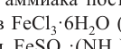


**Ground Truth**

```text
Формула: FeCl3·6H2O
```


**Output инструмента**

```text
Формула: FeCl3
```


**Тип ошибки:** ошибки индексов; ошибки химических символов

**Причина:** GT='FeCl3·6H2O', output='FeCl3'; token F1=54.55, composition similarity=30.77.

**Влияние на метрику:** Object Score=30.98/100; потеря относительно идеального объекта=69.02 п.п.; detection=100.00, token_f1=54.55, composition_similarity=30.77, structured_extraction=30.98


#### Пример 3: Tables — TAB_006 (D04, стр. 8), 35,92/100


**Ground Truth**

```text
Размер: 25 × 6; ячеек: 132
[H] Сеть | [H] Показатель | [H] Обучающее α | [H] Обучающее λ | [H] Обучающее + 5% шум α | [H] Обучающее + 5% шум λ
1 | Правильно | 68,20 % | 35,60 % | 67,60 % | 36,20 %
 | Средняя ошибка | 0,0787 | 0,1430 | 0,0827 | 0,1441
 | Макс. ошибка | 0,3728 | 0,5027 | 0,9759 | 0,5047
 | Дисперсия ошибки | 0,0030 | 0,0088 | 0,0046 | 0,0089
2 | Правильно | 86,00 % |  | 82,40 % | 
 | Средняя ошибка | 0,0604 |  | 0,0641 | 
 | Макс. ошибка | 0,3622 |  | 0,4495 | 
 | Дисперсия ошибки | 0,0020 |  | 0,0028 | 
3 | Правильно | 88,70 % |  | 82,40 % | 
 | Средняя ошибка | 0,0583 |  | 0,0634 | 
 | Макс. ошибка | 0,2045 |  | 0,8540 | 
 | Дисперсия ошибки | 0,0013 |  | 0,0029 | 
4 | Правильно | 77,10 % | 39,50 % | 75,80 % | 38,60 %
 | Средняя ошибка | 0,0671 | 0,1449 | 0,0712 | 0,1466
 | Макс. ошибка | 0,3594 | 0,5603 | 0,7292 | 0,5605
 | Дисперсия ошибки | 0,0025 | 0,0103 | 0,0036 | 0,0104
5 | Правильно | 88,50 % |  | 84,20 % | 
 | Средняя ошибка | 0,0574 |  | 0,0651 | 
 | Макс. ошибка | 0,3233 |  | 1,4295 | 
 | Дисперсия ошибки | 0,016 |  | 0,0057 | 
6 | Правильно | 80,60 % |  | 79,00 % | 
 | Средняя ошибка | 0,0631 |  | 0,0683 | 
 | Макс. ошибка | 0,2647 |  | 0,8166 | 
 | Дисперсия ошибки | 0,0018 |  | 0,0037 | 
```


**Output инструмента**

```text
Размер: 8 × 6; ячеек: 48
[H]  | [H]  | [H] Обуч | [H] ающее | [H] Обучающ | [H] ее+5% шум
Сеть |  | α | λ | α | λ
1 | ПравильноСредняя ошибкаМакс. ошибкаДисперсия ошибки | 68,20 %0,07870,37280,0030 | 35,60 %0,14300,50270,0088 | 67,60 %0,08270,97590,0046 | 36,20 %0,14410,50470,0089
2 | ПравильноСредняя ошибкаМакс. ошибкаДисперсия ошибки | 86,00 %0,06040,36220,0020 |  | 82,40 %0,06410,44950,0028 | 
3 | ПравильноСредняя ошибкаМакс. ошибкаДисперсия ошибки | 88,70 %0,05830,20450,0013 |  | 82,40 %0,06340,85400,0029 | 
4 | ПравильноСредняя ошибкаМакс. ошибкаДисперсия ошибки | 77,10 %0,06710,35940,0025 | 39,50 %0,14490,56030,0103 | 75,80 %0,07120,72920,0036 | 38,60 %0,14660,56050,0104
5 | ПравильноСредняя ошибкаМакс. ошибкаДисперсия ошибки | 88,50 %0,05740,32330,016 |  | 84,20 %0,06511,42950,0057 | 
6 | ПравильноСредняя ошибкаМакс. ошибкаДисперсия ошибки | 80,60 %0,06310,26470,0018 |  | 79,00 %0,06830,81660,0037 | 
```


**Тип ошибки:** потеря строк; ошибки объединения ячеек; искажение содержимого ячеек

**Причина:** GT=25×6, output=8×6; headers 6→6. Cell recall=31.06, TEDS-like=26.79.

**Влияние на метрику:** Object Score=35.92/100; потеря относительно идеального объекта=64.08 п.п.; cell_recall=31.06, cell_content=27.04, row_structure=32.00, column_structure=100.00, merged_f1=0.00, teds_like=26.79


#### Пример 4: Math — MATH_001 (D01, стр. 17), 39,77/100


**Ground Truth**

```text
\tilde{R}_{x}=\frac{U_{\mathrm{в}}}{I_{\mathrm{а}}}=\frac{U_R}{I_0+I_{\mathrm{в}}}=\frac{R_x}{1+\frac{R_x}{R_{\mathrm{в}}}}
```


**Output инструмента**

```text
\widetilde {\mathrm{R}} _ {\mathrm{x}} = \frac {\mathrm{U} _ {\mathrm{B}}}{\mathrm{I} _ {\mathrm{a}}} = \frac {\mathrm{U} _ {\mathrm{R}}}{\mathrm{I} _ {0} + \mathrm{I} _ {\mathrm{B}}} = \frac {\mathrm{R} _ {\mathrm{x}}}{1 + \frac {\mathrm{R} _ {\mathrm{x}}}{\mathrm{R} _ {\mathrm{B}}}},\tag{3}
```


**Тип ошибки:** искажение токенов/номера формулы

**Причина:** Exact match отсутствует; token precision=62.31, token recall=94.19, edit similarity=48.85.

**Влияние на метрику:** Object Score=39.77/100; потеря относительно идеального объекта=60.23 п.п.; raw_exact_match=0.00, normalized_exact_match=0.00, token_precision=62.31, token_recall=94.19, token_f1=75.00, edit_similarity=48.85


#### Пример 5: Images — IMG_005 (D05, стр. 2), 61,97/100

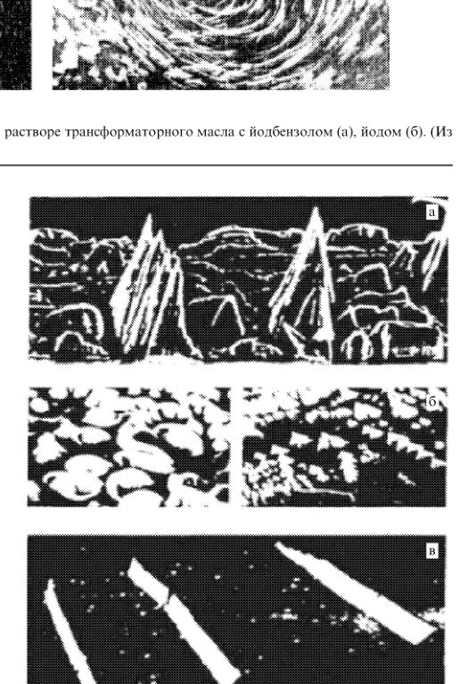


Извлечённый visual asset: [mineru_IMG_005.jpg](prediction_assets/mineru_IMG_005.jpg)


**Ground Truth**

```text
caption: Рис. 2. Фотографии поверхности медного электрода после воздействия электрического поля; asset: ground_truth/assets/IMG_005.png
```


**Output инструмента**

```text
caption: нет; asset: assets\p2_image_0011.jpg
```


**Тип ошибки:** неправильный crop; потеря caption

**Причина:** Detection=100.00, IoU=27.89, extraction=100.00, caption=0.00.

**Влияние на метрику:** Object Score=61.97/100; потеря относительно идеального объекта=38.03 п.п.; detection_recall=100.00, iou=27.89, extraction=100.00, caption=0.00


### OCR.Space


#### Пример 1: Text — TXT_008 (D04, стр. 9), 0,00/100


**Ground Truth**

```text
3. Метод показал себя устойчивым к шуму в начальных данных: в боль-
шинстве рассматриваемых моделей внесение шума в исходные данные обрат-
ной задачи в размере не более 5 % дает 5–7 % снижения точности распознавания
и весьма незначительное увеличение средней ошибки (порядка 0,02–0,03).
Но наиболее неожиданным, на наш взгляд, результатом является то, что
дополнительное знание о расположении измерительного прибора (координа-
та x0) не дает существенного повышения точности определения параметра
дробного дифференцирования α.
Этот факт позволяет выдвинуть гипотезу
о том, что предложенный метод может быть успешно применен для решения
обратной задачи в области Ω′ = {(x, t) : −∞< x < ∞, t ≥0}.
Данные в табл. 5, 6 дают представление о максимальной ошибке восста-
новления параметров задачи (5), но не говорят о том, как часто возникает
ошибка, большая допустимой.
Разобьем отрезок [0, 2] на 11 интервалов [0, 00; 0, 02), [0, 02; 0, 04), [0, 04;
0, 06), [0, 06; 0, 08), [0, 08; 0, 10), [0, 10; 0, 12), [0, 12; 0, 14), [0, 14; 0, 16), [0, 16; 0, 18),
```


**Output инструмента**

```text
Типизированный объект отсутствует.
```


**Тип ошибки:** пропуск текста

**Причина:** В размеченной области не найден TextBlock, поэтому все текстовые компоненты равны нулю.

**Влияние на метрику:** Object Score=0.00/100; потеря относительно идеального объекта=100.00 п.п.; cer=0.00, wer=0.00, edit_similarity=0.00


#### Пример 2: Tables — TAB_006 (D04, стр. 8), 0,00/100


**Ground Truth**

```text
Размер: 25 × 6; ячеек: 132
[H] Сеть | [H] Показатель | [H] Обучающее α | [H] Обучающее λ | [H] Обучающее + 5% шум α | [H] Обучающее + 5% шум λ
1 | Правильно | 68,20 % | 35,60 % | 67,60 % | 36,20 %
 | Средняя ошибка | 0,0787 | 0,1430 | 0,0827 | 0,1441
 | Макс. ошибка | 0,3728 | 0,5027 | 0,9759 | 0,5047
 | Дисперсия ошибки | 0,0030 | 0,0088 | 0,0046 | 0,0089
2 | Правильно | 86,00 % |  | 82,40 % | 
 | Средняя ошибка | 0,0604 |  | 0,0641 | 
 | Макс. ошибка | 0,3622 |  | 0,4495 | 
 | Дисперсия ошибки | 0,0020 |  | 0,0028 | 
3 | Правильно | 88,70 % |  | 82,40 % | 
 | Средняя ошибка | 0,0583 |  | 0,0634 | 
 | Макс. ошибка | 0,2045 |  | 0,8540 | 
 | Дисперсия ошибки | 0,0013 |  | 0,0029 | 
4 | Правильно | 77,10 % | 39,50 % | 75,80 % | 38,60 %
 | Средняя ошибка | 0,0671 | 0,1449 | 0,0712 | 0,1466
 | Макс. ошибка | 0,3594 | 0,5603 | 0,7292 | 0,5605
 | Дисперсия ошибки | 0,0025 | 0,0103 | 0,0036 | 0,0104
5 | Правильно | 88,50 % |  | 84,20 % | 
 | Средняя ошибка | 0,0574 |  | 0,0651 | 
 | Макс. ошибка | 0,3233 |  | 1,4295 | 
 | Дисперсия ошибки | 0,016 |  | 0,0057 | 
6 | Правильно | 80,60 % |  | 79,00 % | 
 | Средняя ошибка | 0,0631 |  | 0,0683 | 
 | Макс. ошибка | 0,2647 |  | 0,8166 | 
 | Дисперсия ошибки | 0,0018 |  | 0,0037 | 
```


**Output инструмента**

```text
Типизированный объект отсутствует.
```


**Тип ошибки:** пропуск таблицы

**Причина:** В области нет типизированной таблицы; строки, колонки и headers не восстановлены.

**Влияние на метрику:** Object Score=0.00/100; потеря относительно идеального объекта=100.00 п.п.; cell_recall=0.00, cell_content=24.24, row_structure=0.00, column_structure=0.00, merged_f1=0.00, teds_like=0.45


#### Пример 3: Images — IMG_001 (D01, стр. 8), 0,00/100

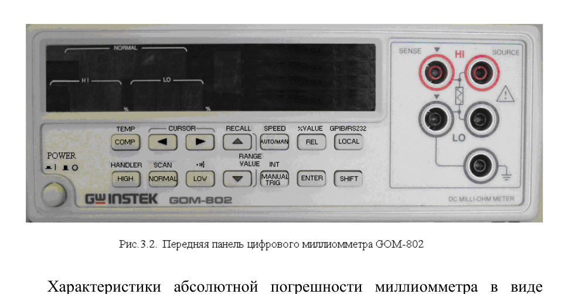


**Ground Truth**

```text
caption: Рис. 3.2. Лицевая панель цифрового миллиомметра GOM-802; asset: ground_truth/assets/IMG_001.png
```


**Output инструмента**

```text
Типизированный объект отсутствует.

Содержимое в той же области, но другого/несопоставленного типа:
- TextBlock overlap=0.03: Рис. 3.2. Передняя панель цифрового миллиомметра GOM-802
- TextBlock overlap=0.00: GWINSTEK
- TextBlock overlap=0.00: DC MILLI-OHM METER
- TextBlock overlap=0.00: GOM-802
- TextBlock overlap=0.00: GPIB/RS232
- TextBlock overlap=0.00: HANDLER
- TextBlock overlap=0.00: NORMAL
- TextBlock overlap=0.00: CURSOR
```


**Тип ошибки:** в области остался только текст; потеря visual payload

**Причина:** В области найдено TextBlock: 8, но отсутствует Image asset; OCR-текст, caption или alt-text не заменяют извлечение изображения.

**Влияние на метрику:** Object Score=0.00/100; потеря относительно идеального объекта=100.00 п.п.; detection_recall=0.00, iou=0.00, extraction=0.00, caption=0.00


#### Пример 4: Diagrams — DIA_001 (D01, стр. 9), 0,00/100


**Ground Truth**

```text
тип: electrical_scheme
caption: Рис. 4.1. Схемы электрических цепей для реализации метода амперметра и вольтметра
текст: Источник напряжения, Rрег, A, V, Rx
ключевые элементы/связи: амперметр, вольтметр, измеряемое сопротивление
asset: ground_truth/assets/DIA_001.png
```


**Output инструмента**

```text
Типизированный объект отсутствует.

Содержимое в той же области, но другого/несопоставленного типа:
- TextBlock overlap=0.01: UBB Rx
- TextBlock overlap=0.01: напряжения
- TextBlock overlap=0.00: 6)
- TextBlock overlap=0.00: Источник
- TextBlock overlap=0.00: Источник
- TextBlock overlap=0.00: a)
- TextBlock overlap=0.00: Rper
- TextBlock overlap=0.00: Rx
```


**Тип ошибки:** диаграмма представлена только текстом/Markdown; связи не типизированы

**Причина:** В GT-области найдено TextBlock: 8, но Diagram отсутствует. OCR-текст или Markdown/Mermaid не дают benchmark typed key_elements без отдельного преобразования.

**Влияние на метрику:** Object Score=0.00/100; потеря относительно идеального объекта=100.00 п.п.; detection_recall=0.00, iou=0.00, diagram_text_recall=0.00, caption=0.00, element_recall=0.00, key_elements=0.00


#### Пример 5: Math — MATH_002 (D04, стр. 1), 22,01/100

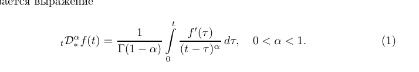


**Ground Truth**

```text
{}_{t}D_*^{\alpha}f(t)=\frac{1}{\Gamma(1-\alpha)}\int_{0}^{t}\frac{f'(\tau)}{(t-\tau)^{\alpha}}\,d\tau,\quad 0<\alpha<1
```


**Output инструмента**

```text
1 f'(т) Dof(t) = (1-a) (1-7) dr. 0 < α <1.
```


**Тип ошибки:** потеря fraction structure; ошибки subscript; ошибки superscript; потеря Greek symbols; потеря operators; потеря brackets

**Причина:** Exact match отсутствует; token precision=72.41, token recall=31.82, edit similarity=21.62.

**Влияние на метрику:** Object Score=22.01/100; потеря относительно идеального объекта=77.99 п.п.; raw_exact_match=0.00, normalized_exact_match=0.00, token_precision=72.41, token_recall=31.82, token_f1=44.21, edit_similarity=21.62


### Nutrient


#### Пример 1: Math — MATH_003 (D04, стр. 2), 0,00/100

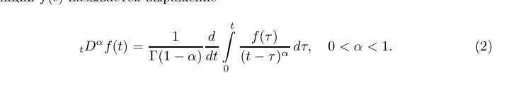


**Ground Truth**

```text
{}_{t}D^{\alpha}f(t)=\frac{1}{\Gamma(1-\alpha)}\frac{d}{dt}\int_{0}^{t}\frac{f(\tau)}{(t-\tau)^{\alpha}}\,d\tau,\quad 0<\alpha<1
```


**Output инструмента**

```text
Formula spatially matched, но математический payload пуст.
```


**Тип ошибки:** потеря fraction structure; ошибки subscript; ошибки superscript; потеря Greek symbols; потеря operators; потеря brackets

**Причина:** Exact match отсутствует; token precision=100.00, token recall=0.00, edit similarity=0.00.

**Влияние на метрику:** Object Score=0.00/100; потеря относительно идеального объекта=100.00 п.п.; raw_exact_match=0.00, normalized_exact_match=0.00, token_precision=100.00, token_recall=0.00, token_f1=0.00, edit_similarity=0.00


#### Пример 2: Diagrams — DIA_001 (D01, стр. 9), 0,00/100


**Ground Truth**

```text
тип: electrical_scheme
caption: Рис. 4.1. Схемы электрических цепей для реализации метода амперметра и вольтметра
текст: Источник напряжения, Rрег, A, V, Rx
ключевые элементы/связи: амперметр, вольтметр, измеряемое сопротивление
asset: ground_truth/assets/DIA_001.png
```


**Output инструмента**

```text
Типизированный объект отсутствует.

Содержимое в той же области, но другого/несопоставленного типа:
- Image overlap=0.68: caption: нет; asset: нет
```


**Тип ошибки:** диаграмма сохранена как обычное изображение; потеря текста и связей

**Причина:** В GT-области найдено Image: 1, но Diagram отсутствует. Generic image не содержит типизированных text_elements/key_elements.

**Влияние на метрику:** Object Score=0.00/100; потеря относительно идеального объекта=100.00 п.п.; detection_recall=0.00, iou=0.00, diagram_text_recall=0.00, caption=0.00, element_recall=0.00, key_elements=0.00


#### Пример 3: Tables — TAB_006 (D04, стр. 8), 34,73/100


**Ground Truth**

```text
Размер: 25 × 6; ячеек: 132
[H] Сеть | [H] Показатель | [H] Обучающее α | [H] Обучающее λ | [H] Обучающее + 5% шум α | [H] Обучающее + 5% шум λ
1 | Правильно | 68,20 % | 35,60 % | 67,60 % | 36,20 %
 | Средняя ошибка | 0,0787 | 0,1430 | 0,0827 | 0,1441
 | Макс. ошибка | 0,3728 | 0,5027 | 0,9759 | 0,5047
 | Дисперсия ошибки | 0,0030 | 0,0088 | 0,0046 | 0,0089
2 | Правильно | 86,00 % |  | 82,40 % | 
 | Средняя ошибка | 0,0604 |  | 0,0641 | 
 | Макс. ошибка | 0,3622 |  | 0,4495 | 
 | Дисперсия ошибки | 0,0020 |  | 0,0028 | 
3 | Правильно | 88,70 % |  | 82,40 % | 
 | Средняя ошибка | 0,0583 |  | 0,0634 | 
 | Макс. ошибка | 0,2045 |  | 0,8540 | 
 | Дисперсия ошибки | 0,0013 |  | 0,0029 | 
4 | Правильно | 77,10 % | 39,50 % | 75,80 % | 38,60 %
 | Средняя ошибка | 0,0671 | 0,1449 | 0,0712 | 0,1466
 | Макс. ошибка | 0,3594 | 0,5603 | 0,7292 | 0,5605
 | Дисперсия ошибки | 0,0025 | 0,0103 | 0,0036 | 0,0104
5 | Правильно | 88,50 % |  | 84,20 % | 
 | Средняя ошибка | 0,0574 |  | 0,0651 | 
 | Макс. ошибка | 0,3233 |  | 1,4295 | 
 | Дисперсия ошибки | 0,016 |  | 0,0057 | 
6 | Правильно | 80,60 % |  | 79,00 % | 
 | Средняя ошибка | 0,0631 |  | 0,0683 | 
 | Макс. ошибка | 0,2647 |  | 0,8166 | 
 | Дисперсия ошибки | 0,0018 |  | 0,0037 | 
```


**Output инструмента**

```text
Размер: 8 × 6; ячеек: 46
[H] Сеть | [H]  | [H] Обучающее |  | [H] Обучающее+5%шум | 
[H]  | [H]  | [H] α | [H] λ | [H] α | [H] λ
1 | Правильно Средняя ошибка Макс. ошибка Дисперсия ошибки | 68,20 % 0,0787 0,3728 0,0030 | 35,60 % 0,1430 0,5027 0,0088 | 67,60 % 0,0827 0,9759 0,0046 | 36,20 % 0,1441 0,5047 0,0089
2 | Правильно Средняя ошибка Макс. ошибка Дисперсия ошибки | 86,00 % 0,0604 0,3622 0,0020 |  | 82,40 % 0,0641 0,4495 0,0028 | 
3 | Правильно Средняя ошибка Макс. ошибка Дисперсия ошибки | 88,70 % 0,0583 0,2045 0,0013 |  | 82,40 % 0,0634 0,8540 0,0029 | 
4 | Правильно Средняя ошибка Макс. ошибка Дисперсия ошибки | 77,10 % 0,0671 0,3594 0,0025 | 39,50 % 0,1449 0,5603 0,0103 | 75,80 % 0,0712 0,7292 0,0036 | 38,60 % 0,1466 0,5605 0,0104
5 | Правильно Средняя ошибка Макс. ошибка Дисперсия ошибки | 88,50 % 0,0574 0,3233 0,016 |  | 84,20 % 0,0651 1,4295 0,0057 | 
6 | Правильно Средняя ошибка Макс. ошибка Дисперсия ошибки | 80,60 % 0,0631 0,2647 0,0018 |  | 79,00 % 0,0683 0,8166 0,0037 | 
```


**Тип ошибки:** потеря строк; ошибки объединения ячеек; искажение содержимого ячеек

**Причина:** GT=25×6, output=8×6; headers 6→10. Cell recall=29.55, TEDS-like=23.66.

**Влияние на метрику:** Object Score=34.73/100; потеря относительно идеального объекта=65.27 п.п.; cell_recall=29.55, cell_content=27.49, row_structure=32.00, column_structure=100.00, merged_f1=0.00, teds_like=23.66


#### Пример 4: Images — IMG_005 (D05, стр. 2), 36,90/100


**Ground Truth**

```text
caption: Рис. 2. Фотографии поверхности медного электрода после воздействия электрического поля; asset: ground_truth/assets/IMG_005.png
```


**Output инструмента**

```text
caption: нет; asset: нет
```


**Тип ошибки:** неправильный crop; изображение не сохранено; потеря caption

**Причина:** Detection=100.00, IoU=27.60, extraction=0.00, caption=0.00.

**Влияние на метрику:** Object Score=36.90/100; потеря относительно идеального объекта=63.10 п.п.; detection_recall=100.00, iou=27.60, extraction=0.00, caption=0.00


#### Пример 5: Chemistry — CHEM_004 (D02, стр. 2), 38,30/100


**Ground Truth**

```text
Тартразин (Tartrazine); текстовые метки: NaOOC, N=N, OH, NaO3S, SO3Na; asset: ground_truth/assets/CHEM_004.png
```


**Output инструмента**

```text
structure; текстовые метки: нет; asset: нет
```


**Тип ошибки:** потеря химических символов/меток; structural formula не извлечена; неточный crop

**Причина:** Structure detection есть, но IoU=33.18, label recall=0.00, extraction=0.00.

**Влияние на метрику:** Object Score=38.30/100; потеря относительно идеального объекта=61.70 п.п.; detection=100.00, iou=33.18, label_recall=0.00, extraction=0.00, structured_extraction=11.85


### Mindee


#### Пример 1: Tables — TAB_001 (D01, стр. 4), 0,00/100


**Ground Truth**

```text
Размер: 5 × 6; ячеек: 30
[H] Тип | [H] Число декад | [H] Пределы воспроизведения R, Ом | [H] Дискретность воспроизведения, Ом | [H] Класс точности γ, % | [H] Допускаемая мощность на декаду, Вт
Р 33 | 6 | 0–100000 | 0,1 | 0,2 | 0,5
КМС 6 | 6 | 0–100000 | 0,1 | 0,2 | 0,5
МСР 60М | 6 | 0–10000 | 0,01 | 0,02 | 0,5
МСР 63 | 7 | 0–100000 | 0,01 | 0,05 | 0,5
```


**Output инструмента**

```text
Типизированный объект отсутствует.

Содержимое в той же области, но другого/несопоставленного типа:
- TextBlock overlap=0.01: Допускаема
- TextBlock overlap=0.01: Дискрет-
- TextBlock overlap=0.01: произведе-
- TextBlock overlap=0.01: Пределы
- TextBlock overlap=0.01: воспроиз-
- TextBlock overlap=0.01: мощность
- TextBlock overlap=0.01: ведения
- TextBlock overlap=0.01: Класс
```


**Тип ошибки:** таблица превращена в обычный текст; структура строк/колонок отсутствует

**Причина:** Typed Table отсутствует, но внутри GT-области найдено TextBlock: 8. Текст извлечён без сетки ячеек, поэтому cell recall и структурные компоненты обнуляются.

**Влияние на метрику:** Object Score=0.00/100; потеря относительно идеального объекта=100.00 п.п.; cell_recall=0.00, cell_content=0.00, row_structure=0.00, column_structure=0.00, merged_f1=100.00, teds_like=1.96


#### Пример 2: Images — IMG_001 (D01, стр. 8), 0,00/100


**Ground Truth**

```text
caption: Рис. 3.2. Лицевая панель цифрового миллиомметра GOM-802; asset: ground_truth/assets/IMG_001.png
```


**Output инструмента**

```text
Типизированный объект отсутствует.

Содержимое в той же области, но другого/несопоставленного типа:
- TextBlock overlap=0.01: GWINSTEK
- TextBlock overlap=0.01: GOM-802
- TextBlock overlap=0.01: миллиомметра
- TextBlock overlap=0.01: цифрового
- TextBlock overlap=0.00: GOM-802
- TextBlock overlap=0.00: Передняя
- TextBlock overlap=0.00: панель
- TextBlock overlap=0.00: -|10
```


**Тип ошибки:** в области остался только текст; потеря visual payload

**Причина:** В области найдено TextBlock: 8, но отсутствует Image asset; OCR-текст, caption или alt-text не заменяют извлечение изображения.

**Влияние на метрику:** Object Score=0.00/100; потеря относительно идеального объекта=100.00 п.п.; detection_recall=0.00, iou=0.00, extraction=0.00, caption=0.00


#### Пример 3: Diagrams — DIA_001 (D01, стр. 9), 0,00/100


**Ground Truth**

```text
тип: electrical_scheme
caption: Рис. 4.1. Схемы электрических цепей для реализации метода амперметра и вольтметра
текст: Источник напряжения, Rрег, A, V, Rx
ключевые элементы/связи: амперметр, вольтметр, измеряемое сопротивление
asset: ground_truth/assets/DIA_001.png
```


**Output инструмента**

```text
Типизированный объект отсутствует.

Содержимое в той же области, но другого/несопоставленного типа:
- TextBlock overlap=0.01: напряжения
- TextBlock overlap=0.01: Источник
- TextBlock overlap=0.01: напряжения
- TextBlock overlap=0.01: Источник
- TextBlock overlap=0.01: Rper
- TextBlock overlap=0.00: Rper
- TextBlock overlap=0.00: б)
- TextBlock overlap=0.00: (B
```


**Тип ошибки:** диаграмма представлена только текстом/Markdown; связи не типизированы

**Причина:** В GT-области найдено TextBlock: 8, но Diagram отсутствует. OCR-текст или Markdown/Mermaid не дают benchmark typed key_elements без отдельного преобразования.

**Влияние на метрику:** Object Score=0.00/100; потеря относительно идеального объекта=100.00 п.п.; detection_recall=0.00, iou=0.00, diagram_text_recall=0.00, caption=0.00, element_recall=0.00, key_elements=0.00


#### Пример 4: Math — MATH_001 (D01, стр. 17), 9,23/100


**Ground Truth**

```text
\tilde{R}_{x}=\frac{U_{\mathrm{в}}}{I_{\mathrm{а}}}=\frac{U_R}{I_0+I_{\mathrm{в}}}=\frac{R_x}{1+\frac{R_x}{R_{\mathrm{в}}}}
```


**Output инструмента**

```text
U R. UR UB = Ř = = , R, I2 I0+1B x a 1+ RA
```


**Тип ошибки:** потеря fraction structure; ошибки subscript; потеря brackets

**Причина:** Exact match отсутствует; token precision=50.00, token recall=11.63, edit similarity=8.40.

**Влияние на метрику:** Object Score=9.23/100; потеря относительно идеального объекта=90.77 п.п.; raw_exact_match=0.00, normalized_exact_match=0.00, token_precision=50.00, token_recall=11.63, token_f1=18.87, edit_similarity=8.40


#### Пример 5: Chemistry — CHEM_001 (D02, стр. 3), 41,50/100


**Ground Truth**

```text
Формула: FeCl3·6H2O
```


**Output инструмента**

```text
Формула: 6H2O
```


**Тип ошибки:** ошибки индексов; ошибки химических символов

**Причина:** GT='FeCl3·6H2O', output='6H2O'; token F1=66.67, composition similarity=90.00.

**Влияние на метрику:** Object Score=41.50/100; потеря относительно идеального объекта=58.50 п.п.; detection=100.00, token_f1=66.67, composition_similarity=90.00, structured_extraction=41.50


### Adobe Extract


#### Пример 1: Tables — TAB_007 (D05, стр. 21), 0,00/100

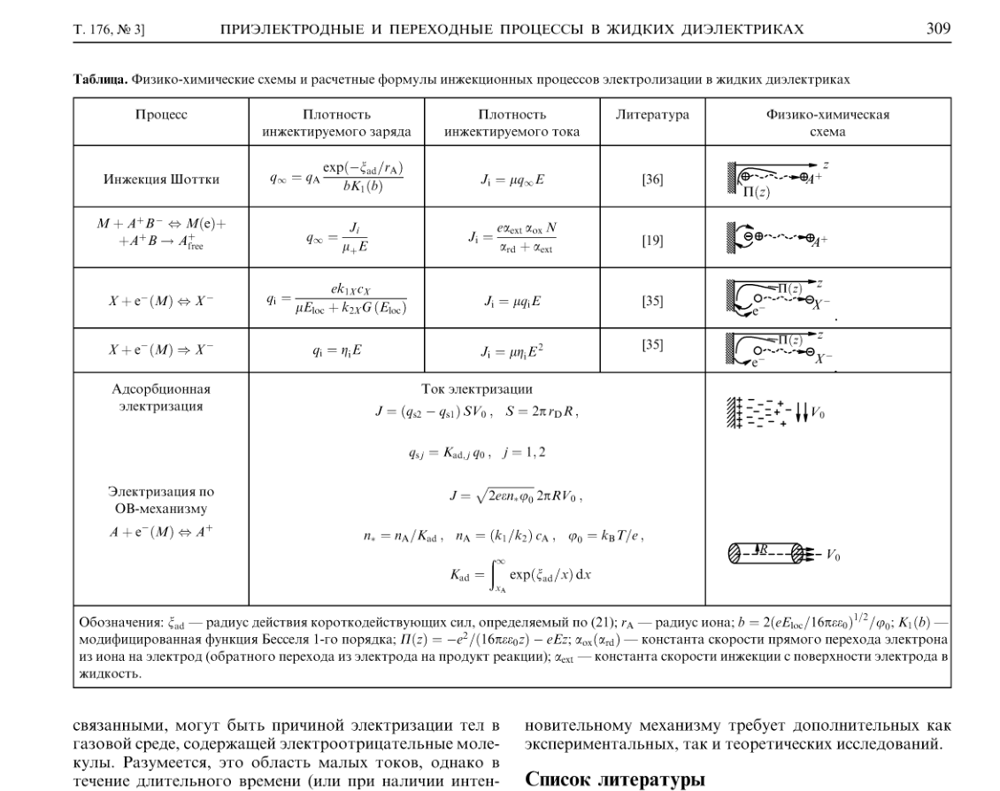


Извлечённый visual asset: [adobe_extract_TAB_007.png](prediction_assets/adobe_extract_TAB_007.png)


**Ground Truth**

```text
Размер: 7 × 5; ячеек: 35
[H] Процесс | [H] Плотность инжектируемого заряда | [H] Плотность инжектируемого тока | [H] Литература | [H] Физико-химическая схема
Инжекция Шоттки | q∞ = qA exp(-ε_ad/r_A) | j_i = β q∞ E | [36] | инжекция с поверхности электрода
M + A+B− ⇄ M(e) + A + B | q∞ | j_i = j_e a_ext a_ox N / (a_red + a_ext) | [19] | окислительно-восстановительный механизм
X+Q−(M) ⇄ X− | q∞ | j_i = μ q∞ E | [35] | полевая инжекция
X+Q−(M) ⇒ X− | q∞ | j_i = μ r_i E² | [35] | полевая инжекция
Адсорбционная электризация | Ток электризации | J = -q_i S V_0; S = 2π r D R |  | q_sj = K_ad j q_0, j=1,2
Электризация по ОВ-механизму | n* = n_A/K_AD; n_A=(k_1/k_2)c_A | I = √(2 ε e n* φ_0) 2πR V_0 |  | K_ad = ∫ exp(E_ad/x) dx
```


**Output инструмента**

```text
Типизированный объект отсутствует.

Содержимое в той же области, но другого/несопоставленного типа:
- Image overlap=1.00: caption: нет; asset: C:\Users\Nocomp\Desktop\nlp\outputs\benchmark\cache\adobe_extract\D05\versions\88da6cd9c6adb25eb367c265\assets\adobe_p21_00613.png
- Image overlap=1.00: caption: нет; asset: нет
- Image overlap=1.00: caption: нет; asset: C:\Users\Nocomp\Desktop\nlp\outputs\benchmark\cache\adobe_extract\D05\versions\88da6cd9c6adb25eb367c265\assets\adobe_p21_00616.png
- Image overlap=1.00: caption: нет; asset: нет
- Image overlap=1.00: caption: нет; asset: C:\Users\Nocomp\Desktop\nlp\outputs\benchmark\cache\adobe_extract\D05\versions\88da6cd9c6adb25eb367c265\assets\adobe_p21_00636.png
- Image overlap=1.00: caption: нет; asset: нет
- TextBlock overlap=0.02: связанными, могут быть причиной электризации тел в газовой среде, содержащей электроотрицательные моле­кулы. Разумеется, это область малых токов, однако в течение длительного времени (или при наличии интен­сивного обтекания тел) накопление зарядов может быть значительным, и эти процессы нельзя не принимать во внимание. По нашему мнению, процесс ионизации плотных газов, скажем воздуха, по окислительно-восста-
- TextBlock overlap=0.02: новительному механизму требует дополнительных как экспериментальных, так и теоретических исследований. 
```


**Тип ошибки:** таблица превращена в обычный текст; структура строк/колонок отсутствует

**Причина:** Typed Table отсутствует, но внутри GT-области найдено TextBlock: 2. Текст извлечён без сетки ячеек, поэтому cell recall и структурные компоненты обнуляются.

**Влияние на метрику:** Object Score=0.00/100; потеря относительно идеального объекта=100.00 п.п.; cell_recall=0.00, cell_content=5.71, row_structure=0.00, column_structure=0.00, merged_f1=100.00, teds_like=1.65


#### Пример 2: Math — MATH_001 (D01, стр. 17), 0,00/100


Извлечённый visual asset: [adobe_extract_MATH_001.png](prediction_assets/adobe_extract_MATH_001.png)


**Ground Truth**

```text
\tilde{R}_{x}=\frac{U_{\mathrm{в}}}{I_{\mathrm{а}}}=\frac{U_R}{I_0+I_{\mathrm{в}}}=\frac{R_x}{1+\frac{R_x}{R_{\mathrm{в}}}}
```


**Output инструмента**

```text
Типизированный объект отсутствует.

Содержимое в той же области, но другого/несопоставленного типа:
- Image overlap=0.52: caption: нет; asset: C:\Users\Nocomp\Desktop\nlp\outputs\benchmark\cache\adobe_extract\D01\versions\92df332f0870ad8424f1dd75\assets\adobe_p17_00663.png
- Image overlap=0.52: caption: нет; asset: нет
- TextBlock overlap=0.02: (3) 
```


**Тип ошибки:** формула возвращена как Figure/Image; нет структурированного Math payload

**Причина:** В области есть графический объект, но нет Formula с LaTeX/plain-math представлением; типобезопасный matcher не переименовывает generic Figure в формулу.

**Влияние на метрику:** Object Score=0.00/100; потеря относительно идеального объекта=100.00 п.п.; raw_exact_match=0.00, normalized_exact_match=0.00, token_precision=100.00, token_recall=0.00, token_f1=0.00, edit_similarity=0.00


#### Пример 3: Images — IMG_004 (D05, стр. 2), 0,00/100


Извлечённый visual asset: [adobe_extract_IMG_004.png](prediction_assets/adobe_extract_IMG_004.png)


**Ground Truth**

```text
caption: Рис. 1. Картины течения в системе двух параллельных проводников; asset: ground_truth/assets/IMG_004.png
```


**Output инструмента**

```text
Типизированный объект отсутствует.

Содержимое в той же области, но другого/несопоставленного типа:
- Image overlap=1.00: caption: нет; asset: C:\Users\Nocomp\Desktop\nlp\outputs\benchmark\cache\adobe_extract\D05\versions\88da6cd9c6adb25eb367c265\assets\adobe_p2_00043.png
- Image overlap=1.00: caption: нет; asset: нет
- Image overlap=1.00: caption: нет; asset: C:\Users\Nocomp\Desktop\nlp\outputs\benchmark\cache\adobe_extract\D05\versions\88da6cd9c6adb25eb367c265\assets\adobe_p2_00047.png
- Image overlap=1.00: caption: нет; asset: нет
- Image overlap=1.00: caption: нет; asset: C:\Users\Nocomp\Desktop\nlp\outputs\benchmark\cache\adobe_extract\D05\versions\88da6cd9c6adb25eb367c265\assets\adobe_p2_00050.png
- Image overlap=1.00: caption: нет; asset: нет
- Image overlap=1.00: caption: нет; asset: C:\Users\Nocomp\Desktop\nlp\outputs\benchmark\cache\adobe_extract\D05\versions\88da6cd9c6adb25eb367c265\assets\adobe_p2_00056.png
- Image overlap=1.00: caption: нет; asset: нет
```


**Тип ошибки:** visual candidate не сопоставлен с Image GT

**Причина:** В области есть visual candidate, но он не выбран при one-to-one сопоставлении по типу/геометрии либо не имеет подтверждённого extraction payload.

**Влияние на метрику:** Object Score=0.00/100; потеря относительно идеального объекта=100.00 п.п.; detection_recall=0.00, iou=0.00, extraction=0.00, caption=0.00


#### Пример 4: Diagrams — DIA_001 (D01, стр. 9), 0,00/100


Извлечённый visual asset: [adobe_extract_DIA_001.png](prediction_assets/adobe_extract_DIA_001.png)


**Ground Truth**

```text
тип: electrical_scheme
caption: Рис. 4.1. Схемы электрических цепей для реализации метода амперметра и вольтметра
текст: Источник напряжения, Rрег, A, V, Rx
ключевые элементы/связи: амперметр, вольтметр, измеряемое сопротивление
asset: ground_truth/assets/DIA_001.png
```


**Output инструмента**

```text
Типизированный объект отсутствует.

Содержимое в той же области, но другого/несопоставленного типа:
- Image overlap=1.00: caption: нет; asset: C:\Users\Nocomp\Desktop\nlp\outputs\benchmark\cache\adobe_extract\D01\versions\92df332f0870ad8424f1dd75\assets\adobe_p9_00278.png
```


**Тип ошибки:** диаграмма сохранена как обычное изображение; потеря текста и связей

**Причина:** В GT-области найдено Image: 1, но Diagram отсутствует. Generic image не содержит типизированных text_elements/key_elements.

**Влияние на метрику:** Object Score=0.00/100; потеря относительно идеального объекта=100.00 п.п.; detection_recall=0.00, iou=0.00, diagram_text_recall=0.00, caption=0.00, element_recall=0.00, key_elements=0.00


#### Пример 5: Chemistry — CHEM_004 (D02, стр. 2), 37,78/100


**Ground Truth**

```text
Тартразин (Tartrazine); текстовые метки: NaOOC, N=N, OH, NaO3S, SO3Na; asset: ground_truth/assets/CHEM_004.png
```


**Output инструмента**

```text
structure; текстовые метки: нет; asset: нет
```


**Тип ошибки:** потеря химических символов/меток; structural formula не извлечена; неточный crop

**Причина:** Structure detection есть, но IoU=31.12, label recall=0.00, extraction=0.00.

**Влияние на метрику:** Object Score=37.78/100; потеря относительно идеального объекта=62.22 п.п.; detection=100.00, iou=31.12, label_recall=0.00, extraction=0.00, structured_extraction=11.11


### LlamaParse


#### Пример 1: Images — IMG_001 (D01, стр. 8), 0,00/100


**Ground Truth**

```text
caption: Рис. 3.2. Лицевая панель цифрового миллиомметра GOM-802; asset: ground_truth/assets/IMG_001.png
```


**Output инструмента**

```text
Типизированный объект отсутствует.

Содержимое в той же области, но другого/несопоставленного типа:
- TextBlock overlap=0.58: photograph: GWINSTEK GOM-802 DC MILLI-OHM METER front panel
- TextBlock overlap=0.03: Рис.3.2. Передняя панель цифрового миллиомметра GОМ-802
```


**Тип ошибки:** в области остался только текст; потеря visual payload

**Причина:** В области найдено TextBlock: 2, но отсутствует Image asset; OCR-текст, caption или alt-text не заменяют извлечение изображения.

**Влияние на метрику:** Object Score=0.00/100; потеря относительно идеального объекта=100.00 п.п.; detection_recall=0.00, iou=0.00, extraction=0.00, caption=0.00


#### Пример 2: Diagrams — DIA_001 (D01, стр. 9), 0,00/100


**Ground Truth**

```text
тип: electrical_scheme
caption: Рис. 4.1. Схемы электрических цепей для реализации метода амперметра и вольтметра
текст: Источник напряжения, Rрег, A, V, Rx
ключевые элементы/связи: амперметр, вольтметр, измеряемое сопротивление
asset: ground_truth/assets/DIA_001.png
```


**Output инструмента**

```text
Типизированный объект отсутствует.

Содержимое в той же области, но другого/несопоставленного типа:
- TextBlock overlap=0.69: graph TD
    subgraph a
        S1["Источникнапряжения"] --- R1["R<sub>per</sub>"]
        R1 --- A1(("A"))
        A1 ---|I<sub>a</sub>| RX1["R<sub>x</sub>"]
        S1 --- V1(("B"))
        V1 ---|U<sub>B</sub>| RX1
        A1 --- V1
    end
    subgraph b
        S2["Источникнапряжения"] --- R2["R<sub>per</sub>"]
        R2 --- A2(("A"))
        A2 ---|I<sub>a</sub>| RX2["R<sub>x</sub>"]
        S2 --- V2(("B"))
        V2 ---|U<sub>B</sub>| RX2
        R2 --- V2
    end
```


**Тип ошибки:** диаграмма представлена только текстом/Markdown; связи не типизированы

**Причина:** В GT-области найдено TextBlock: 1, но Diagram отсутствует. OCR-текст или Markdown/Mermaid не дают benchmark typed key_elements без отдельного преобразования.

**Влияние на метрику:** Object Score=0.00/100; потеря относительно идеального объекта=100.00 п.п.; detection_recall=0.00, iou=0.00, diagram_text_recall=0.00, caption=0.00, element_recall=0.00, key_elements=0.00


#### Пример 3: Math — MATH_001 (D01, стр. 17), 37,44/100


**Ground Truth**

```text
\tilde{R}_{x}=\frac{U_{\mathrm{в}}}{I_{\mathrm{а}}}=\frac{U_R}{I_0+I_{\mathrm{в}}}=\frac{R_x}{1+\frac{R_x}{R_{\mathrm{в}}}}
```


**Output инструмента**

```text
\tilde{\mathbf{R}}_{\mathbf{x}} = \frac{\mathbf{U}_{\mathbf{B}}}{\mathbf{I}_{\mathbf{a}}} = \frac{\mathbf{U}_{\mathbf{R}}}{\mathbf{I}_{\mathbf{0}} + \mathbf{I}_{\mathbf{B}}} = \frac{\mathbf{R}_{\mathbf{x}}}{1 + \frac{\mathbf{R}_{\mathbf{x}}}{\mathbf{R}_{\mathbf{B}}}}, \eqno(3)
```


**Тип ошибки:** искажение токенов/номера формулы

**Причина:** Exact match отсутствует; token precision=58.65, token recall=90.70, edit similarity=44.74.

**Влияние на метрику:** Object Score=37.44/100; потеря относительно идеального объекта=62.56 п.п.; raw_exact_match=0.00, normalized_exact_match=0.00, token_precision=58.65, token_recall=90.70, token_f1=71.23, edit_similarity=44.74


#### Пример 4: Chemistry — CHEM_004 (D02, стр. 2), 37,64/100


**Ground Truth**

```text
Тартразин (Tartrazine); текстовые метки: NaOOC, N=N, OH, NaO3S, SO3Na; asset: ground_truth/assets/CHEM_004.png
```


**Output инструмента**

```text
structure; текстовые метки: Тартразин; asset: нет
```


**Тип ошибки:** потеря химических символов/меток; structural formula не извлечена; неточный crop

**Причина:** Structure detection есть, но IoU=30.56, label recall=0.00, extraction=0.00.

**Влияние на метрику:** Object Score=37.64/100; потеря относительно идеального объекта=62.36 п.п.; detection=100.00, iou=30.56, label_recall=0.00, extraction=0.00, structured_extraction=10.91


#### Пример 5: Tables — TAB_005 (D03, стр. 6), 51,74/100

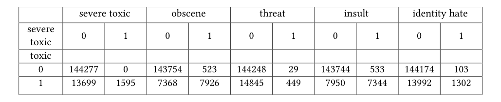


**Ground Truth**

```text
Размер: 5 × 11; ячеек: 55
[H]  | [H] severe toxic | [H]  | [H] obscene | [H]  | [H] threat | [H]  | [H] insult | [H]  | [H] identity hate | [H] 
severe toxic | 0 | 1 | 0 | 1 | 0 | 1 | 0 | 1 | 0 | 1
toxic |  |  |  |  |  |  |  |  |  | 
0 | 144277 | 0 | 143754 | 523 | 144248 | 29 | 143744 | 533 | 144174 | 103
1 | 13699 | 1595 | 7368 | 7926 | 14845 | 449 | 7950 | 7344 | 13992 | 1302
```


**Output инструмента**

```text
Размер: 3 × 12; ячеек: 36
[H] severe toxic | [H] toxic | [H] severe toxic<br/>0<br/>toxic | [H] severe toxic<br/>1<br/>toxic | [H] obscene<br/>0<br/>toxic | [H] obscene<br/>1<br/>toxic | [H] threat<br/>0<br/>toxic | [H] threat<br/>1<br/>toxic | [H] insult<br/>0<br/>toxic | [H] insult<br/>1<br/>toxic | [H] identity hate<br/>0<br/>toxic | [H] identity hate<br/>1<br/>toxic
0 | 144277 | 0 | 143754 | 523 | 144248 | 29 | 143744 | 533 | 144174 | 103 | 
1 | 13699 | 1595 | 7368 | 7926 | 14845 | 449 | 7950 | 7344 | 13992 | 1302 | 
```


**Тип ошибки:** потеря строк; искажение содержимого ячеек

**Причина:** GT=5×11, output=3×12; headers 11→12. Cell recall=60.00, TEDS-like=50.85.

**Влияние на метрику:** Object Score=51.74/100; потеря относительно идеального объекта=48.26 п.п.; cell_recall=60.00, cell_content=1.98, row_structure=60.00, column_structure=91.67, merged_f1=100.00, teds_like=50.85


## 18. Обобщение результатов

Практический выбор по специализации

| Задача | Предпочтительный профиль | Ограничение |
| --- | --- | --- |
| Максимально точный обычный текст | PyMuPDF; затем Nutrient, Mindee, LlamaParse | PyMuPDF не восстанавливает сложную семантику таблиц/диаграмм автоматически. |
| Таблицы | MinerU, LlamaParse, Nutrient | Результаты близки и имеют широкую междокументную неопределённость. |
| Математические формулы | LlamaParse, MinerU, OCR.Space | Даже лидер имеет Math 49,33; обязательна проверка LaTeX. |
| Химия | Все обнаруживают 6/6; payload лучше сравнивать по Extraction | Химия проверена только на одном PDF. |
| Изображения | MinerU; далее Adobe Extract/PyMuPDF/pdfminer.six | Подписи, crop и типизация часто неполны. |
| Диаграммы | Docling; затем MinerU | Среднее категории 5,63; полноценное восстановление связей остаётся нерешённым. |
| Минимальная локальная задержка | pdfplumber или PyMuPDF | Структурные категории слабее локальных ML-систем. |
| Локальный комплексный профиль | Docling или MinerU | Docling ресурсоёмок; MinerU слабее по диаграммам. |

Ни один инструмент не доминирует во всех категориях. Лучший выбор определяется долей обычного текста, таблиц, формул и визуальных объектов, требованиями к локальности, задержке и ресурсам. Для промышленной системы разумна маршрутизация: быстрый локальный парсер для born-digital текста и более тяжёлый структурный/OCR pipeline для сложных страниц.


## 19. Ограничения исследования


- Корпус мал: пять целенаправленно выбранных PDF и 40 репрезентативных, а не исчерпывающе размеченных объектов.
- Химия представлена одним документом, изображения двумя, математика тремя; переносимость соответствующих результатов ограничена.
- Сравниваются конкретные версии, адаптеры и режимы; иной endpoint, OCR engine или модель может дать другой профиль.
- Object Score измеряет совпадение с выбранным представлением GT; для математики не проверяется символическая эквивалентность, для диаграмм — полная графовая эквивалентность.
- Reading order размечен косвенно внутри выбранных регионов; отдельного полного порядка всех блоков страницы нет.
- Облачное время включает клиентскую и сетевую часть конкретных запусков, но не раскрывает серверные ресурсы; локальное и облачное время различаются по природе.
- Стоимость зафиксирована как нулевая в условиях запусков и не является коммерческим сравнением тарифов.
- 13 статистических предупреждений сохранены как наблюдения; outliers автоматически не удалялись.


## 20. Выводы


- Предложенная система даёт отдельные воспроизводимые оценки текста, таблиц, математики, химии, изображений и диаграмм, а затем равновесный Overall.
- PyMuPDF наиболее точен по обычному тексту (99,98), MinerU — по таблицам (71,44) и изображениям (75,01), LlamaParse — по математике (49,33), pdfminer.six — по действующему Chemistry Score (82,59), Docling — по диаграммам (42,19).
- Наибольший Overall у Docling (59,44), но он не является лучшим по всем категориям и требует наибольших ресурсов и времени.
- Локальные ML-системы превосходят классические локальные парсеры в среднем Overall за счёт структурных и визуальных категорий; по тексту средние групп почти совпадают.
- Наиболее сложны диаграммы и математика. Таблицы и изображения также требуют структурного, а не только текстового извлечения.
- Результаты существенно зависят от PDF: D05 сложнее D03 на общем наборе Text/Table/Diagram, а отдельные инструменты резко меняют качество и время между документами.
- Повышение score оправдано только при исправлении ошибок адаптера, matching, нормализации или GT. Подгонка правил под конкретный GT снизила бы исследовательскую достоверность.
- Для внешнего сервера следует предоставлять профиль по категориям, время, ресурсы и примеры ошибок, а не один рейтинг Overall.

[Промпт 12 — контроль baseline](../../PROMPT12_CONTROL.md) · [Промпт 13 — статистический анализ](../../PROMPT13_ANALYSIS.md) · [Промпт 14 — error analysis](../../PROMPT14_ERROR_ANALYSIS.md)
