# PDF benchmark · статистический анализ

Промт 13 · эксперимент 20261004T013334Z_s42_20904978 · 10 инструментов · 5 PDF · 40 GT

## 1. Основные результаты

В этом эксперименте нет инструмента, покрывающего все шесть категорий. Наибольший Text Score у PyMuPDF, Table и Math — у MinerU, Image — у MinerU, Diagram — у Docling. Наибольший Chemistry Score у pdfminer.six (82,59); обнаружение и качество извлечения показаны отдельно ниже.

Наибольший наблюдённый Overall у Docling (59,44), второй — MinerU (56,69). Docling лидирует сразу по таблицам, математике и изображениям, а MinerU — по диаграммам. При этом MinerU требует 2,70 с/стр., а самый быстрый инструмент pdfplumber — 0,086 с/стр. Поэтому Overall не заменяет анализ специализации, скорости и ресурсов.

Все выводы относятся к пяти фиксированным техническим PDF, конкретным адаптерам, версиям и режимам. Измеряется вся цепочка «инструмент → standardized schema → matching → evaluator». Оценка продукта во всех возможных конфигурациях из этого эксперимента не следует.

Основные оценки, 0–100

| Инструмент | Текст | Таблицы | Математика | Химия | Изображения | Диаграммы | Overall |
| --- | --- | --- | --- | --- | --- | --- | --- |
| Docling | 92,01 | 65,71 | 36,28 | 73,45 | 47,03 | 42,19 | 59,44 |
| MinerU | 84,12 | 71,44 | 48,02 | 47,40 | 75,01 | 14,15 | 56,69 |
| Nutrient | 93,73 | 70,82 | 33,70 | 70,38 | 44,22 | 0,00 | 52,14 |
| PyMuPDF | 99,98 | 48,58 | 0,00 | 82,43 | 54,77 | 0,00 | 47,63 |
| Adobe Extract | 92,20 | 65,86 | 0,00 | 69,90 | 54,77 | 0,00 | 47,12 |
| LlamaParse | 92,46 | 71,37 | 30,11 | 69,80 | 0,00 | 0,00 | 43,96 |
| pdfplumber | 82,90 | 47,44 | 0,00 | 72,59 | 36,02 | 0,00 | 39,82 |
| pdfminer.six | 81,66 | 0,00 | 0,00 | 82,59 | 54,77 | 0,00 | 36,50 |
| OCR.Space | 59,26 | 46,11 | 0,00 | 64,06 | 0,00 | 0,00 | 28,24 |
| Mindee | 93,51 | 0,00 | 0,00 | 52,33 | 0,00 | 0,00 | 24,31 |

[Полная таблица CSV](tables/tool_scores.csv)

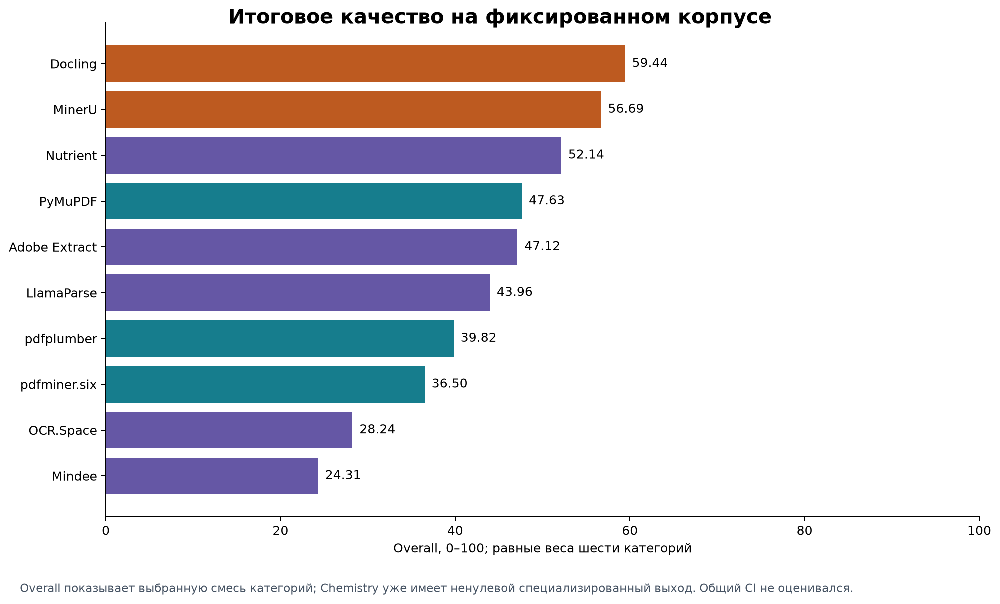

Overall показывает выбранную смесь категорий; Chemistry уже имеет ненулевой специализированный выход. Общий CI не оценивался.

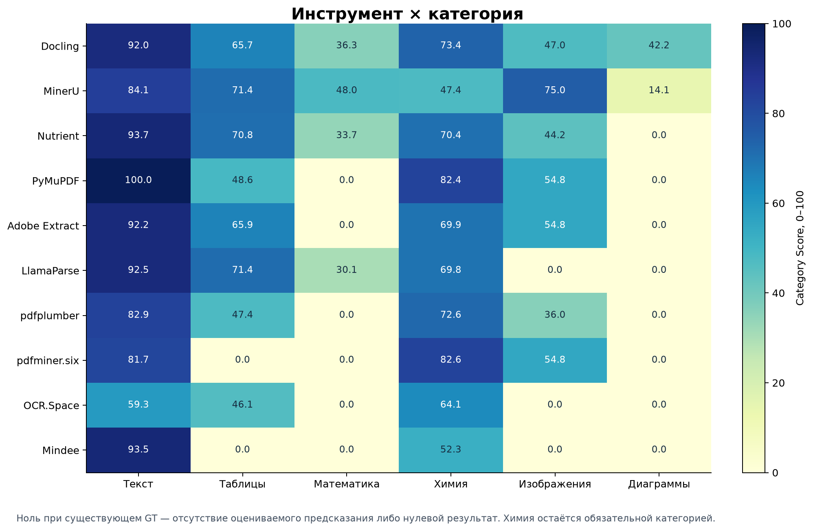

Ноль при существующем GT — отсутствие оцениваемого предсказания либо нулевой результат. Химия остаётся обязательной категорией.

## 2. Данные, методика и статистическая единица

Источник: 20261004T013334Z_s42_20904978; это кэшированная re-standardization сохранённых raw-ответов после исправлений относительно None. 10 tool rows, 50 успешных пар, 400 object rows; 0 ошибок, 13 сохранённых предупреждений. Все утверждённые исправления Ground Truth уже входят в этот baseline; во время анализа PDF, GT, кэши и оценки не изменялись. Новых обращений к поставщикам и запусков парсеров при анализе нет.

Корпус: 98 страниц

| PDF | Файл | Страниц |
| --- | --- | --- |
| D01 | 3619.pdf | 43 |
| D02 | 369.pdf | 7 |
| D03 | mais702.pdf | 14 |
| D04 | sjim924.pdf | 12 |
| D05 | ufn289.pdf | 22 |

Матрица разметки; 0 здесь означает отсутствие GT категории

| PDF | Текст | Таблицы | Математика | Химия | Изображения | Диаграммы | Всего GT |
| --- | --- | --- | --- | --- | --- | --- | --- |
| D01 | 2 | 2 | 1 | 0 | 3 | 2 | 10 |
| D02 | 2 | 2 | 0 | 6 | 0 | 1 | 11 |
| D03 | 2 | 1 | 0 | 0 | 0 | 2 | 5 |
| D04 | 2 | 1 | 4 | 0 | 0 | 1 | 8 |
| D05 | 1 | 1 | 1 | 0 | 2 | 1 | 6 |

[Полная таблица CSV](tables/ground_truth_coverage.csv)

Category Score = среднее document scores среди документов, где категория размечена. Document score = среднее object scores; для химии сначала отдельно усредняются linear formulas и structures, затем эти два подтипа получают равный вес. Overall = сумма шести Category Scores / 6. Отсутствующее предсказание для GT даёт 0. Отсутствие самой GT-категории в PDF не даёт 0 и не добавляет документ в знаменатель категории.

400 строк — повторная оценка одних и тех же 40 объектов десятью инструментами. Их нельзя считать 400 независимыми наблюдениями. Для межинструментных сравнений пары сопоставляются на одних и тех же PDF; основной кластер — документ. Документы выбраны целенаправленно, поэтому интервалы ниже характеризуют ограниченный набор, а не случайную выборку всех технических PDF.

Объектные mean/median/variance в дополнительных таблицах — описательные micro-statistics. Они не заменяют canonical macro scores. Страница и document_overall_present_categories — диагностические уровни; их нельзя усреднить и назвать финальным Overall.

Сохранённые CI рассчитаны percentile bootstrap с 10 000 выборок и seed=42. Text/Table/Diagram имеют 5 PDF, Math — 3, Image — 2. Chemistry размещена только в D02: интервал лидера [64,80; 88,77] отражает только bootstrap химических объектов внутри этого документа и не оценивает переносимость на новые документы. Для Overall общий CI не строится: bootstrap пяти PDF может потерять целую категорию; скрытое перенормирование весов изменило бы показатель.

Проверки при анализе независимо воспроизводят Category/Overall scores, суммы времени и стоимости, максимумы RAM/VRAM и уникальность ключей. Все читаемые входы снабжены SHA-256 и проверены на неизменность после анализа. Значения N/A в таблицах и графиках оставлены пропусками, а не нулями.

## 3. Сравнение по категориям и специализация

*Практическое равенство на точности 0,01 п.п.; это не тест превосходства

| Категория | Наибольшая оценка* | Score | Среднее 10 tools | Медиана | Score>0 | Matched / оценки |
| --- | --- | --- | --- | --- | --- | --- |
| Текст | PyMuPDF | 99,98 | 87,18 | 92,10 | 10/10 | 89/90 |
| Таблицы | MinerU | 71,44 | 48,73 | 57,15 | 8/10 | 49/70 |
| Математика | MinerU | 48,02 | 14,81 | 0,00 | 4/10 | 23/60 |
| Химия | pdfminer.six | 82,59 | 68,49 | 70,14 | 10/10 | 60/60 |
| Изображения | MinerU | 75,01 | 36,66 | 45,62 | 7/10 | 29/50 |
| Диаграммы | Docling | 42,19 | 5,63 | 0,00 | 2/10 | 10/70 |

[Полная таблица CSV](tables/category_difficulty.csv)

Химия: обнаружение отделено от качества структурированного извлечения

| Инструмент | Chemistry Score | Detection | Extraction | detected | Обнаружено | Линейные | Структуры |
| --- | --- | --- | --- | --- | --- | --- |
| PyMuPDF | 82,43 | 100,00 | 74,90 | 6/6 | 2/2 | 4/4 |
| pdfplumber | 72,59 | 100,00 | 60,84 | 6/6 | 2/2 | 4/4 |
| Docling | 73,45 | 100,00 | 62,07 | 6/6 | 2/2 | 4/4 |
| pdfminer.six | 82,59 | 100,00 | 75,13 | 6/6 | 2/2 | 4/4 |
| MinerU | 47,40 | 100,00 | 39,04 | 6/6 | 2/2 | 4/4 |
| OCR.Space | 64,06 | 100,00 | 61,69 | 6/6 | 2/2 | 4/4 |
| Nutrient | 70,38 | 100,00 | 57,69 | 6/6 | 2/2 | 4/4 |
| Mindee | 52,33 | 100,00 | 44,00 | 6/6 | 2/2 | 4/4 |
| Adobe Extract | 69,90 | 100,00 | 57,01 | 6/6 | 2/2 | 4/4 |
| LlamaParse | 69,80 | 100,00 | 56,86 | 6/6 | 2/2 | 4/4 |

[Полная таблица CSV](tables/chemistry_detection_extraction.csv)

Chemistry Detection Score использует все GT-объекты и макробалансирует линейные формулы и структуры. Extraction | detected оценивает формулу, координаты, текстовые метки и наличие извлечённого представления только среди сопоставленных объектов; при отсутствии обнаружений выводится N/A. Оба показателя диагностические: действующие Chemistry Score и Overall ими не заменяются и не пересчитываются.

Текст. PyMuPDF: 99,98, 95% CI [99,95; 100,00], SD между PDF всего 0,038. Далее идут Nutrient (93,73), Mindee (93,51), LlamaParse (92,46), Adobe Extract (92,20) и Docling (92,01). Это результат исправленной пространственной сборки и гранулярности текстовых блоков; отдельной reading-order GT всё ещё нет.

Таблицы. Три близких результата: MinerU 71,44, LlamaParse 71,37, Nutrient 70,82. Их междокументные CI широки: MinerU [51,90; 87,45], LlamaParse [60,85; 81,72], Nutrient [50,11; 88,09]. Docling и Adobe Extract имеют около 66. Нельзя объявить устойчивого универсального лидера по разнице в сотые пункта на пяти PDF.

Математика. Ненулевые результаты у MinerU (48,02), Docling (36,28), Nutrient (33,70) и LlamaParse (30,11). У MinerU также самый узкий из этих междокументных интервалов: [39,77; 52,15] на трёх PDF. Здесь оценивается совпадение LaTeX/токенов, а не доказанная математическая эквивалентность.

Химия. Общий GT-независимый слой сформировал 355 ChemicalObject для всех десяти инструментов. Каждый инструмент сопоставил 6/6 GT-объектов, поэтому Detection=100 у всех и сам по себе этот показатель их не различает. Наибольший Chemistry Score у pdfminer.six: 82,59, условный Extraction=75,13. Различия Chemistry Score отражают качество формулы, координат, текстовых меток и извлечённого представления после одинакового правила обнаружения. В GT только один химический документ: 2 линейные формулы и 4 структуры, поэтому междокументную устойчивость оценить нельзя.

Изображения. MinerU лидирует с 75,01 и CI [66,39; 83,64]. Adobe Extract, PyMuPDF и pdfminer.six практически совпадают около 54,77; Docling — 47,03, Nutrient — 44,22. Image CI основан только на D01 и D05, поэтому устойчивость за пределами этих двух документов не установлена.

Диаграммы. Ненулевой score только у Docling (42,19) и MinerU (14,15). Docling получает положительные document scores на всех пяти PDF и CI [36,22; 48,35]. Это специализация текущей цепочки извлечения/классификации, а не гарантия понимания логики всех схем.

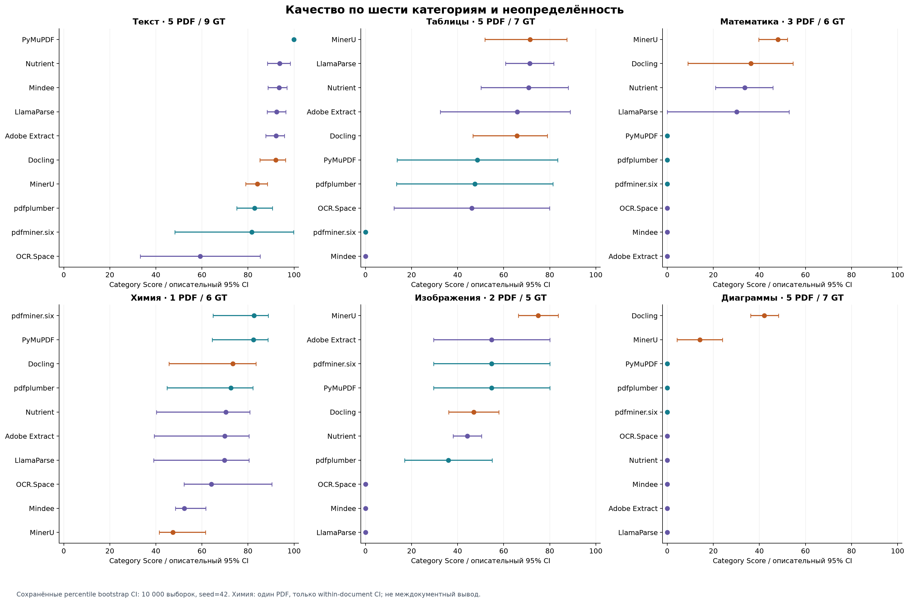

Сохранённые percentile bootstrap CI: 10 000 выборок, seed=42. Химия: один PDF, только within-document CI; не междокументный вывод.

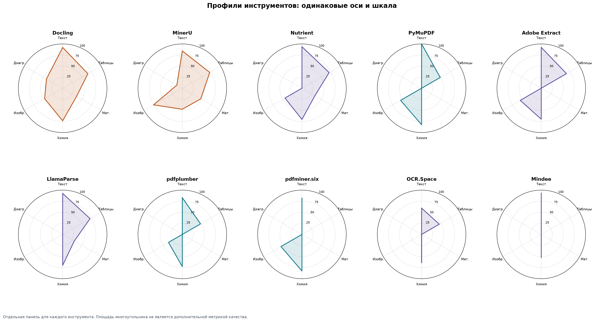

Отдельная панель для каждого инструмента. Площадь многоугольника не является дополнительной метрикой качества.

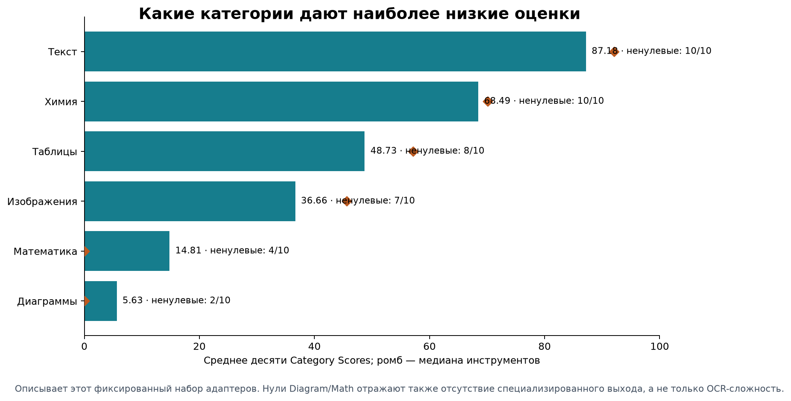

Описывает этот фиксированный набор адаптеров. Нули Diagram/Math отражают также отсутствие специализированного выхода, а не только OCR-сложность.

## 4. Cloud/local и classic/ML

Равновесные средние фиксированных инструментов

| Группа | Текст | Таблицы | Математика | Химия | Изображения | Диаграммы | Mean Overall |
| --- | --- | --- | --- | --- | --- | --- | --- |
| Локальные (5) | 88,13 | 46,64 | 16,86 | 71,69 | 53,52 | 11,27 | 48,02 |
| Облачные (5) | 86,23 | 50,83 | 12,76 | 65,30 | 19,80 | 0,00 | 39,15 |
| Классические локальные (3) | 88,18 | 32,01 | 0,00 | 79,20 | 48,52 | 0,00 | 41,32 |
| ML локальные (2) | 88,06 | 68,58 | 42,15 | 60,42 | 61,02 | 28,17 | 58,07 |

[Полная таблица CSV](tables/group_scores.csv)

Среднее Overall локальных участников — 48,02, облачных — 39,15. Эта разность относится именно к пяти выбранным реализациям каждой группы. Локальная группа включает быстрые classic parsers и тяжёлые ML-системы; переносить её среднее на «любую локальную библиотеку» нельзя.

Внутри local: ML (Docling, MinerU) имеет среднее Overall 58,07, classic (PyMuPDF, pdfplumber, pdfminer.six) — 41,32. Средний Text почти одинаков: ML 88,06, classic 88,18. Преимущество ML-группы в этом наборе связано с Table, Math, Image и Diagram, но достигается при намного больших медианных RAM/VRAM и времени.

Cloud/local — место исполнения, classic/ML — тип реализации. Облачные сервисы могут использовать ML, поэтому они не отнесены к «не-ML». Их внутренние модели не классифицировались без подтверждения. Парные интервалы разности групп пересэмплируют документы, сохраняя состав инструментов; они не учитывают неопределённость выбора продуктов.

Исследовательские парные CI; состав инструментов фиксирован

| Разность групп | Категория | PDF | Δ, п.п. | 95% low | 95% high |
| --- | --- | --- | --- | --- | --- |
| Локальные (5) − Облачные (5) | Текст | 5 | 1,90 | -1,66 | 5,46 |
| Локальные (5) − Облачные (5) | Таблицы | 5 | -4,20 | -15,00 | 3,37 |
| Локальные (5) − Облачные (5) | Математика | 3 | 4,10 | 2,66 | 6,58 |
| Локальные (5) − Облачные (5) | Химия | 1 | 6,39 | — | — |
| Локальные (5) − Облачные (5) | Изображения | 2 | 33,72 | 22,21 | 45,23 |
| Локальные (5) − Облачные (5) | Диаграммы | 5 | 11,27 | 8,70 | 13,36 |
| ML локальные (2) − Классические локальные (3) | Текст | 5 | -0,11 | -7,12 | 8,76 |
| ML локальные (2) − Классические локальные (3) | Таблицы | 5 | 36,57 | 22,59 | 51,93 |
| ML локальные (2) − Классические локальные (3) | Математика | 3 | 42,15 | 30,57 | 53,38 |
| ML локальные (2) − Классические локальные (3) | Химия | 1 | -18,78 | — | — |
| ML локальные (2) − Классические локальные (3) | Изображения | 2 | 12,50 | -0,88 | 25,89 |
| ML локальные (2) − Классические локальные (3) | Диаграммы | 5 | 28,17 | 21,75 | 33,39 |

[Полная таблица CSV](tables/paired_group_differences.csv)

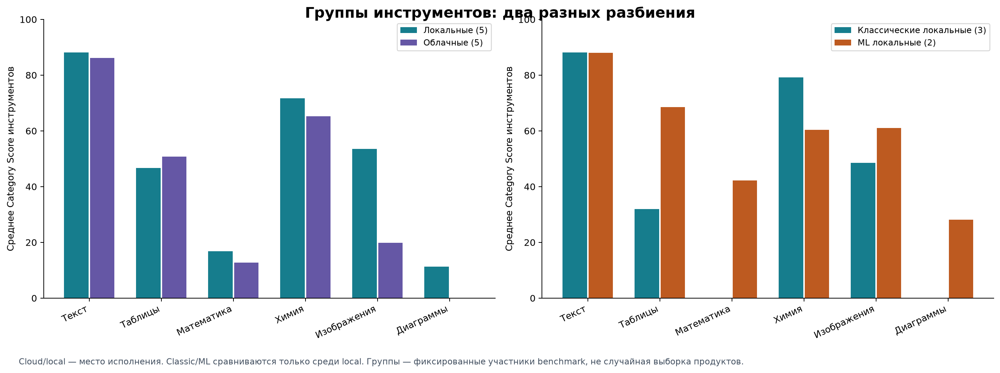

Cloud/local — место исполнения. Classic/ML сравниваются только среди local. Группы — фиксированные участники benchmark, не случайная выборка продуктов.

## 5. Зависимость от конкретного PDF

Текст по документам: сопоставимый набор категорий

| Инструмент | D01 | D02 | D03 | D04 | D05 |
| --- | --- | --- | --- | --- | --- |
| Docling | 93,80 | 94,22 | 96,97 | 96,68 | 78,36 |
| MinerU | 86,77 | 81,59 | 91,75 | 75,19 | 85,31 |
| Nutrient | 94,22 | 99,40 | 99,41 | 92,03 | 83,60 |
| PyMuPDF | 99,91 | 100,00 | 100,00 | 100,00 | 100,00 |
| Adobe Extract | 94,22 | 97,91 | 94,39 | 89,85 | 84,64 |
| LlamaParse | 94,61 | 93,93 | 99,50 | 89,18 | 85,09 |
| pdfplumber | 94,48 | 92,60 | 74,80 | 73,55 | 79,05 |
| pdfminer.six | 93,75 | 100,00 | 100,00 | 98,76 | 15,78 |
| OCR.Space | 93,59 | 45,36 | 96,25 | 46,66 | 14,44 |
| Mindee | 93,72 | 98,42 | 96,16 | 94,74 | 84,49 |

[Полная таблица CSV](tables/document_category_scores.csv)

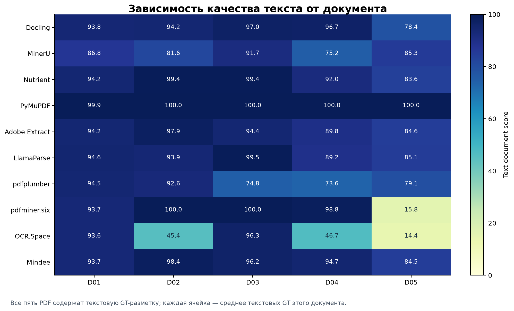

Все пять PDF содержат текстовую GT-разметку; каждая ячейка — среднее текстовых GT этого документа.

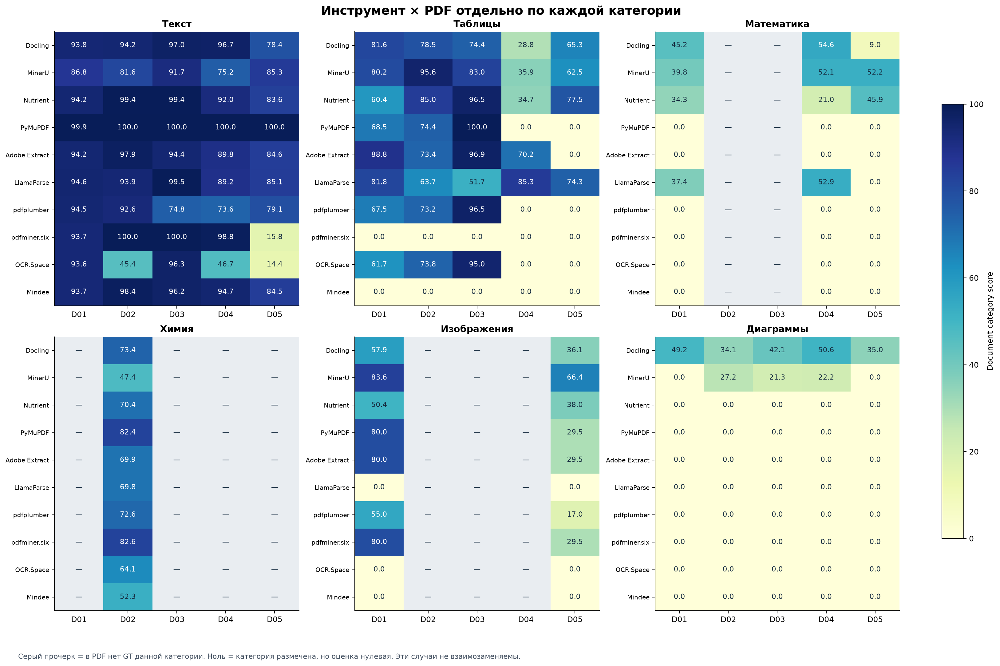

Серый прочерк = в PDF нет GT данной категории. Ноль = категория размечена, но оценка нулевая. Эти случаи не взаимозаменяемы.

Сырые document_overall_present_categories смешивают разные категории: D03 содержит text/table/diagram, D02 дополнительно chemistry, D01 и D05 — image и math. Поэтому для отдельного описательного сравнения PDF ниже используется один и тот же набор Text/Table/Diagram, размеченный во всех документах. Он не заменяет шестикатегорийный Overall.

Средние по фиксированным 10 инструментам

| PDF | Среднее Text/Table/Diagram | Text | Table | Diagram |
| --- | --- | --- | --- | --- |
| D01 | 52,62 | 93,91 | 59,05 | 4,92 |
| D02 | 52,74 | 90,34 | 61,75 | 6,12 |
| D03 | 56,89 | 94,92 | 69,41 | 6,35 |
| D04 | 39,49 | 85,66 | 25,50 | 7,29 |
| D05 | 34,18 | 71,08 | 27,96 | 3,50 |

[Полная таблица CSV](tables/document_difficulty.csv)

При таком общем наборе категорий наименьшее среднее у D05 (34,18), наибольшее у D03 (56,89). Это эмпирическая трудность для выбранных адаптеров и GT; она не доказывает причинный эффект тематики, числа страниц или наличия колонок.

pdfplumber Text: минимум 73,55 на D04, максимум 94,48 на D01, размах 20,93 п.п. Полные min/max/SD по 60 комбинациям инструмент–категория приведены в document_dependence.csv.

PyMuPDF Text: минимум 99,91 на D01, максимум 100,00 на D02, размах 0,09 п.п. Полные min/max/SD по 60 комбинациям инструмент–категория приведены в document_dependence.csv.

LlamaParse Text: минимум 85,09 на D05, максимум 99,50 на D03, размах 14,41 п.п. Полные min/max/SD по 60 комбинациям инструмент–категория приведены в document_dependence.csv.

Leave-one-document-out: только варианты с сохранением всех категорий

| Инструмент | Min ΔOverall | Без PDF | Max ΔOverall | Без PDF |
| --- | --- | --- | --- | --- |
| Docling | -3,59 | D01 | 4,98 | D05 |
| MinerU | -1,10 | D03 | 2,00 | D05 |
| Nutrient | -1,30 | D03 | 2,64 | D04 |
| PyMuPDF | -5,03 | D01 | 6,23 | D05 |
| Adobe Extract | -5,24 | D01 | 7,26 | D05 |
| LlamaParse | -2,34 | D04 | 2,70 | D05 |
| pdfplumber | -4,48 | D01 | 5,30 | D05 |
| pdfminer.six | -4,71 | D01 | 6,95 | D05 |
| OCR.Space | -3,58 | D03 | 3,79 | D05 |
| Mindee | -0,11 | D03 | 0,38 | D05 |

[Полная таблица CSV](tables/leave_one_document_out.csv)

Исключение D02 делает Overall неопределённым: химия нигде больше не размечена. Такие строки оставлены N/A. При исключении остальных PDF шесть весов остаются равными; это проверка чувствительности, не очистка данных и не новая официальная оценка. Основной результат по-прежнему включает все пять документов.

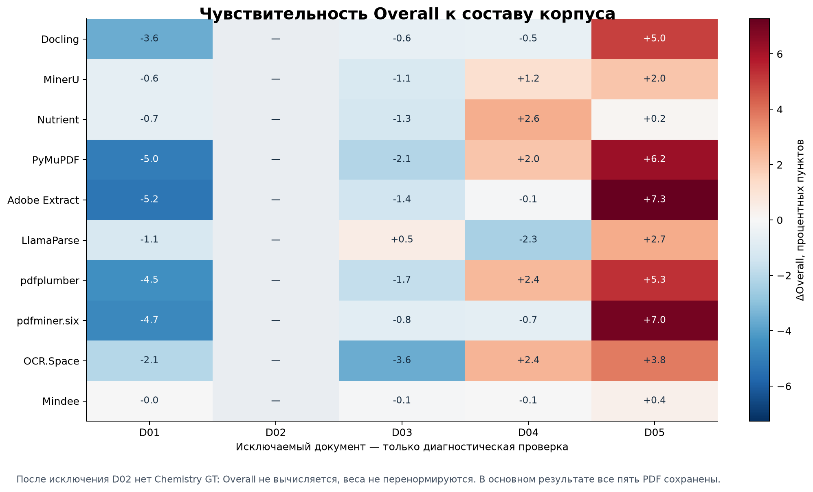

После исключения D02 нет Chemistry GT: Overall не вычисляется, веса не перенормируются. В основном результате все пять PDF сохранены.

## 6. Объектный разброс, покрытие и доверительные интервалы

Sample variance: сумма квадратов отклонений / (n−1). Mean объектов — диагностический

| Инструмент | Категория | GT | Matched | Mean объектов | SD | Variance | Median | Min | Max |
| --- | --- | --- | --- | --- | --- | --- | --- | --- | --- |
| Docling | Текст | 9 | 9 | 93,52 | 6,88 | 47,32 | 96,26 | 78,36 | 100,00 |
| Docling | Таблицы | 7 | 7 | 69,80 | 22,75 | 517,45 | 72,44 | 28,82 | 98,36 |
| Docling | Математика | 6 | 6 | 45,44 | 18,27 | 333,94 | 53,72 | 8,99 | 56,33 |
| Docling | Химия | 6 | 6 | 64,60 | 27,66 | 765,21 | 50,35 | 42,20 | 100,00 |
| Docling | Изображения | 5 | 3 | 49,21 | 45,38 | 2059,28 | 72,25 | 0,00 | 90,31 |
| Docling | Диаграммы | 7 | 7 | 43,18 | 6,89 | 47,43 | 42,17 | 34,06 | 50,71 |
| MinerU | Текст | 9 | 9 | 83,99 | 11,87 | 140,92 | 84,50 | 65,88 | 100,00 |
| MinerU | Таблицы | 7 | 7 | 76,14 | 21,76 | 473,63 | 82,96 | 35,92 | 97,55 |
| MinerU | Математика | 6 | 6 | 50,08 | 5,86 | 34,40 | 51,52 | 39,77 | 57,37 |
| MinerU | Химия | 6 | 6 | 51,93 | 14,27 | 203,75 | 59,47 | 30,98 | 64,26 |
| MinerU | Изображения | 5 | 5 | 76,74 | 13,99 | 195,61 | 73,30 | 61,97 | 99,44 |
| MinerU | Диаграммы | 7 | 3 | 13,15 | 17,52 | 306,89 | 0,00 | 0,00 | 42,65 |
| Nutrient | Текст | 9 | 9 | 94,86 | 6,34 | 40,23 | 98,79 | 83,60 | 100,00 |
| Nutrient | Таблицы | 7 | 7 | 71,35 | 21,80 | 475,26 | 77,52 | 34,73 | 96,45 |
| Nutrient | Математика | 6 | 6 | 27,33 | 15,74 | 247,77 | 30,60 | 0,00 | 45,90 |
| Nutrient | Химия | 6 | 6 | 60,51 | 30,65 | 939,44 | 42,41 | 38,30 | 100,00 |
| Nutrient | Изображения | 5 | 5 | 45,46 | 7,26 | 52,77 | 47,59 | 36,90 | 54,27 |
| Nutrient | Диаграммы | 7 | 0 | 0,00 | 0,00 | 0,00 | 0,00 | 0,00 | 0,00 |
| PyMuPDF | Текст | 9 | 9 | 99,98 | 0,06 | 0,00 | 100,00 | 99,83 | 100,00 |
| PyMuPDF | Таблицы | 7 | 5 | 55,12 | 41,22 | 1698,99 | 70,74 | 0,00 | 100,00 |
| PyMuPDF | Математика | 6 | 0 | 0,00 | 0,00 | 0,00 | 0,00 | 0,00 | 0,00 |
| PyMuPDF | Химия | 6 | 6 | 76,58 | 18,19 | 330,73 | 66,06 | 62,91 | 100,00 |
| PyMuPDF | Изображения | 5 | 4 | 59,81 | 34,64 | 1200,13 | 80,00 | 0,00 | 80,00 |
| PyMuPDF | Диаграммы | 7 | 0 | 0,00 | 0,00 | 0,00 | 0,00 | 0,00 | 0,00 |
| Adobe Extract | Текст | 9 | 9 | 93,04 | 5,72 | 32,77 | 94,79 | 84,64 | 100,00 |
| Adobe Extract | Таблицы | 7 | 6 | 70,21 | 32,62 | 1063,78 | 77,17 | 0,00 | 96,89 |
| Adobe Extract | Математика | 6 | 0 | 0,00 | 0,00 | 0,00 | 0,00 | 0,00 | 0,00 |
| Adobe Extract | Химия | 6 | 6 | 59,87 | 31,13 | 968,87 | 41,38 | 37,78 | 100,00 |
| Adobe Extract | Изображения | 5 | 4 | 59,81 | 34,64 | 1200,13 | 80,00 | 0,00 | 80,00 |
| Adobe Extract | Диаграммы | 7 | 0 | 0,00 | 0,00 | 0,00 | 0,00 | 0,00 | 0,00 |
| LlamaParse | Текст | 9 | 9 | 93,28 | 5,64 | 31,82 | 91,60 | 85,09 | 100,00 |
| LlamaParse | Таблицы | 7 | 7 | 71,77 | 14,19 | 201,39 | 72,83 | 51,74 | 90,83 |
| LlamaParse | Математика | 6 | 5 | 41,49 | 21,34 | 455,23 | 50,93 | 0,00 | 56,00 |
| LlamaParse | Химия | 6 | 6 | 59,74 | 31,23 | 975,21 | 41,19 | 37,64 | 100,00 |
| LlamaParse | Изображения | 5 | 0 | 0,00 | 0,00 | 0,00 | 0,00 | 0,00 | 0,00 |
| LlamaParse | Диаграммы | 7 | 0 | 0,00 | 0,00 | 0,00 | 0,00 | 0,00 | 0,00 |
| pdfplumber | Текст | 9 | 9 | 83,32 | 10,42 | 108,64 | 79,05 | 72,10 | 100,00 |
| pdfplumber | Таблицы | 7 | 5 | 53,98 | 40,21 | 1616,91 | 69,18 | 0,00 | 96,54 |
| pdfplumber | Математика | 6 | 0 | 0,00 | 0,00 | 0,00 | 0,00 | 0,00 | 0,00 |
| pdfplumber | Химия | 6 | 6 | 63,45 | 28,34 | 803,01 | 46,30 | 43,30 | 100,00 |
| pdfplumber | Изображения | 5 | 4 | 39,81 | 24,03 | 577,48 | 55,00 | 0,00 | 55,00 |
| pdfplumber | Диаграммы | 7 | 0 | 0,00 | 0,00 | 0,00 | 0,00 | 0,00 | 0,00 |
| pdfminer.six | Текст | 9 | 9 | 88,98 | 27,60 | 761,76 | 99,17 | 15,78 | 100,00 |
| pdfminer.six | Таблицы | 7 | 0 | 0,00 | 0,00 | 0,00 | 0,00 | 0,00 | 0,00 |
| pdfminer.six | Математика | 6 | 0 | 0,00 | 0,00 | 0,00 | 0,00 | 0,00 | 0,00 |
| pdfminer.six | Химия | 6 | 6 | 76,78 | 18,02 | 324,87 | 66,30 | 63,30 | 100,00 |
| pdfminer.six | Изображения | 5 | 4 | 59,81 | 34,64 | 1200,13 | 80,00 | 0,00 | 80,00 |
| pdfminer.six | Диаграммы | 7 | 0 | 0,00 | 0,00 | 0,00 | 0,00 | 0,00 | 0,00 |
| OCR.Space | Текст | 9 | 8 | 64,24 | 43,51 | 1893,21 | 87,19 | 0,00 | 100,00 |
| OCR.Space | Таблицы | 7 | 5 | 52,29 | 38,51 | 1483,21 | 70,60 | 0,00 | 95,04 |
| OCR.Space | Математика | 6 | 0 | 0,00 | 0,00 | 0,00 | 0,00 | 0,00 | 0,00 |
| OCR.Space | Химия | 6 | 6 | 72,36 | 26,70 | 713,06 | 84,55 | 32,75 | 94,39 |
| OCR.Space | Изображения | 5 | 0 | 0,00 | 0,00 | 0,00 | 0,00 | 0,00 | 0,00 |
| OCR.Space | Диаграммы | 7 | 0 | 0,00 | 0,00 | 0,00 | 0,00 | 0,00 | 0,00 |
| Mindee | Текст | 9 | 9 | 94,51 | 5,62 | 31,56 | 95,55 | 84,49 | 100,00 |
| Mindee | Таблицы | 7 | 0 | 0,00 | 0,00 | 0,00 | 0,00 | 0,00 | 0,00 |
| Mindee | Математика | 6 | 0 | 0,00 | 0,00 | 0,00 | 0,00 | 0,00 | 0,00 |
| Mindee | Химия | 6 | 6 | 55,27 | 9,33 | 86,97 | 59,47 | 41,50 | 63,93 |
| Mindee | Изображения | 5 | 0 | 0,00 | 0,00 | 0,00 | 0,00 | 0,00 | 0,00 |
| Mindee | Диаграммы | 7 | 0 | 0,00 | 0,00 | 0,00 | 0,00 | 0,00 | 0,00 |

[Полная таблица CSV](tables/object_variance.csv)

В object_variance.csv также есть Q1/Q3, количество нулей, средняя оценка только matched объектов и разложение SS_total = SS_within_document + SS_between_documents. Доля SS_between / SS_total показывает, сколько наблюдённого разброса связано с группировкой по PDF; это описательное разложение, не причинная доля объяснённой дисперсии. При одном объекте на PDF within-часть равна нулю по конструкции; при всех нулях доля не определена.

Низкая дисперсия при нулевых scores не означает надёжное распознавание. Отдельно нужно смотреть coverage: matched — наличие сопоставленного объекта, а не его правильность. Положительный score при широком разбросе указывает на зависимость результата от конкретных GT; большой matched_fraction при низком score — на проблемы содержимого/структуры уже найденных объектов.

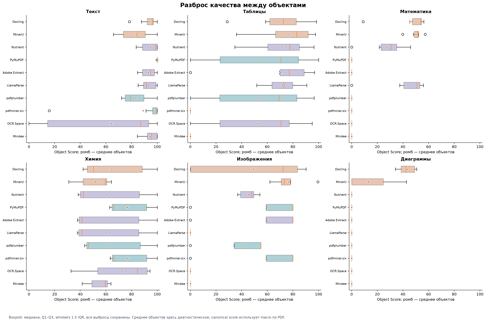

Boxplot: медиана, Q1–Q3, whiskers 1.5 IQR, все выбросы сохранены. Среднее объектов здесь диагностическое; canonical score использует macro по PDF.

Для всех 45 пар инструментов и 6 категорий сохранены 270 строк paired_category_differences.csv. Разность считается на одинаковых document scores; bootstrap выбирает одни и те же индексы документов для обоих инструментов. Для Chemistry при n=1 парный междокументный CI оставлен пустым. Интервалы исследовательские, без поправки на множественные сравнения; на их основе не делаются 270 утверждений о статистическом превосходстве.

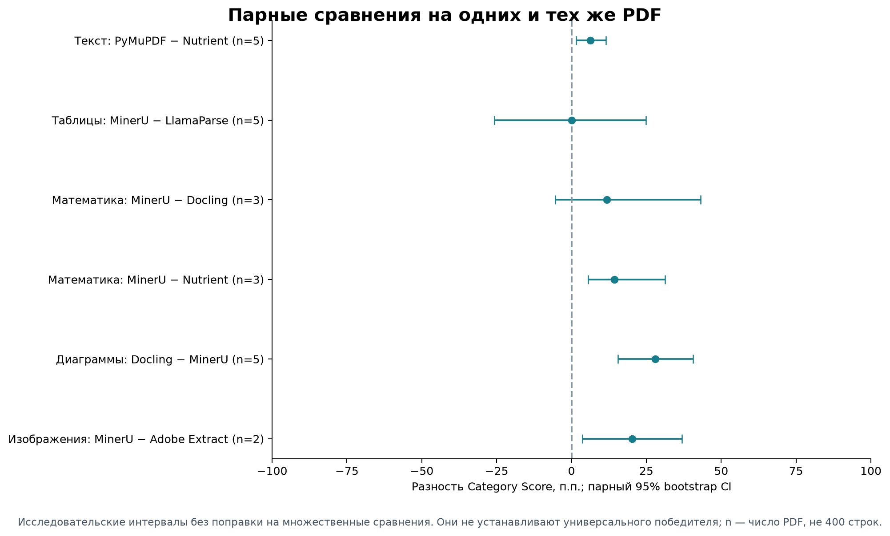

Исследовательские интервалы без поправки на множественные сравнения. Они не устанавливают универсального победителя; n — число PDF, не 400 строк.

Таблицы, MinerU−LlamaParse: Δ=0,07 п.п., парный 95% CI [-25,74; 24,92], n=5 PDF. Интервал включает 0: наблюдённый порядок нельзя считать устойчивым превосходством.

Математика, MinerU−Docling: Δ=11,74 п.п., парный 95% CI [-5,46; 43,16], n=3 PDF. Интервал включает 0: наблюдённый порядок нельзя считать устойчивым превосходством.

Диаграммы, Docling−MinerU: Δ=28,05 п.п., парный 95% CI [15,49; 40,65], n=5 PDF. Интервал не включает 0 в этой описательной проверке; малая целевая выборка и отсутствие поправки ограничивают переносимость вывода.

## 7. Скорость и качество

Оригинальные замеры адаптеров; время повторного вычисления метрик исключено

| Инструмент | Всего, с | с/стр, корпус | Median PDF, с/стр | Самый медленный PDF | Доля времени | Overall |
| --- | --- | --- | --- | --- | --- | --- |
| pdfplumber | 8,47 | 0,086 | 0,085 | D05 | 42,00% | 39,82 |
| PyMuPDF | 34,96 | 0,357 | 0,278 | D05 | 58,50% | 47,63 |
| Adobe Extract | 138,72 | 1,415 | 1,285 | D05 | 48,87% | 47,12 |
| Mindee | 140,67 | 1,435 | 1,596 | D05 | 35,94% | 24,31 |
| MinerU | 265,07 | 2,705 | 1,876 | D05 | 56,26% | 56,69 |
| pdfminer.six | 270,49 | 2,760 | 0,053 | D05 | 98,67% | 36,50 |
| LlamaParse | 272,95 | 2,785 | 3,267 | D02 | 16,54% | 43,96 |
| Nutrient | 416,03 | 4,245 | 2,163 | D05 | 67,15% | 52,14 |
| OCR.Space | 605,83 | 6,182 | 5,419 | D05 | 45,47% | 28,24 |
| Docling | 7098,76 | 72,436 | 52,094 | D05 | 64,32% | 59,44 |

[Полная таблица CSV](tables/speed_sensitivity.csv)

pdfplumber быстрее Docling на этом корпусе примерно в 838,43 раза, но не даёт Math/Diagram. MinerU быстрее Docling примерно в 26,78 раза; у него выше Table, Math и Image, тогда как Docling значительно сильнее по Diagram и лучше по Text. Это разные профили качества, а не взаимозаменяемые решения.

pdfminer.six: D05 занимает 98,67% суммарного времени; на нём 12,132 с/стр. Общая оценка 2,760 с/стр отличается от медианы пяти PDF 0,053. Диагностическое значение без самого медленного документа — 0,047 с/стр; из основного результата этот документ не исключался.

Docling: D05 занимает 64,32% суммарного времени; на нём 207,550 с/стр. Общая оценка 72,436 с/стр отличается от медианы пяти PDF 52,094. Диагностическое значение без самого медленного документа — 33,324 с/стр; из основного результата этот документ не исключался.

Номинальный Pareto frontier по двум осям Overall↑ / sec/page↓: pdfplumber, PyMuPDF, MinerU, Docling. Каждая следующая точка покупает прирост Overall увеличением наблюдённого времени; неопределённость оценок и профиль категорий frontier не учитывает. Frontier по отдельным категориям сохранён в pareto_frontiers.csv; он включает только инструменты с положительным score категории.

Local использует adapter wall time, cloud — сохранённый processing_seconds, который у части сервисов совпадает с client latency. В этих измерениях могут различаться upload, ожидание очереди и серверная обработка. Повторных запусков одного задания нет: нельзя строить CI повторяемости latency по пяти разным PDF. Корреляции Spearman в correlations.csv — описания фиксированных 10 участников, без причинной интерпретации и без тестов значимости.

Точка = сумма времени / 98 страниц. Отрезок = min–max по пяти PDF, не доверительный интервал. Cloud/local timing scopes различаются.

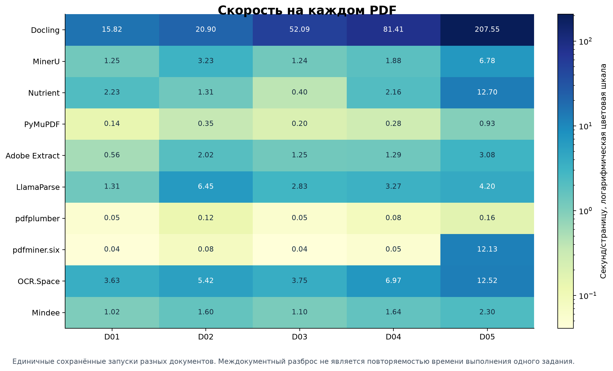

Единичные сохранённые запуски разных документов. Междокументный разброс не является повторяемостью времени выполнения одного задания.

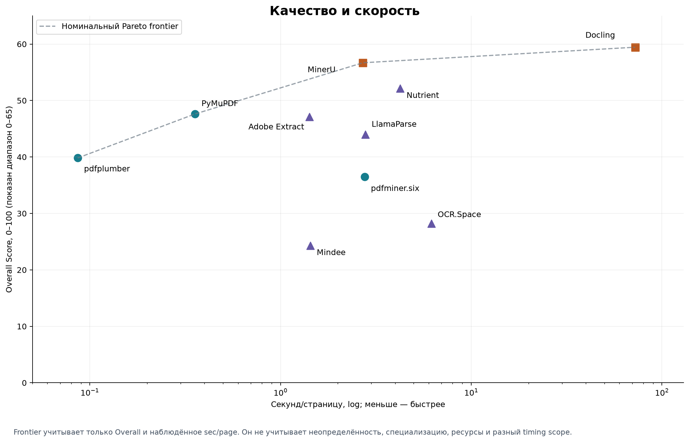

Frontier учитывает только Overall и наблюдённое sec/page. Он не учитывает неопределённость, специализацию, ресурсы и разный timing scope.

## 8. Стоимость и качество

Записанные API costs; коммерческая цена из них не следует

| Инструмент | API USD / 98 стр. | Основание | Overall |
| --- | --- | --- | --- |
| Docling | 0,00 | not_applicable_local | 59,44 |
| MinerU | 0,00 | not_applicable_local | 56,69 |
| Nutrient | 0,00 | estimated | 52,14 |
| PyMuPDF | 0,00 | not_applicable_local | 47,63 |
| Adobe Extract | 0,00 | estimated | 47,12 |
| LlamaParse | 0,00 | estimated | 43,96 |
| pdfplumber | 0,00 | not_applicable_local | 39,82 |
| pdfminer.six | 0,00 | not_applicable_local | 36,50 |
| OCR.Space | 0,00 | actual | 28,24 |
| Mindee | 0,00 | estimated | 24,31 |

[Полная таблица CSV](tables/tool_scores.csv)

25 local пар имеют not_applicable_local=0; 5 OCR.Space пар — actual=0; 20 остальных cloud пар — estimated=0 с историческими free/trial пояснениями. Estimated=0 не является проверкой счёта поставщика. Текущие тарифы и оплата подписок не исследовались и не подставлялись вместо наблюдённых значений.

Quality/cost при нулевом знаменателе не определён. Spearman с постоянной осью cost также не определён. Поэтому график quality–cost построен с истинными cost=0 и смещением только подписей, без искусственного разброса точек. Он показывает отсутствие данных для экономического ранжирования, а не одинаковую коммерческую выгодность всех решений.

Для последующего отдельного стоимостного сценария потребовались бы дата тарифов, фиксированный режим обработки, платный объём, валюта, учёт подписок и повторов, а для local — стоимость оборудования/времени/электроэнергии. Ничего из этого нельзя достоверно получить из текущих api_cost_usd=0. Исторические credits и pricing notes сохранены в operational_provenance.csv без объявления их актуальными ценами.

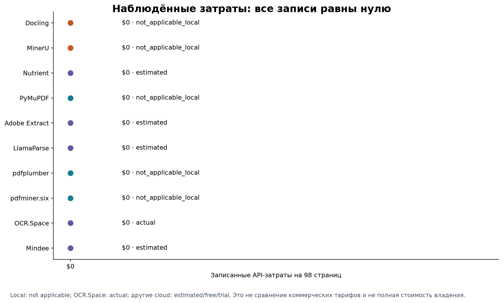

Local: not applicable; OCR.Space: actual; другие cloud: estimated/free/trial. Это не сравнение коммерческих тарифов и не полная стоимость владения.

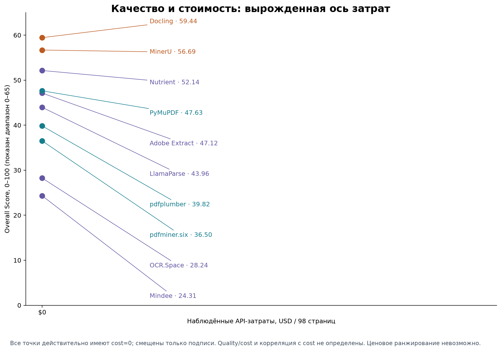

Все точки действительно имеют cost=0; смещены только подписи. Quality/cost и корреляция с cost не определены. Ценовое ранжирование невозможно.

## 9. Ресурсы и эксплуатационные ограничения

Пик по пяти исходным запускам; поля _mb содержат единицы 1024² байт

| Инструмент | RAM, МиБ | VRAM, МиБ | Область измерения RAM | VRAM basis |
| --- | --- | --- | --- | --- |
| Docling | 10878,44 | 8180,71 | локальный процесс + дочерние | device upper bound + Torch activity |
| MinerU | 5791,13 | 4767,93 | локальный процесс + дочерние | device upper bound + Torch activity |
| Nutrient | 96,05 | 0,00 | только облачный клиент | 0 attributable; не server GPU |
| PyMuPDF | 558,62 | 0,00 | локальный процесс + дочерние | 0 attributable |
| Adobe Extract | 95,38 | 0,00 | только облачный клиент | 0 attributable; не server GPU |
| LlamaParse | 84,32 | 0,00 | только облачный клиент | 0 attributable; не server GPU |
| pdfplumber | 828,73 | 0,00 | локальный процесс + дочерние | 0 attributable |
| pdfminer.six | 790,89 | 0,00 | локальный процесс + дочерние | 0 attributable |
| OCR.Space | 94,29 | 0,00 | только облачный клиент | 0 attributable; не server GPU |
| Mindee | 141,23 | 0,00 | только облачный клиент | 0 attributable; не server GPU |

[Полная таблица CSV](tables/pair_operational.csv)

Docling: RAM 10,62 ГиБ, VRAM 7,99 ГиБ; MinerU: RAM 5,66 ГиБ, VRAM 4,66 ГиБ. Для этих десяти пар использован device-wide GPU upper bound при подтверждённой активности Torch. Это не эксклюзивная память процесса и не минимальные аппаратные требования продукта.

У CPU tools/cloud-client published VRAM=0 означает отсутствие атрибутированного GPU-использования. Для cloud ресурсы серверов неизвестны. RAM — RSS процесса и его дочерних процессов, включая интерпретатор и импорты; сравнивать её с минимально необходимой памятью библиотеки нельзя. Низкий клиентский RAM облачного API не доказывает меньшую вычислительную стоимость на стороне поставщика.

Историческая среда исследования: Windows 11, Python 3.12.10, NVIDIA RTX 4070 Laptop 8 GB по CODEX_CONTEXT.md. Анализ не является повторным измерением на Linux или другом сервере. Mindee разбивал длинные PDF на запросы до 10 страниц и собирал исходный документ обратно; чанки не увеличивают число документов или статистических повторов.

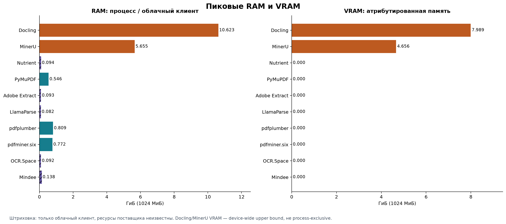

Штриховка: только облачный клиент, ресурсы поставщика неизвестны. Docling/MinerU VRAM — device-wide upper bound, не process-exclusive.

## 10. Практические профили всех десяти участников

PyMuPDF: Быстрый classic parser и лидер по Text, с ненулевыми Table и Image. По Image практически совпадает с Adobe Extract и pdfminer.six, но работает значительно быстрее pdfminer. Math, Chemistry и Diagram в текущей схеме нулевые. Сопоставлено 24/40 GT; Overall=47,63.

pdfplumber: Самая быстрая обработка корпуса. Text остаётся сильным, но после исправления PyMuPDF, Nutrient, Mindee, LlamaParse, Adobe Extract и Docling выше. Таблицы сильно зависят от документа; Math/Chemistry/Diagram не покрываются специализированными объектами. Сопоставлено 24/40 GT; Overall=39,82.

Docling: Лидер по Diagram, высокий Text/Table и ненулевая математика. Второй Overall получен ценой максимального времени и RAM/VRAM. Исправленная классификация picture-объектов также дала ненулевой Image Score. Сопоставлено 38/40 GT; Overall=59,44.

pdfminer.six: Профиль текста и изображений, без ненулевых Table/Math/Chemistry/Diagram. D05 определяет почти всё суммарное время. Image практически совпадает с PyMuPDF и Adobe Extract; данный эксперимент не показывает преимущества pdfminer по этим итоговым осям. Сопоставлено 19/40 GT; Overall=36,50.

MinerU: Локальная ML-система с наибольшими Overall, Table, Math и Image, но Diagram заметно ниже Docling. Она примерно в 27 раз быстрее Docling на этом корпусе, однако остаётся ресурсоёмкой и требует около 5,7 ГиБ RAM и 4,7 ГиБ измеренного VRAM upper bound. Сопоставлено 36/40 GT; Overall=56,69.

OCR.Space: Единственный специализированный химический профиль: обнаружены 6/6 GT, при этом Detection и условное качество Extraction показаны отдельно. Text и Table ненулевые, но Text заметно слабее остальных участников и отмечен IQR-предупреждением. Время на страницу — второе по величине после Docling. Сопоставлено 19/40 GT; Overall=28,24.

Nutrient: Сильный облачный профиль Text/Table/Math/Image и третий Overall, без Diagram/Chemistry. Исправление coordinate canvas существенно изменило результат; междокументный разброс таблиц остаётся большим. Сопоставлено 33/40 GT; Overall=52,14.

Mindee: В этом эксперименте положительный score только у Text, где результат один из самых высоких. Общий показатель снижен пятью нулевыми категориями. Длинные документы проходили chunking; серверные ресурсы неизвестны. Сопоставлено 15/40 GT; Overall=24,31.

Adobe Extract: Облачный профиль Text/Table/Image и наименьшее наблюдённое sec/page среди cloud. Table существенно зависит от PDF. Math/Chemistry/Diagram нулевые; клиентские RAM/VRAM не описывают серверную обработку. Сопоставлено 25/40 GT; Overall=47,12.

LlamaParse: Table практически совпадает с лидером, Text высокий, Math ненулевой, но после исправления полной MATH_006 ниже MinerU, Docling и Nutrient. Image/Chemistry/Diagram остаются нулевыми; ресурсы серверной стороны неизвестны. Сопоставлено 27/40 GT; Overall=43,96.

Для задачи преимущественно текста на этом корпусе ориентир по качеству — PyMuPDF, по скорости — pdfplumber; для таблиц нужно сопоставлять MinerU, LlamaParse и Nutrient; для математических формул — MinerU с проверкой отдельных объектов; для диаграмм — Docling; для изображений — MinerU. Это направления выбора для данных benchmark, а не рекомендации безусловно оплачивать или внедрять продукт.

## 11. Ограничения и сохранённые предупреждения

(1) Всего пять целенаправленно выбранных документов и 40 GT; coverage категорий неравномерен. (2) В GT нет отдельной reading_order разметки для 9 текстовых объектов: действующие веса Text — 0,5 CER quality, 0,375 WER quality, 0,125 edit similarity. Ошибки порядка влияют косвенно, но отдельная оценка reading order не получена. (3) TEDS-like — собственный аналог, не официальный PubTabNet TEDS. (4) Для формул matching использует нормализованное представление, а evaluator раздельно хранит raw и normalized LaTeX; метрика не доказывает математическую эквивалентность.

(5) GT для image/diagram выборочный, поэтому действует sampled_gt_recall_v1: пропущенный обязательный GT даёт 0, а лишние кандидаты сохраняются только как unmatched_candidate_count без неподтверждённого FP penalty. Page-level precision по этой разметке не оценивается. (6) Отсутствие специализированного объекта и низкое качество распознавания — разные причины нулей; они разделяются через coverage и standardized_object_counts.csv. (7) Cloud/local timing и resource scopes различаются. (8) Стоимость и межзапусковая вариация недостаточны для экономического ранжирования или SLA.

Все 13 исходных IQR-предупреждений сохранены

| Инструмент | Показатель | Значение | Предупреждение |
| --- | --- | --- | --- |
| ocr_space | text_score | 59.261231429979 | statistical_outlier_iqr |
| pdfminer | table_score | 0.0 | statistical_outlier_iqr |
| mindee | table_score | 0.0 | statistical_outlier_iqr |
| mineru | chemistry_score | 47.395047906711 | statistical_outlier_iqr |
| mindee | chemistry_score | 52.332710188652 | statistical_outlier_iqr |
| docling | diagram_score | 42.19306332072 | statistical_outlier_iqr |
| mineru | diagram_score | 14.14642778473 | statistical_outlier_iqr |
| docling | sec_per_page | 72.43632366837059 | statistical_outlier_iqr |
| docling | total_processing_time_sec | 7098.759719500318 | statistical_outlier_iqr |
| docling | peak_ram_mb | 10878.44140625 | statistical_outlier_iqr |
| mineru | peak_ram_mb | 5791.12890625 | statistical_outlier_iqr |
| docling | peak_vram_mb | 8180.71484375 | statistical_outlier_iqr |
| mineru | peak_vram_mb | 4767.93359375 | statistical_outlier_iqr |

[Полная таблица CSV](tables/quality_issues.csv)

IQR warnings — наблюдения, не доказательства повреждения данных. Для Chemistry, Diagram и VRAM большая часть инструментов имеет нули, поэтому IQR=0 отмечает любое ненулевое значение. Распределение предупреждений: Docling — 5, pdfminer.six — 1, MinerU — 4, OCR.Space — 1, Mindee — 2. Внутридокументная аномалия времени pdfminer/D05 исследована отдельно и тоже сохранена.

## 12. Артефакты и воспроизводимость

Версии из сохранённых adapter snapshots; OCR.Space — версия requests, не версия серверного OCR

| Инструмент | Версия пакета | Deployment | Группа |
| --- | --- | --- | --- |
| pymupdf | 1.28.2 | local | classic_local |
| pdfplumber | 0.11.10 | local | classic_local |
| docling | 2.130.0 | local | ml_local |
| pdfminer | 20260107 | local | classic_local |
| mineru | 4.0.0 | local | ml_local |
| ocr_space | 2.32.5 | cloud | cloud_unspecified |
| nutrient | 3.1.0 | cloud | cloud_unspecified |
| mindee | 5.3.1 | cloud | cloud_unspecified |
| adobe_extract | 4.2.0 | cloud | cloud_unspecified |
| llamaparse | 2.16.0 | cloud | cloud_unspecified |

[Полная таблица CSV](tables/versions.csv)

Полные model_versions/tier/version находятся в versions.csv. Основная информация о методах взята из исходников evaluation/aggregation.py, evaluation/*_metrics.py, benchmark/matching.py, benchmark/experiment.py и зафиксированных metadata; актуальные рыночные цены не подмешивались в результаты.

Полный набор машинно-читаемых таблиц

| Таблица | Строк |
| --- | --- |
| tool_scores.csv | 10 |
| pair_operational.csv | 50 |
| object_scores.csv | 400 |
| category_uncertainty.csv | 60 |
| document_category_scores.csv | 210 |
| document_diagnostics.csv | 50 |
| ground_truth_coverage.csv | 5 |
| category_difficulty.csv | 6 |
| document_difficulty.csv | 5 |
| object_variance.csv | 60 |
| document_dependence.csv | 60 |
| leave_one_document_out.csv | 50 |
| group_scores.csv | 4 |
| paired_category_differences.csv | 270 |
| paired_group_differences.csv | 12 |
| speed_sensitivity.csv | 10 |
| operational_provenance.csv | 50 |
| standardized_object_counts.csv | 50 |
| metric_diagnostics.csv | 530 |
| chemistry_detection_extraction.csv | 10 |
| versions.csv | 10 |
| quality_issues.csv | 13 |
| correlations.csv | 28 |
| pareto_frontiers.csv | 20 |

Воспроизведение из корня проекта: .venv-analysis\Scripts\python.exe scripts\analyze_benchmark.py --experiment-id 20261004T013334Z_s42_20904978. Среда графиков отдельная; её зависимости фиксируются в requirements-analysis-pinned.txt. Основные среды адаптеров не изменялись.

report.html содержит встроенные SVG и открывается без интернета; report.md содержит ссылки на графики; figures.pdf — 17-страничный атлас; figures/ содержит PNG и SVG; tables/ — CSV; analysis_manifest.json — версии, seed, проверки и хэши входов. Архив рядом с папкой объединяет все артефакты. Полный error analysis и пять примеров на инструмент относятся к следующему промту 14 и здесь не подменяются сравнительными графиками.
