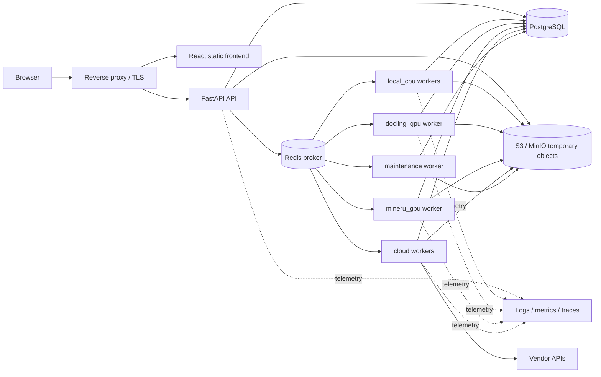
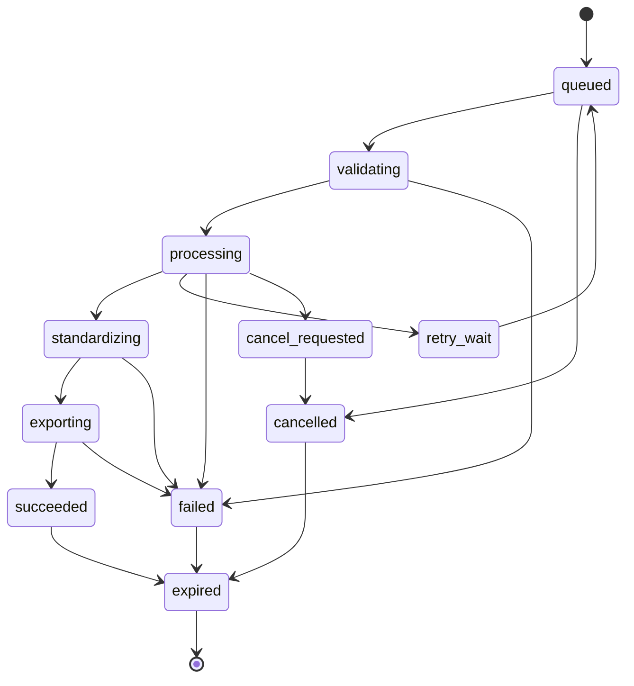
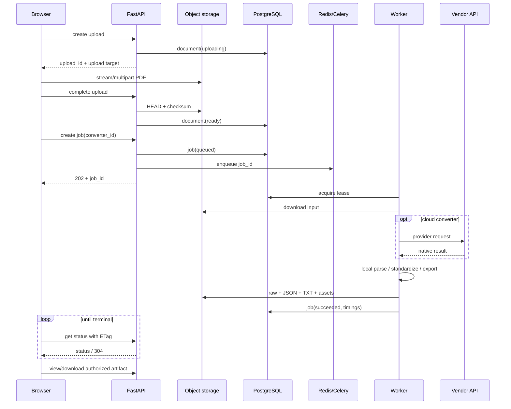
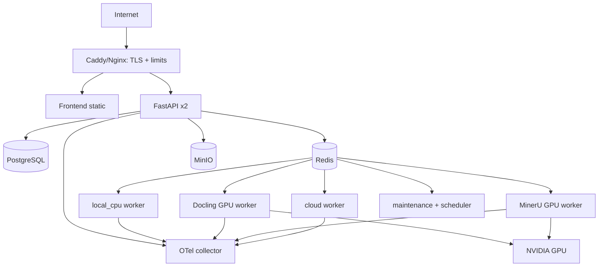

# Архитектура web-приложения для PDF-конвертеров

**Статус:** архитектурный проект, без реализации приложения  
**Дата:** 2026-10-04  
**Исходный проект:** `pdf-benchmark` 0.2.1, Python 3.12+  
**Активный набор:** 5 локальных библиотек и 5 облачных сервисов

## 1. Цель и границы

Приложение должно принимать пользовательский PDF, запускать один выбранный конвертер и показывать исходный документ рядом с результатом. Пользователь получает текст, структурированные объекты, время обработки, предупреждения, ошибки и файлы TXT/JSON.

Web-приложение является демонстрационным runtime поверх существующих адаптеров. Оно не является продолжением benchmark-runner и не должно:

- читать `ground_truth/` или сопоставлять результат с GT;
- вычислять Overall Score или категориальные benchmark-оценки для нового PDF;
- писать в `outputs/benchmark/` либо использовать исследовательский кэш как пользовательское хранилище;
- менять стандартизированную схему ради отображения в интерфейсе;
- автоматически отправлять документ нескольким платным сервисам.

Оценка качества требует размеченного эталона. Для произвольного пользовательского PDF приложение показывает фактически извлечённые данные и provenance, но не выдумывает quality score.

## 2. Зафиксированные архитектурные решения

| Область | Решение | Причина |
|---|---|---|
| Backend | Python + FastAPI, stateless API | Соответствует требованию и позволяет масштабировать HTTP независимо от конвертеров |
| Фоновые задания | Celery + Redis broker | Конвертация длительная, ресурсоёмкая и должна переживать перезапуск API |
| Состояние | PostgreSQL | Надёжный источник состояния, переходов, ошибок и метаданных |
| Файлы | S3-совместимое object storage; MinIO на одном сервере | PDF, raw-ответы, JSON и изображения не должны храниться в Redis или БД |
| Frontend | React + TypeScript; PDF.js | Нужны split-view, вкладки объектов и координатная подсветка PDF |
| Обновление статуса | Polling с `ETag` и backoff в первой версии | Проще развёртывание и восстановление после потери соединения; SSE можно добавить позднее |
| Изоляция конвертеров | Раздельные worker images и очереди | У текущих инструментов разные окружения, зависимости и требования CPU/GPU |
| Экспорт | Отдельный детерминированный TXT renderer + исходный `StandardizedDocument` JSON | TXT должен иметь стабильный порядок, а JSON — сохранять структуру и provenance |
| Хранение | TTL 24 часа по умолчанию, немедленное удаление по запросу | Ограничивает объём и срок хранения пользовательских документов |
| Развёртывание | Docker Compose на одном Linux-сервере; переход к оркестратору только при реальной нагрузке | Соответствует демонстрационному назначению и сохраняет границы сервисов |

FastAPI рекомендует `UploadFile` вместо чтения всего файла в `bytes` для крупных загрузок и отдельно указывает, что тяжёлые фоновые вычисления лучше выносить в очередь вроде Celery: [file uploads](https://fastapi.tiangolo.com/tutorial/request-files/), [background tasks](https://fastapi.tiangolo.com/tutorial/background-tasks/). Celery поддерживает явную маршрутизацию заданий по очередям: [task routing](https://docs.celeryq.dev/en/stable/userguide/routing.html).

## 3. Активные конвертеры

Приложение публикует ровно текущий активный roster.

| ID | Тип | Класс исполнения | Очередь |
|---|---|---|---|
| `pymupdf` | local, classic | CPU subprocess/container | `local_cpu` |
| `pdfplumber` | local, classic | CPU subprocess/container | `local_cpu` |
| `pdfminer` | local, classic | CPU subprocess/container | `local_cpu` |
| `docling` | local, ML | выделенный GPU worker, CPU fallback только как отдельный профиль | `docling_gpu` |
| `mineru` | local, ML | выделенный GPU worker | `mineru_gpu` |
| `ocr_space` | external API | network worker | `cloud` |
| `nutrient` | external API | network worker | `cloud` |
| `mindee` | external API | network worker | `cloud` |
| `adobe_extract` | external API | network worker | `cloud` |
| `llamaparse` | external API | network worker | `cloud` |

Marker не регистрируется. Azure Document Intelligence остаётся reserve/inactive и не появляется в пользовательском списке.

`GET /converters` возвращает для каждого инструмента display name, тип, доступность, поддерживаемые выходы, ограничения файла/страниц, ориентир времени и стоимости, а также безопасную причину недоступности. Наличие API key возвращается только как `configured: true/false`; имя, значение и часть секрета не выдаются.

Capabilities означают, что адаптер способен вернуть соответствующий тип объекта. Это не обещание, что объект будет найден в каждом PDF. Пустая вкладка должна сообщать «объекты этого типа не извлечены», а не «в документе объектов нет».

## 4. Компонентная схема

### Ответственность компонентов

**Reverse proxy** завершает TLS, ограничивает размер запроса и частоту обращений, проксирует Range-запросы к PDF и отдаёт frontend. API остаётся недоступным напрямую из интернета.

**FastAPI** проверяет доступ, создаёт upload/job records, выдаёт статусы и короткоживущие ссылки на артефакты. Он не запускает парсеры внутри HTTP-процесса.

**PostgreSQL** является единственным источником истины для задания. Redis не хранит окончательный статус.

**Redis** доставляет задания worker-процессам и хранит короткоживущие служебные данные очереди. Потеря Redis не должна уничтожать документы и итоговые статусы; reconciliation возвращает незавершённые задания в очередь.

**Object storage** хранит входной PDF, native/raw output, `standardized.json`, TXT и извлечённые assets. Доступ из браузера разрешается только после проверки владельца задания.

**Workers** импортируют адаптеры, выполняют acquisition, standardization и экспорт. Каждый тяжёлый инструмент работает в совместимом образе и с ограниченной concurrency.

## 5. Слои backend

Предлагаемая структура пакетов описывает границы, но пока не создаётся в репозитории:

| Слой | Назначение |
|---|---|
| `api` | HTTP routes, auth/session, DTO, обработка Range и download |
| `application` | use cases: загрузить, создать, отменить, получить результат, удалить |
| `domain` | Job, Document, Artifact, статусы, правила переходов, error codes |
| `converters` | реестр десяти инструментов и мост к существующим адаптерам |
| `workers` | Celery tasks, маршрутизация, lease/heartbeat, timeouts |
| `storage` | PostgreSQL repositories, Redis transport, S3 object gateway |
| `exports` | детерминированные TXT/JSON renderers |
| `observability` | structured logging, metrics, tracing, redaction |

HTTP handlers не знают о vendor SDK. Адаптеры не знают о cookie, пользователе, базе данных или Celery. Worker получает `job_id`, загружает сведения из БД и файл из object storage, затем вызывает converter service.

### Интеграция с существующим кодом

Переиспользуются:

- `BaseLocalAdapter`/`BaseCloudAdapter` и их разделение `run_raw` → `standardize`;
- `StandardizedDocument` и типы `TextBlock`, `Table`, `Formula`, `ChemicalObject`, `ImageObject`, `DiagramObject`;
- текущие tool configs, enrichment химии/математики и resource monitor;
- раздельные зависимости `.venv`, `.venv-mineru`, `.venv-cloud` как основание для отдельных container images.

Не переиспользуются как runtime-слой:

- benchmark runner, manifest и GT matching;
- benchmark `PairCache` и `latest_experiment.txt`;
- правила resume, которые предназначены для фиксированной матрицы tool × D01–D05.

Web runtime получает собственный `WebJobWorkspace`. Он сохраняет raw response до standardization, чтобы ошибку стандартизатора можно было исправить и повторить локально без нового платного вызова. Повторное использование разрешается только внутри того же job и того же владельца; межпользовательская дедупликация по SHA-256 запрещена из-за утечки факта наличия документа.

## 6. Модель данных

### `documents`

| Поле | Назначение |
|---|---|
| `id` | UUID документа |
| `owner_id` / `session_id` | владелец или анонимная сессия |
| `original_filename` | очищенное отображаемое имя |
| `object_key` | случайный внутренний путь, без имени пользователя |
| `sha256`, `size_bytes`, `page_count` | контроль целостности и лимитов |
| `status` | `uploading`, `ready`, `invalid`, `deleting`, `deleted` |
| `created_at`, `expires_at` | жизненный цикл |

### `jobs`

| Поле | Назначение |
|---|---|
| `id`, `document_id`, `owner_id` | идентичность и доступ |
| `converter_id`, `converter_version`, `config_snapshot` | воспроизводимость результата |
| `status`, `stage`, `attempt` | состояние выполнения |
| `queued_at`, `started_at`, `finished_at` | временные отметки |
| `queue_time_ms`, `processing_time_ms`, `total_time_ms` | раздельные интервалы |
| `progress_current`, `progress_total`, `progress_unit` | только подтверждённый прогресс, например страницы |
| `worker_id`, `heartbeat_at`, `trace_id` | диагностика и восстановление |
| `error_code`, `public_error`, `internal_error_ref` | безопасное сообщение и ссылка на внутренний лог |
| `estimated_cost`, `actual_cost`, `cost_currency`, `cost_basis` | контроль расходов |
| `expires_at` | срок жизни результатов |

### `artifacts`

`Artifact` связывает job с `input_pdf`, `raw`, `standardized_json`, `plain_text`, `image`, `diagram`, `table_csv`, `provider_file` или `log_bundle`. Хранятся `object_key`, MIME type, размер, SHA-256 и флаг доступности пользователю. Raw provider responses и внутренние логи по умолчанию пользователю не выдаются.

### `job_events`

Append-only события содержат номер последовательности, stage, timestamp, level и безопасное сообщение. Они формируют историю статуса, но не содержат извлечённый текст или секреты.

## 7. Жизненный цикл задания

Переход выполняется транзакционно и с проверкой текущей версии строки. Дублированная доставка Celery не должна повторно запускать завершённое задание. Worker получает lease и обновляет heartbeat. Reconciler переводит зависшее задание в `retry_wait` либо `failed` только после истечения lease и проверки числа попыток.

Процент показывается лишь когда конвертер сообщает надёжный `current/total`. Иначе UI показывает текущую стадию и прошедшее время. Ложный линейный процент для внешнего API не используется.

## 8. Последовательность обработки

Для небольшого MVP FastAPI может принимать `multipart/form-data` через `UploadFile` и потоково писать объект. Для больших PDF production-путь выдаёт presigned multipart upload, затем API обязательно проверяет размер, checksum и принадлежность object key. Presigned URL даёт временный доступ без раскрытия storage credentials: [AWS S3 documentation](https://docs.aws.amazon.com/AmazonS3/latest/userguide/using-presigned-url.html).

## 9. HTTP API v1

Все endpoints имеют префикс `/api/v1`. Mutating-запросы требуют CSRF-защиту при cookie auth либо bearer token при API-клиенте. Ответы об ошибках используют единый envelope: `code`, `message`, `trace_id`, `retryable`, `details` с безопасными полями.

| Метод и путь | Назначение | Основной результат |
|---|---|---|
| `GET /converters` | список активных конвертеров и availability | 200 |
| `POST /documents/uploads` | начать прямую или multipart загрузку | 201 |
| `POST /documents/{id}/complete` | подтвердить upload и запустить валидацию | 200/202 |
| `GET /documents/{id}` | метаданные и срок хранения | 200 |
| `GET /documents/{id}/content` | PDF для viewer с HTTP Range | 200/206 |
| `DELETE /documents/{id}` | удалить документ и связанные jobs | 202 |
| `POST /jobs` | создать одно задание для одного converter | 202 |
| `GET /jobs/{id}` | статус, stage, времена, ошибка, ссылки | 200 |
| `GET /jobs/{id}/events` | безопасная история этапов | 200 |
| `POST /jobs/{id}/cancel` | запросить отмену | 202/409 |
| `GET /jobs/{id}/result` | краткое структурированное представление | 200 |
| `GET /jobs/{id}/objects` | пагинация/фильтр по page и type | 200 |
| `GET /jobs/{id}/artifacts/{artifact_id}` | preview/download объекта | 200/206 |
| `GET /jobs/{id}/download.txt` | TXT attachment | 200 |
| `GET /jobs/{id}/download.json` | canonical JSON attachment | 200 |

`POST /jobs` принимает `document_id`, один `converter_id` и разрешённые публичные options. Произвольный provider URL, shell argument, output path или секрет принять нельзя. `Idempotency-Key` предотвращает двойной запуск после повторной отправки формы.

Список объектов пагинируется, чтобы документ с тысячами блоков не загружался в browser одним JSON. Full JSON остаётся отдельным download. PDF endpoint поддерживает `Range`, `ETag` и `Content-Disposition: inline`; S3 также поддерживает byte-range responses: [GetObject API](https://docs.aws.amazon.com/AmazonS3/latest/API/API_GetObject.html).

## 10. Валидация входного PDF

1. Проверить лимит upload на reverse proxy и повторно в application layer.
2. Не доверять расширению и клиентскому MIME type; проверить сигнатуру и открыть PDF безопасной библиотекой.
3. Посчитать SHA-256 потоково и сверить checksum завершённой прямой загрузки.
4. Получить page count, признак шифрования и базовую целостность до постановки в очередь.
5. Отклонить зашифрованный PDF без поддержанного password flow; пароль не хранить в первой версии.
6. Использовать случайный object key и очищать исходное имя только для `Content-Disposition`.
7. Задать отдельные лимиты: размер файла, число страниц, число активных jobs на пользователя и суточную квоту.
8. Не исполнять JavaScript, embedded files, launch actions или ссылки из PDF.

Предлагаемые стартовые лимиты для публичной демонстрации: 100 MiB, 300 страниц, одно активное тяжёлое задание и два активных лёгких задания на сессию. Лимиты являются deployment config и уточняются нагрузочным тестом. Ограничение конкретного vendor может быть ниже; UI показывает его до запуска.

## 11. Большие PDF

- Upload и скачивание выполняются потоково; API не вызывает полное чтение файла в RAM.
- Для production используется multipart upload напрямую в object storage с коротким TTL и фиксированным object key.
- Viewer читает PDF диапазонами байтов, поэтому не ждёт полной передачи перед первой страницей.
- Структурированный результат отдаётся страницами и типами объектов.
- Worker копирует PDF в собственный scratch directory с quota и удаляет scratch в `finally`.
- Для каждого converter задаются hard timeout, soft timeout, RAM/VRAM limit и максимальное число страниц.
- Автоматическое разрезание PDF допускается только в converter-specific execution plan, когда API поставщика имеет документированное ограничение и адаптер умеет надёжно объединить page indices. Общий слой не режет документ вслепую.
- Пользователь может выбрать диапазон страниц как явную option; результат помечается этим диапазоном.

## 12. Выполнение локальных инструментов

Локальный adapter запускается в дочернем процессе или отдельном контейнере, а не в процессе Celery worker. Это позволяет принудительно остановить timeout/OOM, освободить GPU и изолировать сбой native-библиотеки.

Для контейнера действуют: non-root user, read-only root filesystem, временный writable scratch, запрет внешней сети для local tools, лимиты CPU/RAM/PIDs, только входной PDF и job-prefix с результатами. Model cache монтируется read-only; загрузка моделей во время пользовательского запроса запрещена.

По текущему benchmark пиковые значения были около 10.9 GiB RAM и 8.2 GiB VRAM для Docling, 5.8 GiB RAM и 4.8 GiB VRAM для MinerU, менее 1 GiB RAM для classic local tools. Поэтому стартовые worker profiles с запасом:

| Pool | Concurrency | CPU | RAM limit | VRAM target | Timeout |
|---|---:|---:|---:|---:|---:|
| `local_cpu` | 2 на host | 2 vCPU/slot | 2 GiB/slot | 0 | 15 min |
| `docling_gpu` | 1/GPU | 8 vCPU | 16 GiB | 12 GiB | 90 min |
| `mineru_gpu` | 1/GPU | 8 vCPU | 10 GiB | 8 GiB | 45 min |

Это стартовые эксплуатационные лимиты, а не минимальные требования поставщиков. Их нужно подтвердить отдельным load/soak test на целевом сервере. CPU fallback для ML-инструмента публикуется как отдельный deployment profile с честным временем ожидания.

## 13. Внешние API

Cloud workers имеют egress только к allowlist доменов пяти поставщиков. Для каждого адаптера задаются отдельные concurrency, requests-per-minute, page/file limits, timeout и budget ceiling.

Retry выполняется с exponential backoff и jitter только для transport errors, 429 и временных 5xx. Ошибки credentials, quota/payment, invalid PDF и provider rejection не повторяются автоматически. Если API поддерживает idempotency token, job ID используется как его основа. Иначе перед повторной отправкой проверяется сохранённый provider request ID, чтобы не создать двойной платный вызов.

Перед постановкой облачного задания API показывает тип стоимости и доступный estimate. После выполнения сохраняются `actual`, если поставщик его вернул, либо `estimated` с формулой и версией тарифа. Превышение дневного/месячного operator budget отключает converter до вмешательства администратора. Кнопка запуска одного выбранного облачного конвертера является явным действием пользователя; массовый запуск всех облаков отсутствует в первой версии.

Native response сохраняется до standardization. Если acquisition завершился, а standardization упал, повторное задание должно использовать сохранённый raw response при совпадении adapter/version fingerprint и не обращаться к API ещё раз.

## 14. TXT и JSON

JSON download — сериализация `StandardizedDocument` плюс отдельный web envelope с job timings, warnings и artifact URLs. Внутренние абсолютные пути заменяются на стабильные artifact IDs/relative paths. Секреты, локальные пути и raw credentials не сериализуются.

TXT renderer следует `reading_order`; при его отсутствии использует page number и `order_index`, затем стабильный fallback. Между страницами вставляется явный разделитель. Таблицы представляются читаемым TSV/Markdown-подобным блоком, формулы — provider LaTeX или plain text без исправления содержания, химия — сохранённой формулой/labels, изображения и диаграммы — caption и нейтральный placeholder. Один объект не должен дублироваться как текст и как вложенная подпись.

TXT не заменяет JSON и не является основой UI. В интерфейсе показывается canonical object model, поэтому bbox, cells, captions, provenance и assets не теряются.

## 15. Frontend

### Основные экраны

1. **Upload.** Drag-and-drop, размер, page count после проверки, TTL и предупреждение о передаче третьей стороне для cloud converter.
2. **Converter selection.** Карточки десяти инструментов: local/cloud, classic/ML, availability, поддерживаемые outputs, ориентир времени/стоимости и текущая очередь.
3. **Job status.** Стадия, queue time, processing time, elapsed time, отмена, безопасная ошибка и trace ID.
4. **Result workspace.** PDF слева; справа вкладки Text, Tables, Math, Chemistry, Images, Diagrams и JSON summary.
5. **Downloads.** TXT, JSON и доступные assets; срок автоматического удаления.

PDF.js предоставляет browser rendering layer/viewer, который можно расширить собственной панелью и координатной подсветкой: [PDF.js getting started](https://mozilla.github.io/pdf.js/getting_started/).

### Работа с объектами

- Клик по объекту переводит viewer на `page_number` и рисует bbox поверх страницы.
- Клик по bbox выбирает соответствующий объект справа.
- Если bbox отсутствует, UI показывает объект без подсветки и явно помечает отсутствие координат.
- Table view содержит сетку ячеек, spans, header flags и кнопку CSV, если экспорт построен.
- Formula view показывает raw/plain text и LaTeX; безопасный renderer не разрешает произвольный HTML.
- Image/diagram view получает asset через авторизованный endpoint и показывает caption/provenance.
- Вкладка отображает число объектов, а не бинарное «поддерживается/не поддерживается».

### Получение статуса

Frontend опрашивает job каждые 1–2 секунды во время активной стадии, затем увеличивает интервал до 5–10 секунд. `ETag`/`If-None-Match` сокращает тело ответа. При восстановлении сети status запрашивается из PostgreSQL через API; состояние UI не считается источником истины. SSE можно добавить через отдельный endpoint после измерения реальной нагрузки, не меняя модель jobs/events.

## 16. Ошибки

| Код | Значение | Retryable |
|---|---|---|
| `PDF_INVALID` | файл не является допустимым PDF | нет |
| `PDF_ENCRYPTED` | требуется неподдержанный пароль | нет |
| `LIMIT_FILE_SIZE` / `LIMIT_PAGE_COUNT` | превышен лимит | нет |
| `CONVERTER_UNAVAILABLE` | worker/модель/ключ не настроены | позднее |
| `PROVIDER_AUTH` | неверные server-side credentials | нет |
| `PROVIDER_RATE_LIMIT` | временный лимит поставщика | да |
| `PROVIDER_QUOTA` | исчерпана квота/бюджет | нет до изменения квоты |
| `PARSER_TIMEOUT` | превышен hard timeout | возможно |
| `PARSER_OOM` | превышен RAM/VRAM limit | нет автоматически |
| `ACQUISITION_FAILED` | native result не получен | зависит от причины |
| `STANDARDIZATION_FAILED` | raw сохранён, преобразование схемы не удалось | да без нового acquisition |
| `EXPORT_FAILED` | canonical JSON сохранён, TXT/assets не собраны | да локально |
| `STORAGE_FAILED` | object storage недоступно | да |
| `CANCELLED` | отменено пользователем | нет |

Пользователь видит короткое сообщение, retryable и trace ID. Stack trace, provider response body и секреты доступны только оператору в защищённых логах. Успешный результат с предупреждениями имеет `succeeded` и массив warnings; частичный результат должен иметь явный `partial` indicator на уровне result, а не маскироваться под полный.

## 17. API keys и безопасность

- Provider keys находятся в secret manager или Docker secrets; `.env` допустим только локально.
- Секрет передаётся только соответствующему cloud worker и никогда frontend, local worker или artifact renderer.
- API не принимает vendor key от анонимного пользователя в первой версии.
- Логи редактируют Authorization, cookies, query tokens, SDK request dumps и environment values.
- Object storage bucket закрыт; ссылки короткоживущие, scoped к одному object key и создаются после authorization.
- Same-origin frontend уменьшает CORS surface. CSP запрещает inline scripts и неизвестные image/frame sources.
- Сессия имеет случайный идентификатор, HttpOnly/Secure/SameSite cookie и серверные quotas. Административные endpoints требуют отдельной роли.
- Каждый запрос к документу, job и artifact проверяет ownership; UUID сам по себе не является разрешением.
- Local workers работают без egress; cloud workers не имеют доступа к benchmark inputs и чужим job prefixes.
- Dependency images фиксируются digest/version, проходят vulnerability scan и обновляются отдельно.

## 18. Временное хранение и очистка

Рекомендуемый object layout:

`jobs/{yyyy}/{mm}/{job_id}/input/source.pdf`, затем подкаталоги `raw/`, `standardized/`, `exports/` и `assets/`. Имена создаёт сервер; пользовательские filenames в key не входят.

TTL по умолчанию — 24 часа после завершения или загрузки без запуска. UI показывает точное `expires_at` и кнопку «Удалить сейчас». Очистка двухуровневая:

1. scheduler выбирает истёкшие записи и транзакционно ставит `deleting`;
2. maintenance worker удаляет весь job prefix и scratch remnants;
3. после подтверждения удаления запись получает `deleted`, а чувствительные метаданные минимизируются;
4. неудачное удаление повторяется и попадает в `cleanup_backlog` alert.

Bucket lifecycle служит страховочной сеткой с более длинным сроком, например 48 часов, но не заменяет application cleanup. MinIO поддерживает lifecycle expiration, причём удаление может происходить не мгновенно: [object deletion and lifecycle](https://min.io/docs/minio/linux/administration/object-management/object-delete.html).

Не следует включать временные PDF в обычные backup. PostgreSQL backup хранит только необходимые метаданные и не должен позволять скачать уже удалённый файл. Audit logs сохраняют событие удаления и IDs, но не содержимое документа.

## 19. Logging, metrics и tracing

Логи — JSON в stdout. Обязательные поля: timestamp, level, service, environment, trace_id, job_id, converter_id, stage, attempt, duration_ms, error_code и worker_id. Не логируются extracted text, PDF bytes, raw provider body, секреты и полный исходный filename.

Метрики:

- HTTP requests, errors, latency;
- upload bytes и validation failures;
- queue depth/oldest age по каждой очереди;
- job duration, success, failure и cancellation по converter;
- CPU/RAM/VRAM и OOM/timeout;
- provider latency, 429/5xx, retries и оценочная/фактическая стоимость;
- object storage errors/bytes и cleanup backlog;
- число jobs, зависших без heartbeat.

Кардинальность метрик ограничивается: `job_id`, filename и user ID не являются labels. Они остаются только в logs/traces. OpenTelemetry связывает API, queue и worker одним trace context; документация описывает spans, attributes и exception recording: [OpenTelemetry Python](https://opentelemetry.io/docs/languages/python/instrumentation/). Для алертов используются принципы request/error/latency и batch-job duration/failures: [Prometheus instrumentation](https://prometheus.io/docs/practices/instrumentation/).

Минимальные alerts: API 5xx, oldest queue age, worker absent, GPU OOM, provider auth/quota, cleanup backlog, storage capacity, PostgreSQL/Redis unavailable и неожиданная стоимость за сутки.

## 20. Deployment

### Первая production-конфигурация: один Linux-сервер

Docker Compose подходит для multi-container deployment на одном сервере; production override должен убирать bind mounts исходного кода, задавать restart policies и отдельную конфигурацию: [Docker production guidance](https://docs.docker.com/compose/how-tos/production/).

Компоненты находятся в трёх сетевых зонах:

- public: только reverse proxy;
- application: frontend/API/workers/queue;
- data: PostgreSQL и MinIO без опубликованных наружу портов.

API запускается минимум в двух процессах/репликах. GPU workers имеют concurrency 1 и healthcheck готовности модели. PostgreSQL и MinIO используют отдельные persistent volumes; Redis persistence полезна для восстановления очереди, но не заменяет PostgreSQL. Контейнеры получают фиксированные image tags/digests, healthchecks, restart policy и лимиты ресурсов.

### Development

Docker Compose поднимает API, frontend, PostgreSQL, Redis, MinIO и лёгкий CPU worker. Cloud converters выключены без secrets. ML workers подключаются отдельным profile, чтобы обычная разработка не скачивала модели и не требовала GPU. Для Windows frontend/backend можно запускать локально, но целевое worker/deployment окружение остаётся Linux.

### Масштабирование

Сначала масштабируются очереди отдельно: дополнительные `local_cpu`/`cloud` workers и по одному ML worker на GPU. API масштабируется stateless. PostgreSQL и object storage выносятся в managed/external services при необходимости. Переход к Kubernetes оправдан, когда нужны несколько узлов, autoscaling очередей, отдельные GPU nodes и rolling updates; API contract и storage layout при этом не меняются.

## 21. Доступность и восстановление

- API readiness проверяет PostgreSQL и возможность поставить служебное сообщение; недоступный converter не делает весь API unhealthy.
- `GET /converters` строит availability из heartbeat workers, secret configuration и circuit breaker поставщика.
- Задание после смерти worker восстанавливается по lease/heartbeat. Raw artifact и provider request ID проверяются до нового acquisition.
- PostgreSQL транзакция и unique idempotency key защищают от двойного job.
- Artifact записывается под временным key, проверяется checksum и атомарно публикуется в БД.
- Shutdown worker сначала прекращает брать задания, затем даёт активному subprocess ограниченное время и сохраняет состояние.
- Для deployment upgrade очередь дренируется по pool; API остаётся доступным для просмотра готовых результатов.

Целевые SLO для демонстрационного сервиса после нагрузочного теста: 99% доступности API за месяц, создание job p95 < 500 ms без учёта upload, отсутствие потери terminal status, cleanup не позднее TTL + 2 часа. Время самой конвертации в SLO не фиксируется одним числом: оно зависит от converter, размера и поставщика.

## 22. Приёмочные сценарии

Архитектура считается реализованной, когда проходят следующие end-to-end сценарии:

1. PDF загружается потоково, валидируется и открывается в viewer через Range.
2. Каждый доступный converter создаёт асинхронный job и не блокирует HTTP process.
3. Статус переживает reload browser и restart API.
4. Успешный job показывает фактические типы объектов и выдаёт валидные TXT/JSON.
5. Клик по объекту с bbox подсвечивает правильную страницу и область.
6. Timeout, OOM, provider 429, invalid key и invalid PDF дают разные безопасные ошибки.
7. Отмена завершает local subprocess и не публикует неполный результат как полный.
8. Повтор standardization после сохранённого raw response не делает новый cloud call.
9. Секрет отсутствует в HTTP, logs, artifacts и database dump.
10. TTL cleanup удаляет input/raw/result/assets и оставляет проверяемый статус удаления.
11. Два одинаковых PDF разных пользователей не открывают друг другу документ или кэш.
12. Web runtime не читает и не изменяет `documents/`, `ground_truth/`, object manifest и benchmark cache.

## 23. План реализации

### Этап 1 — contracts и вертикальный срез

Зафиксировать DB migrations, job state machine, converter registry и API schemas. Реализовать upload, один `pymupdf` worker, status, PDF viewer, Text view и TXT/JSON. Добавить ownership, TTL cleanup и structured logs сразу, потому что позднее их внедрение меняет все границы.

### Этап 2 — десять адаптеров

Добавить classic CPU workers, затем отдельные Docling/MinerU images, затем cloud pool. Для каждого converter провести contract tests на сохранённых fixtures; live smoke test запускать отдельно и явно, с budget limit. Реализовать повторную standardization из raw artifact.

### Этап 3 — структурированный интерфейс

Добавить таблицы, формулы, химию, изображения, диаграммы, bbox overlay, pagination, asset download, cancellation и полную error taxonomy.

### Этап 4 — внешнее развёртывание

Настроить TLS, secrets, quotas, monitoring/alerts, backups метаданных, retention, load test и эксплуатационный runbook. После soak test скорректировать concurrency и resource limits.

## 24. Решения, которые нужно подтвердить перед реализацией

Для архитектуры приняты безопасные стартовые значения: один PDF на job, один converter на запуск, TTL 24 часа, anonymous session с quota, React/TypeScript, Redis/Celery, PostgreSQL и MinIO. Эти значения вынесены в configuration и не требуют изменения доменной модели, если позже будут выбраны авторизация, иной TTL или S3 cloud storage.

Главное ограничение первой версии: пользователь выбирает один converter и осознанно запускает его. Сравнение нескольких результатов можно добавить как batch из независимых jobs, но облачные расходы и квоты должны подтверждаться до создания batch.

